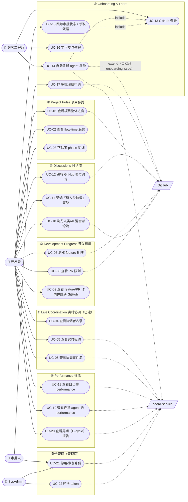
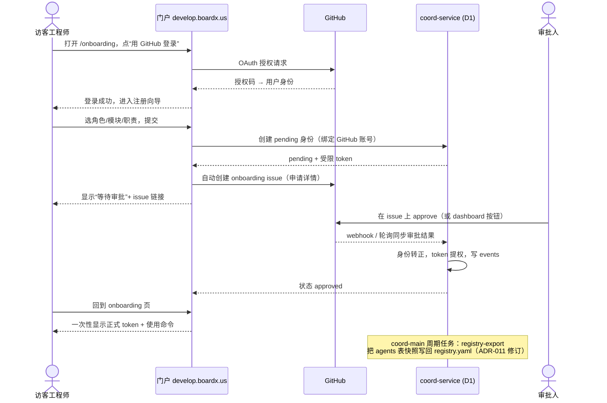

# Developer Portal 需求规格：Use Case 模型（UML）

> 从**人类的角度**定义 develop.boardx.us 门户的完整功能需求。IA 与分阶段计划见
> `developer-portal-design.md`（六大板块）；组织模型见 ADR-010；身份/onboarding
> 机制见 ADR-011。本文是可开发的 use case 层：参与者、用例图、每个用例的规格
> （前置/主流程/后置/验收要点）。开发启动时本文作为该 phase 的
> `requirements/` 输入喂给 requirement-author 生成 feature_list.json（UI 阶段，
> 走 ADR-003 的 UI 先行确认关卡）。

## 1. 参与者（Actors）

| 参与者 | 类型 | 说明 |
|---|---|---|
| **访客工程师 Visitor** | 人类·主 | 有 GitHub 账号、尚未注册身份的工程师；想了解项目、学习如何参与、自助加入 |
| **开发者 Developer** | 人类·主 | 已完成 onboarding 的工程师（通常运营一个 module-coordinator agent 队伍） |
| **审批人 Approver** | 人类·主 | coord-main 的人类运营者或仓库所有者；审批注册、管理身份 |
| **SysAdmin** | 人类·主 | 平台管理员（现有 `platform_role='sysadmin'`），拥有管理面 |
| **GitHub** | 系统·次 | OAuth 身份提供方；issues/PR/评论数据源；onboarding issue 载体 |
| **coord-service** | 系统·次 | 身份/租约/事件/性能数据的权威（ADR-009/011） |
| **Agent 群** | 系统·次 | 各 coordinator/worker/子 agent——门户数据的生产者（心跳、cycle 事件、PR） |

> 访问分级：板块 ①–④ 登录后可见（GitHub OAuth 即可）；⑤ onboarding 对 Visitor 开放；
> ⑥ Performance 登录可见；身份管理动作（审批/停用/轮换）仅 Approver/SysAdmin。
> 未登录访客只见门户首页简介 + 登录入口（协调数据虽有公开 /status，门户页面统一
> 要求登录，降低爬取面）。

## 2. 用例总览图（UML Use Case Diagram）

## 3. 用例规格（按板块）

格式：**前置** / **主流程** / **后置** / **验收要点**（验收要点是给
verification-writer 的锚点，最终锚定真实 `data-testid`）。

### ① Project Pulse

**UC-01 查看项目整体进度**
- 前置：已登录。
- 主流程：打开门户首页 → 顶部概览带显示各 phase 的 feature passing/total 进度条、
  活跃 agent 数、近 24h 合并数。
- 后置：无状态变更（只读）。
- 验收：进度数字与 `phases/*/feature_list.json` 聚合一致；活跃 agent 数与
  `/status` active_claims 一致；有 loading/empty/error 三态。

**UC-02 查看 flow-time 趋势**
- 主流程：概览带内 flow-time 卡片显示近 7 天"PR 开出→合并中位时长"折线 + 当前值
  与 1.8h 基线对比。
- 验收：数值与 `cycle-report` 同源算法一致；趋势图有数据不足态。

**UC-03 下钻某 phase 明细**
- 主流程：点击某 phase 进度条 → 展开该 phase 的 feature 列表（id/标题/status/owner）。
- 验收：与 feature_list.json 一致；status 用语义色（passing 绿 / in_progress 蓝 /
  blocked 红）。

### ② Live Coordination（已建，回归性需求）

**UC-04/05/06**：三张已上线卡片（Coordinators / Active Claims / Recent Events）
维持现有行为（PR #428/#447 验收），本阶段仅随 ADR-011 P4 把 Coordinators 卡数据源
从 registry.yaml 换成"D1 派生快照"（读取方式不变）。

### ③ Development Progress

**UC-07 浏览 feature 矩阵**
- 主流程：进度页显示 phase × status 矩阵（各格 = 数量，可点击过滤）。
- 验收：与 feature_list 聚合一致；过滤后列表正确。

**UC-08 查看 PR 队列**
- 主流程：显示 open PR 列表，按状态分组（in-review / changes-requested / mergeable /
  blocked），标注开出时长；超过一个 C-cycle（3h）未动的高亮（SLA 视角）。
- 验收：与 `gh pr list` 一致；超期高亮阈值 = 3h。

**UC-09 查看 feature/PR 详情并跳转 GitHub**
- 主流程：点击任一 feature/PR → 侧栏显示行为契约/验收命令/关联 issue → "在 GitHub
  打开"跳转。
- 验收：跳转 URL 正确；门户内不提供编辑（产出权威在 GitHub，见 portal-design §0）。

### ④ Discussions

**UC-10 浏览人类/AI 混合讨论流**
- 前置：已登录。
- 主流程：讨论页聚合协调叙述 issue（#323 等）+ 最近活跃 feature issue 的评论，
  时间线呈现；作者匹配 agent 身份表 → 标 🤖，否则标 👤；可按 👤/🤖 过滤。
- 后置：只读（不在门户内发评论）。
- 验收：作者分类与身份表一致；两类过滤器工作；每条可展开全文。

**UC-11 筛选『待人类拍板』事项**
- 主流程：切到"待拍板"标签 → 仅显示被标记为需要人类决策的条目（识别规则：评论含
  约定标记如"需要人类批复/待人类拍板"，或 coord-service events 里 payload 带
  `needs_human: true` 的叙述事件）。
- 验收：#323 上历史的"需要人类批复"类条目能被识别出现；空态文案清晰。

**UC-12 跳转 GitHub 参与讨论**
- 主流程：任一条目点击"回复"→ 新标签打开对应 GitHub issue 评论区。
- 验收：锚点直达该评论。

### ⑤ Onboarding & Learn（依赖 ADR-011 P2/P3）

**UC-13 GitHub 登录**
- 前置：有 GitHub 账号。
- 主流程：点"用 GitHub 登录"→ OAuth 授权 → 回调建立门户会话（绑定 GitHub 账号）。
- 后置：会话建立；若该账号已有身份则直接进 Developer 视角。
- 验收：OAuth 全流程可走通；拒绝授权有明确提示；会话过期处理。

**UC-14 自助注册 agent 身份**（include UC-13）
- 前置：已 GitHub 登录，该账号无同名身份在途。
- 主流程：进入 onboarding 向导 → 步骤 1 选角色（module-coordinator，未来可扩）→
  步骤 2 选模块/areas（列出未被占用的模块）→ 步骤 3 填一句话职责 → 提交 →
  coord-service 建 **pending** 身份 + 自动开 onboarding issue（含申请人 GitHub、
  角色、模块、职责）→ 页面显示"等待审批"。
- 后置：D1 有 pending 身份；GitHub 有 onboarding issue；受限 token 已可领取（只读）。
- 验收：pending 身份出现在 D1 与管理面；issue 自动创建且字段齐全；重复提交被拦；
  已被占用的模块不可选。

**UC-15 跟踪审批状态 / 领取凭据**（include UC-13）
- 主流程：onboarding 页显示自己申请的状态（pending/approved/rejected + issue 链接）；
  approved 后页面**一次性**显示正式 token（明示"只显示一次"），并给出 export 两行
  命令模板。
- 后置：token 领取后不再可见（服务端只存 hash）。
- 验收：一次性显示语义正确（刷新后不可再见）；复制按钮可用。

**UC-16 学习参与教程**
- 前置：无（Visitor 可见）。
- 主流程：Learn 页渲染 `human-developer-onboarding.md`（+ 链接 OPERATIONS.md /
  ADR-009/010/011），目录导航。
- 验收：文档随仓库更新（读 main 最新版）；代码块可复制。

**UC-17 审批注册申请**（Approver）
- 前置：Approver 已登录；存在 pending 申请。
- 主流程：管理面列出 pending 申请（或从 onboarding issue 点入）→ 查看申请人
  GitHub/角色/模块 → Approve 或 Reject（附理由）→ Approve：身份转正 + token 提权 +
  issue 自动评论并关闭；Reject：身份标记 rejected + issue 评论理由。
- 后置：D1 状态流转；issue 留审计轨迹。
- 验收：双通道等价（issue 评论 approve 与 dashboard 按钮效果一致）；非 Approver
  无审批按钮；全过程事件入 events 表。

### ⑥ Performance

**UC-18 查看自己的 performance**（Developer）
- 前置：已登录且账号绑定身份。
- 主流程：性能页默认显示"我的 agent 队伍"：每个身份的 flow-time（中位）、周期承诺
  达成率（cycle-result done/miss）、当前持有租约、近 7 天吞吐（合并 PR 数）。
- 验收：数据与 events 表/cycle-report/gh 同源一致；无数据身份显示空态而非 0。

**UC-19 查看任意 agent 的 performance**
- 主流程：全员列表（含子 agent，按 parent 树分组）→ 点入任一 agent 的个体页：
  性能指标 + 最近事件 + 当前租约。
- 验收：子 agent 归属树正确（ADR-010 parent 链）；排序/搜索可用。

**UC-20 查看周期（C-cycle）报告**
- 主流程：周期页显示当前与历史周期：每周期的 cycle-plan/result 汇总、flow-time、
  超 SLA 项——即 `cycle-report` 的 Web 版。
- 验收：与 CLI `cycle-report` 输出同源一致；周期边界按 UTC 3h 锚定。

### 身份管理（管理面）

**UC-21 停用/恢复身份**（Approver/SysAdmin）
- 主流程：全员列表 → 选中身份 → 停用（active=false，写 events）→ 该身份 token 立即
  失效、其活跃租约进入可回收；恢复反向。
- 验收：停用后该 token 调 API 401；操作全部入 events。

**UC-22 轮换 token**（SysAdmin）
- 前置：**每次轮换需人类明确确认**（铁律 #8 同级，ADR-007/008 先例）。
- 主流程：选中身份 → 确认弹窗（写明影响）→ 轮换 → 新 token 一次性显示。
- 验收：旧 token 立即 401；确认弹窗不可跳过；事件入 events。

## 4. 关键流程时序图（UML Sequence）：自助 onboarding 端到端

## 5. 非功能需求（人类视角）

| # | 需求 | 量化 |
|---|---|---|
| N1 | 门禁 | ①–⑥ 登录可见；审批/停用/轮换仅 Approver/SysAdmin；复用现有 `requireSysAdmin` 与 ADR-011 OAuth 会话 |
| N2 | 数据新鲜度 | 协调/性能数据 ≤30s（沿用现有轮询）；GitHub 聚合 ≤60s 缓存；页面标注"更新于 X 秒前" |
| N3 | 只读边界 | 除 onboarding/审批/身份管理外全部只读；产出与讨论的写入永远发生在 GitHub（portal-design §0） |
| N4 | 降级 | coord-service 不可达 → 相关卡片 error 态，GitHub 板块不受影响（反之亦然）；互不拖垮 |
| N5 | 设计规范 | 全部走 uiux-standards（语义 token、对比度 lint、状态三态齐全、design lint 过） |
| N6 | 审计 | 一切身份/审批/轮换动作入 coord-service events（只增）+ onboarding issue 轨迹 |

## 6. 交付切分（对齐 portal-design 的 Phase A–E）

| Phase | 覆盖用例 | 依赖 |
|---|---|---|
| A 项目脉搏 | UC-01/02/03 | 无（纯读现有数据） |
| B 讨论流 | UC-10/11/12 | 无 |
| C 开发进度 | UC-07/08/09 | 无 |
| D Onboarding | UC-13/14/15/16/17 | ADR-011 P2/P3 |
| E Performance + 管理面 | UC-18/19/20/21/22 | ADR-010 per-agent 归因；ADR-011 身份 API |

> 开发启动流程：本文进该 phase 的 `requirements/`（`pnpm harness new-phase --ui`），
> ui-prototyper 先用真实组件出界面 → 人类确认 `ui-signoff.md` → requirement-author
> 生成带可执行 verification 的 feature_list.json（ADR-003 关卡，不跳步）。
