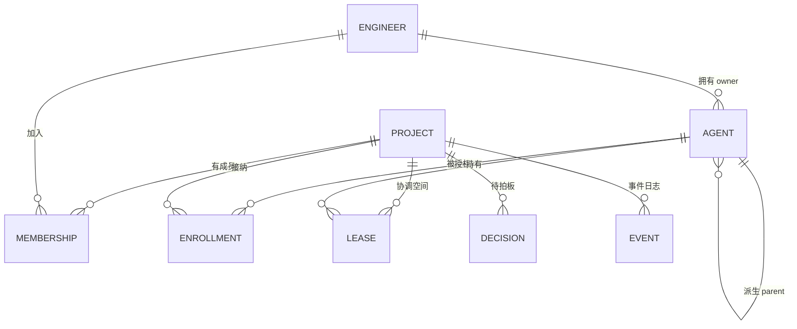
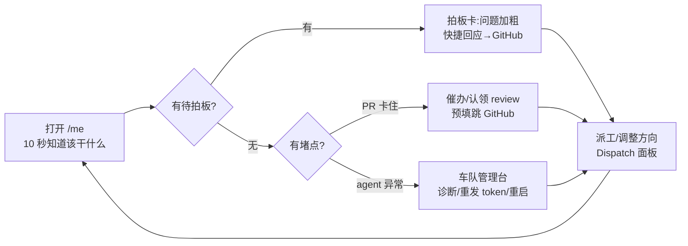
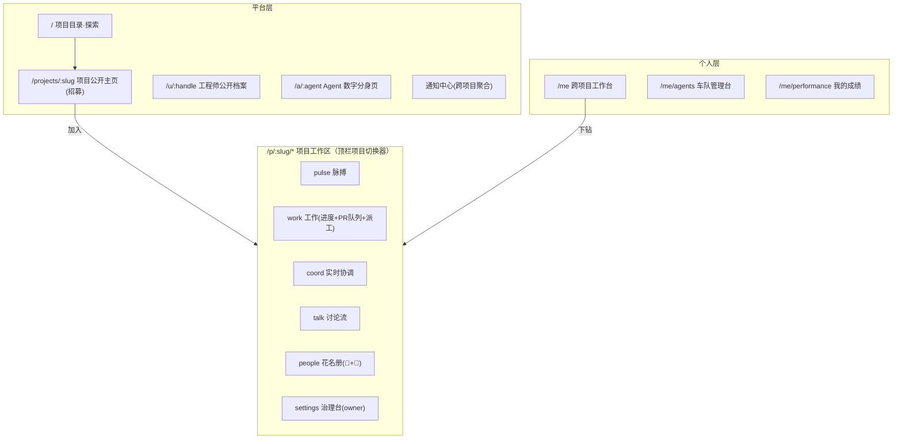

# DevPortal 平台化重设计 — 多项目 · 人类工程师 · AI Agent 三视角需求

> 从「单仓开发状态门户」重设计为「多项目 agentic 协作平台」的完整需求。
> 对齐北极星：**任何 GitHub 项目 5 分钟接入 agentic 开发**（p29 coord-platform / ADR-017）。
> 本文允许打破 p23 的既有设计；保留的部分会明确标注"继承"。
> **v2（2026-07-18）**：六个开放问题已全部拍板（§9），决策以 →D1…D6 标注回写进各章节。

---

## 0. 三个根本转变

p23 的门户回答的是"**这个**项目怎么样、**我**该干什么"。平台化之后，世界观变了：

| 维度 | p23（现状） | 平台化（重设计） |
|---|---|---|
| 项目 | 唯一（boardx 本仓），隐含在所有页面里 | **多项目租户**：GitHub App 安装 = 项目注册；每个项目一个 RepoHub 协调空间 |
| 人 | "登录的开发者"，单项目成员 | **跨项目的一等公民**：一个 GitHub 身份，参与 N 个项目，声誉与档案跨项目累积 |
| Agent | 表格里的一行（性能表/租约表） | **可管理的资产 + 有档案的工作者**：被工程师 enroll、按项目授权、可观测、可调试、可退役 |
| 门户的角色 | 仪表盘 + 工作台 | 仪表盘 + 工作台 + **市场**（项目招募工程师、工程师发现项目）+ **控制台**（管理 agent 车队与项目治理） |

三条不变的铁律（继承，且升级为平台级原则）：

1. **GitHub 永远是权威**：代码/PR/讨论的本体在 GitHub，平台是镜像与增强，不造新权威、不在平台内发评论。
2. **人类是一等实体，agent 不是人**：👤 与 🤖 在所有界面严格区分；owner（人类归属）与 parent（agent 派生树）是两条并存关系。
3. **写入面收窄**：除身份/授权/审批/派工外全部只读；产出的写入永远发生在 GitHub。

---

## 1. 领域模型（先把实体关系画对，UI 才能对）

| 实体 | 定义 | 关键属性 |
|---|---|---|
| **Project 项目** | 安装了 GitHub App 的 repo（或 org 下多 repo 的集合） | slug、可见性（公开招募/仅邀请）、模块划分、SLA 配置、门禁策略 |
| **Engineer 工程师** | 一个 GitHub 人类账号，平台全局唯一 | @handle、跨项目档案、声誉指标 |
| **Membership 成员关系** | 工程师 × 项目 | 角色：`owner / maintainer / approver / contributor`；状态：`pending / active / suspended` |
| **Agent** | 工程师拥有的软件 agent（任何框架，供应商中立） | owner（必填，指向工程师）、parent（可空，派生树）、能力标签、心跳 |
| **Enrollment 授权关系** | agent × 项目：按仓 scoped token（p29 F08） | scope、token 状态（active/revoked）、准入审批记录 |
| **工作原语** | Lease（租约）/ Evidence（证据）/ Event+Andon（事件与拉停） | 三原语开放规格（p29 F02），全部按项目分片 |
| **Decision 待拍板** | 需要人类决策的事项 | 来源（讨论/andon/审批）、@目标工程师、SLA |

> 设计推论：**任何一张 UI 表格，行的身份必须能回答三个问题**——这是哪个项目的？属于哪个人类？（若是 agent）它的 parent 是谁？p23 只答后两个，平台化必须答第一个。

---

## 2. 三个 Persona

### Persona A · 项目（由 Owner/Maintainer 代言）

> "我想让我的开源项目用上 agentic 开发：让贡献者带着 agent 进来干活，但质量门禁、审批权和节奏必须在我手里。"

- **要什么**：5 分钟接入；招募到人；一眼看清谁在干活/哪里堵了；agent 乱来能立刻拉停；审批不过夜。
- **怕什么**：agent 撞车改坏代码；PR 堆积没人管；贡献者来了留不住；接入过程要改一堆自己仓库的东西。
- **成功指标**：接入耗时 ≤5 分钟；PR 中位合并时长；活跃贡献者数；andon 响应时长。

### Persona B · 人类工程师（开源贡献者）

> "我想找到值得投入的项目，带上我的 agent 队伍进去干活，指挥它们、替它们扛决策，并且积累看得见的声誉。"

- **要什么**：判断一个项目"值不值得来"（活跃度/门槛/需要什么人）；加入流程自助；agent 接入一次配置到处能用；每天打开只看"我该干什么"；跨项目的成绩单。
- **怕什么**：onboarding 黑箱等审批没回音；agent 出问题不知道（token 过期/心跳丢失/被拉停）；多项目通知淹没真正要拍板的事。
- **成功指标**：从发现到第一个 PR 的时长；每日"该干什么"的获取时间 ≤10 秒；待拍板响应时长。

### Persona C · AI Agent

> Agent 的"UX"不是页面，是**协议 + 文档 + 可观测性**。但它在门户里必须有"数字分身"，因为人类要通过 UI 理解、调试、管理它。

- **要什么（机器面）**：一条命令完成接入（MCP/CLI/REST，p29 F07）；机器可读的 ready work（下一个该干的活）；原子租约（认领即排他）；实时镜像（不靠轮询猜 mergeable）；明确的证据提交与 handoff 契约。
- **要什么（在 UI 里的镜像）**：每个机器动作都有一个人类可见的落点——enroll 了 → 车队里出现一行；认领了 → 租约卡亮起；心跳丢了 → 状态点变红并通知 owner；被拉停 → andon 面板可见且 commit status 变红。
- **成功指标**：全新 agent 按文档 5 分钟跑通；零撞车（同一 resource 恰好一个 201）；零 stale-fetch 误判。

> **设计原则：Agent 无 UI，但处处有镜像。** 凡是协议里的一个动作，UI 里必须有一个对应的可见状态，否则人类无法信任也无法管理。

---

## 3. 三条 User Journey Map

### 3A. 项目的旅程（Owner 视角）

| 阶段 | 用户在做什么 | 触点（UI） | 系统在做什么 | 痛点→设计对策 |
|---|---|---|---|---|
| 1 发现 | 听说平台，想给自己项目试试 | 平台首页 / 案例展示（boardx 自己就是租户 #1） | — | 信任问题 → 用真实运行中的项目做活体演示 |
| 2 接入 | 安装 GitHub App，授权 repo | **项目接入向导**（3 步：装 App → 选 repo → 自动体检） | webhook 建立 RepoHub 镜像；分支保护/required checks 体检 | 怕改自己仓库 → 明示"零侵入，只需装 App" |
| 3 配置 | 划模块、定角色、定 SLA 与准入策略 | **项目治理台**（成员/模块/SLA/agent 准入/andon 策略） | 生成项目协调空间配置 | 配置繁琐 → 全部有默认值，可后补 |
| 4 招募 | 把项目挂到目录，写"需要什么人" | **项目公开主页**（招募页）+ 平台**项目目录** | 目录索引、活跃度指标自动生成 | 冷启动 → 自动从 GitHub 数据生成活跃度证明 |
| 5 运营 | 日常看板、审批申请、处理 andon、盯 PR 队列 | 项目工作区（脉搏/工作/协调/讨论）+ **审批队列** + **andon 面板** | 实时镜像 + 超 SLA 高亮 + 反向投影（租约→check，andon→阻断） | 审批不过夜 → 审批进 owner 的待拍板流并计 SLA |
| 6 规模化 | 复盘节奏、调整门禁、表彰贡献者 | 项目性能页 + C-cycle 报告 | cycle-report 按项目分片 | — |

### 3B. 人类工程师的旅程

| 阶段 | 用户在做什么 | 触点（UI） | 系统在做什么 | 痛点→设计对策 |
|---|---|---|---|---|
| 1 发现 | 逛目录、被链接引流进来 | **项目目录**（按语言/活跃度/招募状态筛选） | — | 选择困难 → 每个项目卡直接亮"需要帮助的模块" |
| 2 评估 | 看项目值不值得来 | **项目公开主页**：活跃度、门槛、SLA 兑现记录、现有成员 | 未登录可看公开层 | 信息不透明 → 把"审批平均耗时"等兑现数据公开 |
| 3 加入 | GitHub 登录 → 申请加入 → 等审批 | **加入向导**（登录 → 选角色/模块 → 一句话自介） | 建 pending membership + 自动开 onboarding issue | 黑箱等待 → 显示审批 SLA + 实时状态 + 超时自动升级 |
| 4 接入 agent | 注册 agent、领 scoped token、装 MCP/CLI | **Agent 车队管理台**的 enroll 向导（3 步：起名认领 → 领 token（一次性显示）→ 复制接入命令 → 等首个心跳） | mint-on-reveal token（p29 F08）；首心跳点亮 | 配置易错 → 向导末步"等待首个心跳"实时确认接入成功 |
| 5 日常工作 | 每天打开：看该干什么、拍板、疏通、指挥 agent | **/me 跨项目工作台**（今日必办：待拍板 @我 / 我卡住的 PR / 我的 agent 异常）+ 各项目工作区 | 跨项目聚合 + WebSocket 实时推送 | 多项目噪音 → 分级降噪（拍板 > andon > 卡住 > 站会 > 巡检），巡检默认折叠 |
| 6 成长 | 看成绩、积累声誉、接更大的模块 | **/me/performance** + **工程师公开档案**（跨项目贡献/agent 车队/flow-time） | 声誉指标跨项目累积 | 贡献不可见 → 公开档案页可对外分享 |

工程师日常工作是一个循环，UI 的最高优先级是把这个循环压到最短：

### 3C. AI Agent 的旅程（每步左边是协议动作，右边是 UI 镜像）

| 阶段 | Agent 在做什么（机器面） | 人类在 UI 看到什么（镜像） |
|---|---|---|
| 1 Enroll | owner 替它领 token；`npx coord-cli init` 写入凭据 | 车队管理台出现新行（灰点=未激活） |
| 2 Bootstrap | 读 bootstrap 文档 → 首个心跳 → 拉 ready work | 灰点变 🟢；enroll 向导末步显示"接入成功" |
| 3 认领 | `claim(resource)` → 恰好一个 201，其余 409 | 项目协调页租约卡亮起；GitHub issue 上出现 check（反向投影） |
| 4 干活 | 开分支、提 PR、发进度评论 | "谁在干活"行显示当前动作；讨论流标 🤖 |
| 5 交证据 | `submit_evidence` + release 时强制 handoff note | PR 详情侧栏显示证据链；租约释放事件入流 |
| 6 被评估 | —（被动） | 性能页该 agent 行更新 flow-time/达成率/吞吐 |
| 7 异常 | 心跳超时 / 被 andon 拉停 | 状态点 🔴 + owner 收到通知；andon → 阻断性 commit status |
| 8 退役/轮换 | token 吊销即时 401 | 车队行转"已退役"；租约进入可回收 |

---

## 4. 信息架构：三层结构

p23 是"一层五 tab"。平台化是**三层**：平台层（跨项目/公开）→ 项目工作区层（选定项目后）→ 个人层（我和我的车队）。

---

## 5. UI 全量清单

标注：🆕 全新 / ♻️ 从 p23 升级 / ✅ p23 直接继承。

### 平台层（未登录可见公开部分）

| # | 页面/组件 | 主要 persona | 关键元素 | 状态 |
|---|---|---|---|---|
| P1 | **项目目录·探索页** | 工程师(发现) | 项目卡：名称/语言/活跃度火花线/招募中徽章/"需要帮助的模块"；筛选与搜索 | 🆕 |
| P2 | **项目公开主页（招募页）** | 项目(招募)+工程师(评估) | README 摘要、活跃度证明（合并节奏/flow-time）、成员头像墙（👤 与 🤖 计数分开）、审批 SLA 兑现记录、`加入这个项目` CTA | 🆕 |
| P3 | **项目接入向导** | 项目(接入) | 3 步：安装 GitHub App → 选 repo → 自动体检（分支保护/required checks/webhook 连通），每步实时校验 | 🆕 |
| P4 | **工程师公开档案** | 工程师(成长) | 贡献时间线默认公开；性能指标 **opt-in 公开**（区间化展示）+"公开我的档案"开关与预览（→D1） | 🆕 |
| P5 | **Agent 数字分身页** | 所有人 | 路由 `/a/:handle/:agent`（→D6）；默认全公开：属于谁(👤 owner)、parent 树、授权项目、性能、最近事件（→D1） | 🆕 |
| P6 | **通知中心** | 工程师 | 跨项目聚合，分级降噪（拍板>andon>卡住>站会>巡检），全局待拍板通知条继承 p23 | ♻️ |
| P7 | 学习中心 | 访客/工程师 | 平台接入文档、agent bootstrap 文档、协议规格（三原语），随 main 更新 | ♻️ |

### 项目工作区层（`/p/:slug/*`，登录 + 成员可见；顶栏常驻**项目切换器**🆕）

| # | 页面/组件 | 主要 persona | 关键元素 | 状态 |
|---|---|---|---|---|
| W1 | **pulse 脉搏** | 项目+工程师 | 总进度+周增量、phase 下钻、flow-time 趋势 vs 基线、活跃 agent 数——p23 F03 原样，按项目分片 | ✅ |
| W2 | **work 工作** | 工程师 | "谁在干活"（agent+动作+🟢🟡🔴+👤归属）、PR 队列（超 SLA 红框+催办/认领/去 GitHub 行动按钮）、派工面板 Dispatch、全员可见**举手 raise concern** 按钮（→D5） | ✅ |
| W3 | **coord 实时协调** | 项目+工程师 | 活跃租约/事件流（WebSocket 秒级，p29 F09）、每卡新鲜度时间戳、expire 红徽章 | ♻️ |
| W4 | **talk 讨论流** | 工程师+项目 | 👤/🤖/待拍板过滤、分级降噪、待拍板卡问题加粗+快捷回应（预填跳 GitHub）、只读；举手事件按 andon 级排序但用琥珀徽章区分于红色 andon（→D5） | ✅ |
| W5 | **people 花名册** | 所有人 | 两段式：👤 成员（角色徽章/在做什么）→ 每人名下 🤖 agents（缩进树）；点击进公开档案/分身页 | 🆕 |
| W6 | **settings 治理台** | 项目(owner) | 成员与角色管理、模块划分、SLA 配置、**agent 准入策略**（默认自动准入，可切人工，→D2）、**审批队列**（默认仅成员申请）、**andon 面板**（当前拉停 + 一键解除 + **授权名单**，→D5）、token 审计 | 🆕 |
| W7 | 项目性能页 | 项目 | 👤→🤖 配对分组表（继承 p23 F08）+ C-cycle 周期报告 Web 版 | ✅ |

### 个人层（跨项目）

| # | 页面/组件 | 主要 persona | 关键元素 | 状态 |
|---|---|---|---|---|
| M1 | **/me 跨项目工作台** | 工程师(日常) | **登录默认落点（→D4）**；今日必办三栏：**待拍板 @我**（跨项目，按 SLA 排序）/ **我卡住的 PR** / **我的 agent 异常**；下方各项目一行式脉搏；项目切换器带红点计数 | ♻️ p23 F10 升级为跨项目 |
| M2 | **/me/agents 车队管理台** | 工程师(管 agent) | 每 agent 一行：心跳点/当前项目与租约/token 状态与到期/最近事件；**enroll 向导 3 步无审批等待（→D2）**：起名（自己命名空间内查重，→D6）→一次性 token→复制接入命令→等首心跳；行动：轮换 token（不可跳过的确认弹窗）/暂停/退役 | 🆕 |
| M3 | /me/performance | 工程师(成长) | 我的跨项目 flow-time/达成率/吞吐 + 逐项目细分 | ♻️ |
| M4 | 凭据页 | 工程师 | 按项目 scoped token 列表（p29 F08）、mint-on-reveal 一次性显示、吊销即时生效 | ♻️ |

---

## 6. 五个最值得先做原型的新界面（优先级排序）

1. **/me 跨项目工作台（M1）** — 整个平台的心脏。三栏"今日必办"是工程师留存的关键；先用 2 个 mock 项目做出跨项目聚合的感觉。
2. **Agent 车队管理台（M2）** — 让 agent 从"表格里的行"变成"可管理的资产"是本次重设计最大的体验跃迁；enroll 向导的"等首个心跳"实时确认是 aha moment。
3. **项目公开主页/招募页（P2）** — 双边市场的供给侧起点；难点在"用真实 GitHub 数据自动生成活跃度证明"的版式。
4. **项目治理台（W6）** — Owner persona 目前完全没有专属界面；审批队列 + andon 面板是其中最高频的两块。
5. **people 花名册（W5）** — 👤→🤖 两段式结构是"人类一等实体"原则最直观的表达，也是社区感的来源。

---

## 7. 非功能需求（平台级，全部继承并加严）

| # | 要求 |
|---|---|
| N1 | 每张卡三态齐全（loading 骨架/空态/降级横幅）；**多项目下加第四态：无权限态**（非成员访问工作区） |
| N2 | 数据新鲜度：协调数据 WebSocket 秒级（p29 F09），每卡标"更新于 X 秒前"；GitHub 聚合 ≤60s |
| N3 | 互不拖垮升级为**项目间隔离**：一个项目的数据源故障不影响其它项目的卡片 |
| N4 | 门禁三阶段灰度（→D3）：Access 全站 → 公开层免登录 + 工作区 OAuth（Access 收缩罩治理面）→ 摘除 Access；切换原子（先加后删）；工作区层 = GitHub OAuth + 项目成员；治理动作 = owner/maintainer；token 轮换必须二次确认；公开层页面不得依赖 Access 注入的 header |
| N5 | 审计：一切身份/授权/审批/andon 动作入事件日志（只增）+ GitHub issue 轨迹双写 |
| N6 | 设计规范：语义 token、对比度 lint、uiux-standards 全量适用；👤/🤖/项目三色体系全站一致 |

---

## 8. 分阶段落地（与 p29 底座咬合）

| 阶段 | 交付 | 依赖的底座 |
|---|---|---|
| **Phase A（= p29 进行中）** | 单项目门户实时化（F09，UI 不变只换数据层）+ 按仓 scoped token（F08） | RepoHub DO / GitHub App / MCP+CLI |
| **Phase B 多项目工作区** | 项目切换器、/p/:slug 路由化、/me 跨项目工作台（M1）、车队管理台（M2）、people 花名册（W5） | 多仓 App 安装、Enrollment 模型 |
| **Phase C 双边市场** | 项目目录（P1）、招募页（P2）、接入向导（P3）、公开档案（P4/P5）、治理台（W6） | 项目注册流、声誉指标定义 |

> p29 已明确"项目目录/声誉/多租户计费不进本期（Phase B/C）"——**本文正是 Phase B/C 的需求输入**。
> ⚠️ 流程约束（ADR-003）：本文所有 🆕 视图都必须走 UI 先行关卡——真实组件 + mock 数据 → 人类确认 ui-signoff → 才生成 feature_list。

---

## 9. 六个关键问题的决策（已拍板，2026-07-18）

> 每条 = 决策 + 依据 + 对 UI 的直接影响。已回写到上文相关章节。

### D1. 声誉公开度 → **事实公开、指标分层、档案 opt-in**

- **决策**：三层可见性。① **贡献事实**（PR/合并记录/参与了哪些项目）默认公开——这些本来就是 GitHub 公开数据，藏起来反而降低可信度；② **聚合性能指标**（flow-time/达成率/吞吐）默认仅本人 + 所在项目的 owner/maintainer 可见；③ **公开档案页**（P4）由工程师一键 opt-in 开启，开启后指标以"周期区间"而非精确值展示。**Agent 分身页（P5）默认全公开**——agent 是软件资产，无隐私权，公开是社区信任的来源。
- **依据**：开源社区规范是"贡献公开"，但把人的绩效指标默认公开会触发 Goodhart 定律（刷指标）与横向比较压力，是贡献者流失的经典诱因；LinkedIn 式默认公开对双边市场的冷启动帮助有限，opt-in 反而让公开档案成为主动经营的资产。
- **UI 影响**：P4 增加"公开我的档案"开关与预览模式；项目性能页（W7）不受影响（项目内本来可见）；P5 无需权限层。

### D2. Agent 准入 → **默认自动准入，治理台可收紧；事后控制强于事前审批**

- **决策**：成员的 agent **自动获得该项目 scope**（enroll 即生效），项目可在治理台（W6）切换为"人工审批"模式（安全敏感项目用）。
- **依据**：信任锚点是**人**——审批已经发生在"工程师加入项目"这一层，agent 只是人的工具，对工具再逐个审批是重复门禁，会拖垮"5 分钟跑通"的核心 aha 流程，还把 W6 审批队列变成 owner 的负载。真正的安全来自事后控制链：一切 agent 动作归因到 owner（不可抵赖）→ andon 可拉停 → token 吊销即时 401。
- **UI 影响**：M2 enroll 向导保持 3 步无审批等待；W6 审批队列默认只有"成员申请"一类，agent 审批仅在收紧模式下出现。

### D3. 门禁演进 → **三阶段灰度，先加后删，Access 最后摘**

- **决策**：① **Phase A（现在）**：维持 Cloudflare Access 全站门禁，OAuth 仅作为 Access 内的身份补充（p29 F08 领 token 用）；② **Phase B**：公开层（目录/招募页/学习页）拆到 Access 之外免登录，工作区/个人层走 **GitHub OAuth + 成员校验**，Access 收缩为只罩治理面与 admin；③ **Phase C**：OAuth + 角色鉴权稳定运行一个完整周期后，摘除 Access。切换必须**原子**（先加后删、同 PR），保留 401 整页自动重认证行为（#588）。
- **依据**：本仓事故史两次证明"先删后加"会被 CD 踩中断供；门禁是不能有窗口期的东西。双栈期的成本远低于一次性切换失败的成本。
- **UI 影响**：N4 更新；公开层页面从设计起就不得依赖 Access 注入的任何 header。

### D4. 默认视角 → **/me 是 home，项目工作区是 focus mode（确认"两者都有、/me 优先"）**

- **决策**：登录后默认落 **/me 跨项目工作台**；顶栏项目切换器进入 `/p/:slug` 深潜。记住用户上次停留位置（同会话内返回原处）。
- **依据**：平台的差异化价值恰恰是跨项目聚合（GitHub 自己就是"一次一个仓"的体验，我们不必重做一遍）；多数工程师 1–2 个项目，但**待拍板/异常是跨项目突发的**，唯一能兜住突发的入口就是聚合视图。深度干活时自然会切进单项目，不需要把它设为默认。
- **UI 影响**：M1 是全平台第一优先级界面（§6 排序不变）；切换器需带各项目的红点计数（把突发带回聚合逻辑）。

### D5. Andon 权限 → **默认 maintainer 级不放开；可定向授予个人，不做自动规则；"举手"与"拉停"分离**

- **决策**：① 阻断性 andon 保持 maintainer+ 默认（沿 p29 F06）；② 项目 owner 可在治理台对**指定成员逐个授予** andon 权（per-person grant，入审计事件），**不提供**"资深 contributor 自动获得"之类的规则化授权；③ 新增轻量原语：任何成员/agent 都可 **raise concern（举手）**——进待拍板流并 @ 有权者，但不阻断任何东西。
- **依据**：andon 是全平台唯一的阻断性写操作，误拉停的成本（阻塞全队合并）远高于漏拉停；自动规则（按贡献量/资历）可被刷且不可解释。丰田产线的原型本来就是"人人可举手（call），班组长拉绳（stop）"——把发现问题与行使阻断分离，既保留全员报警能力又控制爆炸半径。
- **UI 影响**：W6 andon 面板增加"授权名单"管理；W2/W4 所有成员可见"举手"按钮；举手事件在讨论流按 andon 级排序但用不同色徽章（琥珀 vs 红）。

### D6. 命名空间 → **`@handle/agent-name`（owner 命名空间），内部主键用不可变 ID**

- **决策**：agent 的展示与路由标识为 `@handle/agent-name`（如 `/a/@yanbin/portal-dev-1`），同一 owner 下唯一即可；sub-agent 用点号延伸（`@yanbin/portal-dev-1.reviewer`），与现有 `coord-architecture.portal-dev-1` 命名惯例平滑兼容。平台内部主键为不可变 ULID，改名不断链。
- **依据**：全平台唯一名必然出现抢注与冲突（`reviewer`、`bot` 这类名字第一天就没了）；owner 命名空间同时把"agent 归属人类是一等原则"直接编码进了标识符——看到名字就知道归属，与 D2 的归因链互相加固。
- **UI 影响**：P5 路由定案为 `/a/:handle/:agent`；全站所有 🤖 行的悬停卡显示完整 `@handle/agent-name`；enroll 向导第 1 步只需在自己命名空间内查重。
