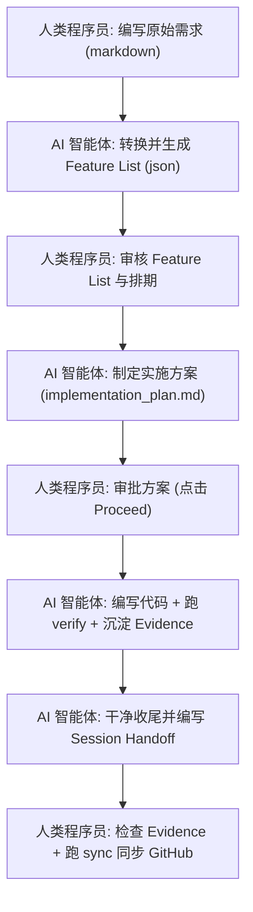

# 人机协同开发指南：Harness Engineering 设计哲学与实操手册

本文旨在帮助团队中的**程序员（人类开发者）**理解本脚手架（基于 Harness Engineering 规范）的设计理念，并掌握如何高效地与 AI 智能体（Agent）协作进行软件开发。

有关脚手架的基础启动步骤，请先阅读 [README.md](file:///Users/shenyanbin/Downloads/harnessdemo4/boardx-dev-template/README.md)。有关 Agent 的详细执行规则，请参阅 [AGENTS.md](file:///Users/shenyanbin/Downloads/harnessdemo4/boardx-dev-template/AGENTS.md)。

---

## 一、 为什么这样设计？（设计哲学与痛点）

在传统的“人机对话式开发”中，程序员通常会遇到以下痛点：
1. **上下文丢失与幻觉**：AI 无法长期记住人类对它说的话。当人类开辟新会话时，AI 丢失了之前的语境，极易写出与现有系统冲突的代码。
2. **“假 Passing”现象**：AI 常常自我感觉良好，声明“代码已经写完，应该可以运行了”，但实际上由于缺少端到端的测试，代码一跑就崩。
3. **漫无目的的过度重构**：当 AI 拥有全盘修改代码的权限时，可能会出于某种“洁癖”大范围重构，破坏不相关的模块，引入难以排查的 Regression（回归 Bug）。
4. **协作信息差**：人类不清楚 AI 当前在改哪个文件，AI 也不清楚人类的真实意图，双方在零散的 Chat 窗口里贴代码，低效且易错。

为了解决上述问题，本脚手架引入了 **Harness Engineering（控制夹具工程）**。其核心理念是：**用严格的约束换取可预测的质量，以结构化的文件为唯一事实来源，建立人机互信的协作契约。**

### 1. 仓库即唯一事实来源 (Git as the Single Source of Truth)
AI 没有大脑中的长期记忆，因此我们将所有的状态、任务、需求、交接信息全部落盘为 Git 仓库中的文件：
* **需求定义**：写在各阶段的 `requirements/` 文件夹下。
* **功能清单**：作为权威来源记录在 `phases/<phase>/feature_list.json` 中。
* **开发进度**：记录在当前 Sprint 的 `progress.md`。
* **会话交接**：跨会话的上下文交接写在 `session-handoff.md`。

AI 每次启动，只需读取仓库中的这些结构化文件，就能在 3秒内恢复完整的语境，消除了人机之间的信息不对称。

### 2. 严格的完成定义 (Definition of Done, DoD)
一个功能（Feature）写完与否，不由 AI 说了算，也不由人类的肉眼粗略评估，而是由严苛的 **DoD 契约**决定。必须同时满足以下条件：
1. **用户可见行为** (`user_visible_behavior`) 描述的行为真实可见、端到端可复现。
2. 该 Feature 的每一条 **验证命令** (`verification`) 都执行成功（退出码为 0）。
3. **证据** (`evidence`) 已写入指定目录（包含命令输出、执行日志或浏览器截图）。
4. 本地基础验证 [init.sh](file:///Users/shenyanbin/Downloads/harnessdemo4/boardx-dev-template/init.sh) 依然通过，确保未引入新的回归错误。

> [!IMPORTANT]
> **没有证据 = 没有完成**。在 Harness 体系中，“代码写完了”或“看起来能跑”都不是完成的标志。

### 3. 一次只做一个 Feature & 范围纪律 (Scope Discipline)
AI 具有极强的并发探索欲，这在软件开发中很容易导致代码库失控。因此：
* **单 Feature 限制**：同一时刻，对于一个 owner 而言，只能有一个 Feature 的状态为 `in_progress`。这避免了多 Feature 交叉修改导致的代码冲突。
* **范围纪律**：AI 只被允许修改当前 Feature 涉及的文件，禁止顺手重构无关区域，从而把变动控制在最小的安全边界内。

### 4. 只读的状态流转与 verify 门控
在 `feature_list.json` 中，Feature 的 `passing` 状态是只读的，禁止人类或 AI 手动修改。唯一的流转途径是通过执行验证命令：
```bash
pnpm harness verify --sprint <phase_id>/<sprint_id>
```
该命令会自动运行所有的 Verification。只有当所有断言全部成功时，验证脚本才会把状态更新为 `passing`。这杜绝了口头承诺和欺骗性提交。

---

## 二、 程序员如何与 AI 协作？（协作流程）

在这个脚手架中，人类程序员与 AI 是**双驾驶员（Co-Pilots）**关系。人类是**架构师、需求定义者、方案审批者、最终验证人**，而 AI 是**执行者、自动测试编写者、代码实现者**。



### 阶段 1：需求录入与功能定义 (Requirements & Features)
1. **编写原始需求**：程序员在 `phases/<phase_id>-<name>/requirements/` 下新建 Markdown 文件（如 `auth.md`），用大白话或用户故事描述希望实现的功能。
2. **转换功能清单**：运行需求分析智能体（例如通过 `pnpm harness new-phase`），它会读取 `requirements/` 下的全部 Markdown，自动生成 `feature_list.json`。每个 Feature 都会带上：
   - 唯一标识（如 `F01`）。
   - `user_visible_behavior`：描述用户能看到什么。
   - `verification`：具体的、可执行的 shell 验证命令。
3. **审核验证方案**：程序员检查自动生成的验证命令是否合理、是否防范了假阳性（即避免只检查“进程没崩”，而是检查“产出符合预期”）。关于验证的具体标准，可参考 [.harness/instructions/testing-standards.md](file:///Users/shenyanbin/Downloads/harnessdemo4/boardx-dev-template/.harness/instructions/testing-standards.md)。

### 阶段 2：排期与方案制定 (Sprint Planning & Design)
1. **规划 Sprint**：通过以下命令分配 Feature 到具体的 Sprint 中：
   ```bash
   pnpm harness new-sprint --phase 02 --id 01 --goal "目标描述" --features F01,F02
   ```
2. **制定实施方案**：AI 接手 Sprint 中 `in_progress` 的 Feature，在开始写代码前，必须先在 `artifacts` 目录中生成 `implementation_plan.md`（实施计划）。
3. **人类方案审批**：程序员阅读实施计划，审查设计思路。如果同意，在 IDE 中点击 `Proceed` 批准 AI 开始写码。**严禁 AI 绕过方案审批直接写码。**

### 阶段 3：执行与验证 (Code & Verify)
1. **自动编码**：AI 按照批准的方案修改代码平面（[apps/](file:///Users/shenyanbin/Downloads/harnessdemo4/boardx-dev-template/apps) 或 [packages/](file:///Users/shenyanbin/Downloads/harnessdemo4/boardx-dev-template/packages) 目录下的代码）。
2. **自动验证与留证**：AI 运行 `pnpm harness verify` 跑通该 Feature 的验证命令。如果是 Web 项目，AI 会调用浏览器走真实路径，并将截图或终端输出存入 `evidence/`。
3. **防回归验证**：AI 必须确保根目录的 [init.sh](file:///Users/shenyanbin/Downloads/harnessdemo4/boardx-dev-template/init.sh) 依然通过。

### 阶段 4：干净收尾与会话交接 (Handoff & Sync)
1. **清理工作区**：AI 检查并清理临时垃圾文件，确保开发环境整洁。
2. **撰写交接报告**：AI 自动更新当前 Sprint 的 `progress.md` 并撰写 `session-handoff.md`。
3. **同步进度**：程序员 review AI 提交的 evidence、代码 diff 以及交接报告。满意后，在本地运行：
   ```bash
   pnpm harness sync --phase <phase_id> --apply
   ```
   这会将本阶段的进度、Issue 以及 feature 状态单向同步到 GitHub 仓库中，对团队其他成员可见。

---

## 三、 程序员必备守则（如何避免把 Harness 搞乱）

为了让这套自动化脚手架最大化发挥威力，程序员在日常协作中需要遵守以下守则：

> [!WARNING]
> **守则一：绝对不要手动修改 `active-features.json` 或 `feature_list.json` 中的状态**
> 所有的状态变迁必须依赖 `verify` 机制的退出码。手动修改状态会造成“假 Passing”，破坏人机信任。

> [!IMPORTANT]
> **守则二：当 `init.sh` 失败时，优先修复基础**
> 若基础验证失败，说明主干已坏。在此之上继续开发 Feature，会导致 bug 连环叠加，AI 极易迷失。

> [!TIP]
> **守则三：认真编写原始需求 (Requirements)**
> 垃圾输入，垃圾输出（Garbage in, garbage out）。如果给 AI 的需求描述极其模糊，AI 自动生成的 verification 命令就会毫无价值。

> [!NOTE]
> **守则四：扮演好“破障者” (Blocker Breaker) 的角色**
> AI 运行在沙盒中，它无法处理一些底层依赖问题、服务器配置、缺失的 API Key 或是网络代理。当 AI 遇到无法解决的外部环境障碍并在 handoff 中求助时，程序员应当及时出手干预。

---

## 四、 系统架构总览：代码平面与控制平面

为了实现业务系统的稳健运行与人机协作的无缝衔接，脚手架在系统架构上划分为两大阵营。具体架构设计与代码规范详见 [.harness/instructions/architecture.md](file:///Users/shenyanbin/Downloads/harnessdemo4/boardx-dev-template/.harness/instructions/architecture.md)。

```mermaid
graph LR
    subgraph 控制平面 (.harness)
        A[new-phase / new-sprint] --> B[Implementation Plan]
        B --> C[verify / evaluator]
        C --> D[session-handoff / sync]
    end

    subgraph 代码平面 (apps & packages)
        E[apps/orchestrator] --> F[packages/agent-core]
        F --> G[packages/tools]
        F --> H[packages/memory]
    end

    C -- 运行验证 --> E
```

### 1. 代码平面 (运行时业务)
即被构建的系统本身（一个多 Agent 推理系统），它存放在 [apps/](file:///Users/shenyanbin/Downloads/harnessdemo4/boardx-dev-template/apps) 与 [packages/](file:///Users/shenyanbin/Downloads/harnessdemo4/boardx-dev-template/packages) 目录下：
* **`apps/orchestrator`** (智能体编排器)：业务入口，负责接收任务、规划、调度子能力及汇总结果。
* **`packages/agent-core`** (推理核心)：智能体内核，实现基本的推理循环（plan $\rightarrow$ act $\rightarrow$ observe）与会话状态管理。
* **`packages/tools`** (工具包)：业务智能体所调用的受限工具集合（如 shell、信息检索、API 适配），遵循“最小权限”默认拒绝原则。
* **`packages/memory`** (记忆状态)：持久化短期工作记忆与长期状态，不依赖内存，确保可跨会话恢复。

### 2. 控制平面 (协作夹具)
即用于辅助人机协同的 Harness 机制，主要存放在 [.harness/](file:///Users/shenyanbin/Downloads/harnessdemo4/boardx-dev-template/.harness) 目录下。它不参与业务运行，仅在开发期间为人类与 AI 协作提供规范约束、自动验证、进度审计等工程保障。

---

## 五、 全套子智能体 (Subagents) 职责说明

在 Harness 协作体系中，主 Agent 不会全盘执行所有高噪音或高度敏感的步骤，而是会按需唤醒六个专门的 **Subagents (子智能体)**。每个 Subagent 都在一个**只读、隔离的上下文**中运行，以防主对话被大量日志污染或出现“自我偏袒”：

| Subagent 配置文件 | 角色名称 | 核心职责 |
| :--- | :--- | :--- |
| [codebase-researcher.yaml](file:///Users/shenyanbin/Downloads/harnessdemo4/boardx-dev-template/.harness/agents/codebase-researcher.yaml) | **代码勘探员** | 负责只读的代码搜索（grep/find），在隔离上下文中分析“现有实现”和“推荐位置”，给主线程回传精准的现状摘要。 |
| [code-reviewer.yaml](file:///Users/shenyanbin/Downloads/harnessdemo4/boardx-dev-template/.harness/agents/code-reviewer.yaml) | **代码审查员** | 对即将提交的 git diff 进行只读审查，输出红黄绿问题清单，严防破坏 Harness 不变量或范围纪律。 |
| [test-runner.yaml](file:///Users/shenyanbin/Downloads/harnessdemo4/boardx-dev-template/.harness/agents/test-runner.yaml) | **测试执行器** | 执行 verify/单元测试，将千万行的测试日志写入 `evidence/` 目录，仅向主线程汇报退出码与错误摘要。 |
| [e2e-verifier.yaml](file:///Users/shenyanbin/Downloads/harnessdemo4/boardx-dev-template/.harness/agents/e2e-verifier.yaml) | **端到端活体验证员**| 负责拉起服务，模拟真实的用户路径走一遍（甚至调无头浏览器交互），捕获真实响应，证明功能“活体端到端”可见。 |
| [feature-evaluator.yaml](file:///Users/shenyanbin/Downloads/harnessdemo4/boardx-dev-template/.harness/agents/feature-evaluator.yaml) | **功能评审员** | 贯彻“干活与检查分离”原则，没有实现历史包袱，按照 `evaluator-rubric.md` 规范给 Feature 的产出进行六维客观打分。 |
| [quality-auditor.yaml](file:///Users/shenyanbin/Downloads/harnessdemo4/boardx-dev-template/.harness/agents/quality-auditor.yaml) | **质量审计员** | 仅有 `.harness/state/` 写入权限，审计控制平面自身的健康度，跑控制变量承重实验，去除冗余脚手架。 |

---

## 六、 常用协作技能 (Skills)

除了 Subagents 之外，脚手架在控制台提供了 12 个可自动发现的系统级 **Skills (技能卡片)**。这些 Skill 固化了开发模式，能够被 AI 主动读取和执行：

1. **`requirement-author` (需求转列表)**：将程序员在 `requirements/` 中写的白话文需求，编译生成带可执行验证命令的结构化功能清单（`feature_list.json`）。
2. **`sprint-planner` (Sprint 计划)**：对功能清单进行依赖和并行性分析，切分并分配到指定 Sprint。
3. **`verification-writer` (验证设计)**：为 Feature 编写精确、防假阳性的 shell 验证断言（如 curl 后置判断、数据库轮询状态等）。
4. **`feature-implementer` (Feature 推进)**：指引 Agent 遵守“先有验证再改码，自测证据要落盘”的开发防线。
5. **`session-closer` (会话关闭)**：会话行将结束时，校验 `clean-state-checklist.md` 以清理所有临时和残留文件。
6. **`session-handoff` (会话交接)**：自动起草 `session-handoff.md` 报告，交代本次成果与阻碍，确保下一次开机无缝接轨。
7. **`github-projector` (GitHub 同步)**：包装 `harness sync` 工具，单向地将本地 phases/sprints/features 进度投影同步到 GitHub issue。
8. **`harness-workflow` (工作流实操)**：提供最完整的工作流指南（开工、验证、交接的标准指令顺序）。
9. **`adr-author` (决策记录)**：规范团队的 ADR (Architecture Decision Record) 技术选型模板。
10. **`agentic-development` (Agent 规范)**：管理智能体运行时的内存、计划以及可观测性规范。
11. **`harness-auditor` (承重审计)**：对 harness 脚手架本身进行承重安全测试。

---

通过这套机制，人类可以将繁琐的编码、测试和记录工作交给 AI，同时用严格的文件和断言机制把控最终的交付质量。这不仅能提高团队的研发效能，更能确保系统架构在人机高频协作中保持健康、有序。
