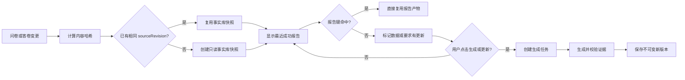

# Survey Versioned Report Architecture

## Decision

Survey 专业报告采用“版本化事实库快照 + 临时分析工作区 + 不可变报告产物”。
F16 先交付精简 UI、事实库修订和按需生成；F17 在独立 PR 中接入 Deep Agents/LangGraph。

这项拆分让每个 feature 都能独立验收，并避免把 UI、数据迁移、缓存语义和新的 agent runtime
一次性塞进同一个 PR。

## Why

报告不是实时仪表盘。新答卷到达后持续调用模型成本高，也会让同一个报告链接的内容无审计地变化。
专业研究报告更需要稳定事实基础、可追溯假设、明确数据截止点和可复现版本。

公开咨询研究方法强调：

- 建立广泛且一致的事实基础。
- 记录假设，并用新证据持续检验。
- 把分析综合为面向决策的执行摘要。

本设计借鉴这些公开方法，不推断或声称复刻任何机构的内部 AI 技术实现。

## End-to-end Flow



## Durable and Ephemeral Boundaries

### Durable

- `sourceRevision` 和 `contentHash`。
- 只读事实库快照及 manifest。
- 报告要求、`requirementHash` 和 `templateVersion`。
- 成功/失败任务元数据。
- 不可变报告版本、证据索引和最近成功版本指针。

### Ephemeral

- 单次生成的分析计划、检索结果、工作笔记和模块中间输出。
- F17 的 LangGraph `StateBackend` 工作区。
- 可由来源修订和要求重新构建，不作为审计事实来源。

因此，并非每次查看或生成报告都重新构建源文件。只有源内容变化才创建新快照；
只有缓存未命中且用户主动生成时才创建临时分析工作区。

## Stable Identities

```text
sourceRevision = hash(schemaVersion + normalizedSurvey + normalizedResponses)
requirementHash = hash(
  normalizedTitle +
  outputType +
  chartTemplateId? +
  normalizedNaturalLanguageRequirement
)
artifactKey = sourceRevision + requirementHash + templateVersion
reportVersion = immutable identifier for a successful generated artifact
```

- 归一化必须稳定排序，避免数据库返回顺序造成无意义新修订。
- `requirementHash` 必须包含归一化后的章节标题、唯一输出类型（`image`、`chart` 或
  `text`）、图表章节归一化后的有效白名单 `chartTemplateId`，以及归一化后的自然语言要求；
  仅图片或文本章节省略 `chartTemplateId`。
- 不把 `generatedAt` 放入内容哈希。
- 数据库记录变化但分析语义不变时不应产生新修订。
- 失败任务可以重试，但不能覆盖同键的成功产物。
- 生成权必须在创建会话和调用模型前，按完整 `artifactKey` 原子抢占。只有一个请求可以成为
  生成者；同键并发请求若已有成功产物则直接复用，若仍在生成则返回 `202 in_progress`，
  不能再创建分析会话或调用模型。
- 生成 claim 持久化保存会话与产物引用；异常退出时释放，超过租约时间的遗留 claim 可被后续
  请求接管。成功完成时 claim 与不可变产物一并进入 ready 状态。

## Compatibility and Migration

- 读取旧章节时，若 `outputType` 缺失或不是有效的 `image`、`chart`、`text`，必须归一化为
  `text`，以保持既有章节的文本生成语义。
- 迁移期旧 `inputModes` 只保留为单值兼容投影：最多保留一个与归一化后 `outputType` 对应的
  值，不能继续表示多输出或驱动新契约；新保存的数据不再依赖该字段。
- 旧章节的模块提示合并为自然语言要求；既有成功报告继续可读，迁移不得覆盖不可变产物。
- 旧产物即使包含原始文本答卷，返回浏览器前也必须经过兼容脱敏；报告正文、导出与历史版本
  只暴露聚合证据和结论，不暴露逐份原始回答。

## Chart Contract and Persistence Safety

- 输出类型与图表模板必须满足条件不变量：`outputType=chart` 时，`chartTemplateId` 必须是产品
  维护的有效白名单值；`outputType=image` 或 `outputType=text` 时必须省略
  `chartTemplateId`。缺失或无效的图表模板必须在持久化前归一化为 `line-simple` 或拒绝请求，
  因而不得持久化没有模板的图表章节。
- 持久化时只允许保存产品维护的白名单 `chartTemplateId` 与归一化后的 `outputType`；服务端
  必须拒绝任意 ECharts `option` 对象、脚本、`formatter` 函数和外部 URL。浏览器提交的模板
  标识必须再次经过服务端白名单校验。
- 预览可以使用白名单模板的安全样例数据，但样例值只能用于草稿预览，绝不能写入事实库、
  证据索引、报告产物或报告版本。
- 右栏的 `Option JSON` 必须展示当前模板对应的完整只读 JSON，并提供复制操作；它不是可编辑
  的配置入口，也不能借此绕过上述白名单和执行内容校验。

## F16 Contract

F16 是完整、可独立使用的产品增量：

- 桌面端章节列表、报告要求、报告预览形成清晰的横向工作区。
- 用户只编辑章节标题、一个输出类型和自然语言要求；每章必须且只能输出图片、图表或文本。
- 图表从白名单 Apache ECharts 官方模板中选择，右栏同时提供效果预览、完整只读 Option JSON
  和复制操作；持久化只接受白名单 `chartTemplateId`，拒绝任意 Option、脚本、formatter 函数
  和外部 URL。
- 服务端以整份问卷和全部授权答卷创建版本化事实库。
- 新数据只产生 stale 状态；用户主动更新才生成新版本。
- 当前确定性证据聚合器继续生成真实统计和可验证报告。
- 对外暴露稳定的 `FactBaseReader` / `ReportGenerator` 边界，供 F17 替换生成实现。

F16 不引入 LangGraph，避免新 runtime 阻塞 UI 和版本机制交付。

## F17 Contract

F17 在 F16 合并后实现：

- `/source` 只读版本化事实库。
- `/workspace` 任务级临时 StateBackend。
- `/artifacts` 受控持久化报告产物。
- 总控和分析模块按需检索，而不是把所有答卷重复塞入每个模型提示。
- 每条模型结论必须引用可验证 evidence id，并经过服务端确定性校验。

生产环境不使用宿主机 `FilesystemBackend`。Web 服务器使用 StateBackend、StoreBackend
或项目实现的虚拟 backend，避免路径泄漏和跨租户访问。

## UI Information Architecture

### Desktop: Composer

```text
| 章节列表 | 报告要求                     | 章节效果预览                 |
|          | 标题                         | 效果预览 / 只读 Option JSON    |
|          | 图片 / 图表 / 文本（单选）   | 生成状态摘要                 |
|          | 一段自然语言约束             |                             |
|          | 保存要求 / 生成或更新报告     |                             |
```

### Narrow viewport

```text
章节列表
报告要求
章节效果预览
生成状态摘要
```

不再展示逐题绑定、可添加问题、自由模块堆叠、可编辑 JSON 映射或常驻聊天栏；每章只保留图片、图表或文本单选。
图表配置只允许白名单 Apache ECharts 官方模板，右栏展示效果预览和只读 Option JSON。

完整报告和不可变历史版本属于 `分析报告` 的 `WorkspaceReportWorkbench`，而非
composer。该工作台承载完整报告，并为版本列表提供独立的可滚动区域。历史版本
选择必须精确匹配请求的 artifact id；只有精确版本成功加载后才替换当前报告，失败
或响应版本不匹配时保留当前报告。

## Data Privacy

- 完整答卷只在服务端授权上下文中读取。
- 快照存储按 survey/team/room 隔离，并记录 source revision。
- 浏览器不接收完整原始答卷。
- 开放题原声在进入报告前匿名化。
- F17 文件工具限制命名空间、路径和读写能力。

## Error Semantics

- 零样本：保留结构，不生成虚构结论。
- 新数据：显示 stale，但继续提供最近成功版本。
- AI 失败：保留确定性统计和最近成功版本。
- 校验失败：拒绝无证据结论，任务标记失败或部分成功。
- 重试：复用 source revision，不重建事实库。

## Feature and PR Boundaries

### F16 PR

- Requirements 15。
- 精简报告编排 UI。
- 事实库版本、产物复用、stale 和版本历史。
- 数据、Web 单元测试和 F16 Playwright 验收。
- PR 只 `Closes` F16 feature issue，并 `Refs #648`。

### F17 PR

- Requirements 16。
- Deep Agents/LangGraph virtual backend。
- 自主检索模块、预算、可观测性和证据校验。
- AI/Web 单元测试和 F17 Playwright 验收。
- F16 合并后复用 Survey 交付 worktree，同步最新 `main` 并切换到独立 F17 分支。
- PR 只 `Closes` F17 feature issue，并 `Refs #648`。

## Rejected Alternatives

### Every report run rebuilds a temporary source file

拒绝。内容未变化时重复构建没有价值，也让审计和缓存困难。临时工作区可以每次创建，
事实库快照必须按内容修订复用。

### Regenerate after every response

拒绝。它会产生不可控模型成本和频繁漂移。新响应只标记 stale，由用户主动更新。

### One PR for UI, versioning, LangGraph and export

拒绝。共享文件多、审查面过大，任何 runtime 问题都会阻塞完整交付。

### Host FilesystemBackend in the Web server

拒绝。宿主路径不适合多租户 Web API。采用受控虚拟 backend。

## Public References

- [McKinsey SCF Insights](https://www.mckinsey.com/capabilities/strategy-and-corporate-finance/how-we-help-clients/scfinsights)
- [How strategy champions win](https://www.mckinsey.com/capabilities/strategy-and-corporate-finance/our-insights/how-strategy-champions-win)
- [McKinsey Strategy](https://www.mckinsey.com/capabilities/strategy-and-corporate-finance/how-we-help-clients/strategy)
- [Putting the A back in FP&A](https://www.mckinsey.com/capabilities/operations/our-insights/putting-the-a-back-in-f-p-and-a)
- [Deep Agents backends](https://docs.langchain.com/oss/javascript/deepagents/backends)
- [Deep Agents customization](https://docs.langchain.com/oss/javascript/deepagents/customization)
- [Deep Agents subagents](https://docs.langchain.com/oss/javascript/deepagents/subagents)
