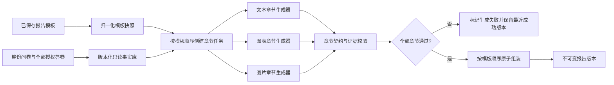

# Template-Driven Professional Survey Report Design

## Decision

Survey 分析报告采用“模板快照 -> 章节独立生成 -> 章节校验 -> 原子组装”的结构。
模板是最终报告业务结构的唯一来源。系统不再固定插入执行摘要、样本质量、假设验证、
方法论或建议等业务章节。

报告页可以显示标题、样本量、数据截止时间、生成时间和版本等文档元信息，但这些元信息
不是模板章节，也不参与章节生成。

## Goals

- 让保存的报告模板真实决定最终报告的章节数量、顺序、标题、类型和生成约束。
- 让每个章节从同一份完整问卷事实库中自主检索相关证据。
- 保证文本、ECharts 图表和图片章节各自具有明确、可验证的产物契约。
- 把分析报告页从编辑工作台重构为适合阅读、分享和导出的专业文档。
- 保留按需生成、不可变版本、失败保留最近成功版本和严格隐私边界。

## Non-Goals

- 不在报告阅读页编辑模板或生成提示词。
- 不支持一个章节同时输出图片、图表和文本。
- 不把参考截图中的具体业务章节硬编码到所有报告。
- 不在本 feature 改变问卷发布、答题或团队权限协议。

## Architecture



### TemplateSnapshot

生成开始前，从持久化的 `SurveyReportCategoryPlan` 构造不可变模板快照。快照包含：

- `templateVersion`
- 归一化后的 `chapters[]`
- 每章 `id`、`order`、`title`、`outputType`、`requirement`
- 图表章节的白名单 `chartTemplateId`
- `requirementHash`

历史报告读取自己的模板快照，不能使用当前模板重新解释旧产物。

### ChapterGenerationContext

所有章节共享同一个：

- `surveyId`
- `sourceRevision`
- 只读事实库 reader
- 样本口径和隐私策略
- 模型与预算配置

章节生成器接收当前章节契约，并从完整事实库自主选择证据。浏览器不传 `questionIds`，
也不接收原始答卷。

### ChapterArtifact

```ts
type ChapterArtifact =
  | {
      outputType: "text";
      body: string;
      claims: ValidatedClaim[];
      evidenceRefs: string[];
      limitations: string[];
    }
  | {
      outputType: "chart";
      option: EChartsOptionJson;
      interpretation: string;
      evidenceRefs: string[];
      sampleSize: number;
      limitations: string[];
    }
  | {
      outputType: "image";
      assetUrl: string;
      altText: string;
      caption: string;
      evidenceRefs: string[];
      limitations: string[];
    };
```

每个产物还携带通用的 `chapterId`、`order`、`title`、`status` 和生成追踪字段。
判别联合由服务端校验，禁止图表章节携带文本正文替代图表，也禁止图片章节只保存提示词。

## Generation Flow

1. 校验管理权限并读取当前问卷、题目和全部授权答卷。
2. 复用或创建 `sourceRevision`。
3. 读取并归一化当前报告模板，固化 `TemplateSnapshot`。
4. 使用 `sourceRevision + requirementHash + templateVersion` 抢占生成 claim。
5. 按模板顺序执行章节生成。每章提示包含该章标题、输出类型、自然语言要求和事实库工具边界。
6. 文本章节对模型结论执行 evidence id、数值和分母校验。
7. 图表章节从证据聚合结果构造所选白名单 ECharts Option，并生成简短图表解读。
8. 图片章节生成受控资产、替代文本和说明，并校验资产归属。
9. 校验章节数量、顺序、ID、唯一类型、证据来源和模板一致性。
10. 全部通过后一次性保存完整报告产物并完成 claim；任一失败则释放 claim，
    记录失败章节并保留最近成功版本。

## Professional Report UI

### Page shell

- 顶部左侧：返回列表、报告类型和问卷名称。
- 顶部右侧：版本状态、重新生成、分享、导出。
- 元信息行：有效样本、数据截止时间、生成时间、报告版本。
- 历史版本收进紧凑菜单或抽屉，不再占据正文上方的整行列表。

### Reading layout

```text
| 模板目录  | 当前版本完整报告                                   |
| 01 标题   | 报告标题与元信息                                   |
| 02 标题   | 01 文本 / 图表 / 图片章节                          |
| 03 标题   | 02 文本 / 图表 / 图片章节                          |
| ...       | ...                                                |
```

- 目录只显示当前版本模板快照中的章节，滚动时同步高亮。
- 正文使用连续文档排版，不把每个页面区块包装成嵌套卡片。
- 文本章节突出结论、证据、限制和行动含义。
- 图表章节使用稳定宽高的真实 ECharts 画布，并在图下显示口径和解读。
- 图片章节使用受控正式资产、说明和替代文本。
- 当前版本失败或过期状态出现在工具区，不覆盖正文。
- 正式阅读页移除常驻 AI 修改栏。用户修改要求时返回“报告模板”步骤。

### Responsive behavior

- 桌面端目录固定为窄列，正文保持适合阅读的最大宽度。
- 移动端目录变为顶部章节菜单，正文单列。
- 图表保持稳定纵横比；长标题、状态和操作按钮允许换行，不产生横向滚动。

## Error Semantics

- **empty**：模板结构可见，每章显示无数据状态，不生成数字、图片或业务判断。
- **directional**：章节正常生成，但在对应章节显示低样本限制。
- **generation_failed**：显示失败章节和可重试操作，继续展示最近成功版本。
- **template_stale**：当前模板与展示版本模板快照不同，旧报告可读，主动重新生成新版本。
- **source_stale**：有新答卷或问卷变化，旧报告可读，不自动调用模型。

## Security and Evidence

- 完整问卷与答卷只在服务端授权边界内读取。
- 所有章节使用同一个 `sourceRevision`，禁止跨版本拼接证据。
- 开放题原文继续匿名化；历史产物返回前按对应事实快照递归脱敏。
- 图表 Option 只能包含 JSON 数据和产品白名单配置，不接受函数、脚本或外部 URL。
- 图片资产必须属于当前 survey/team 的受控命名空间。

## Testing

### Unit and API

- 模板 N 章生成 N 个同序章节。
- 文本、图表和图片判别联合拒绝类型混合或缺失产物。
- 图表章节使用所选模板和真实聚合数据。
- 模板约束进入对应章节生成输入，而不是只进入全局 prompt。
- 任一章节失败时不创建 ready artifact。
- 历史版本使用自己的模板快照。
- 零样本和低样本不生成无证据结论。

### End-to-end

- 在报告模板中创建文本、图表和图片章节并保存。
- 主动生成报告后，目录和正文逐项匹配模板标题、顺序和类型。
- 图表渲染非空 canvas，图片渲染受控资产，文本显示证据化正文。
- 修改模板后旧报告显示 stale；重新生成得到新版本，旧版本仍可打开。
- 桌面和移动端截图与参考布局进行同状态对比。

## Rejected Alternatives

### One model call generates the whole report

拒绝。单次生成容易遗漏章节、改变顺序或混合输出类型，无法对每章执行独立证据校验。

### Fixed professional sections plus template chapters

拒绝。用户已确认报告框架来自模板设计，固定业务章节会让最终报告偏离模板。

### Deterministic report with AI text polish only

拒绝。它能保证结构，但无法充分执行每章自然语言分析要求，也不能满足图片章节的正式产物契约。

## Approval

- 2026-07-19：用户确认采用“每个模板章节独立生成唯一输出，随后组装成完整报告”的方案。

