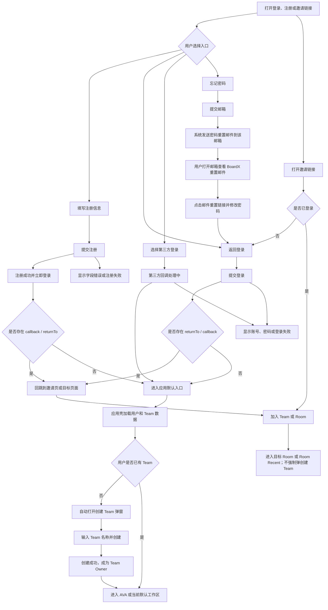

# Auth 交互图

```mermaid
flowchart TD
  Start["打开登录、注册或邀请链接"] --> Choose{"用户选择入口"}
  Choose --> Register["填写注册信息"]
  Choose --> Login["填写邮箱和密码"]
  Choose --> Social["选择第三方登录"]
  Choose --> Forgot["忘记密码"]
  Register --> RegisterSubmit["提交注册"]
  RegisterSubmit --> RegisterOk["注册成功并立即登录"]
  RegisterSubmit --> RegisterFail["显示字段错误或注册失败"]
  RegisterOk --> HasCallback{"是否存在 callback / returnTo"}
  HasCallback -->|是| CallbackTarget["回跳到邀请页或目标页面"]
  HasCallback -->|否| DefaultEntry["进入应用默认入口"]
  DefaultEntry --> AppShell["应用壳加载用户和 Team 数据"]
  AppShell --> HasTeam{"用户是否已有 Team"}
  HasTeam -->|否| ForceCreateTeam["自动打开创建 Team 弹窗"]
  ForceCreateTeam --> SubmitTeam["输入 Team 名称并创建"]
  SubmitTeam --> TeamCreated["创建成功，成为 Team Owner"]
  TeamCreated --> AvaDefault["进入 AVA 或当前默认工作区"]
  HasTeam -->|是| AvaDefault
  Login --> LoginSubmit["提交登录"]
  LoginSubmit --> LoginCallback{"是否存在 returnTo / callback"}
  LoginCallback -->|是| CallbackTarget
  LoginCallback -->|否| DefaultEntry
  LoginSubmit --> LoginFail["显示账号、密码或登录失败"]
  Social --> Callback["第三方回调处理中"]
  Callback --> DefaultEntry
  Callback --> LoginFail
  Forgot --> ResetMail["提交邮箱"]
  ResetMail --> MailSent["系统发送密码重置邮件到该邮箱"]
  MailSent --> OpenMailbox["用户打开邮箱查看 BoardX 重置邮件"]
  OpenMailbox --> ResetPage["点击邮件重置链接并修改密码"]
  ResetPage --> Login["返回登录"]
  Start --> Invite["打开邀请链接"]
  Invite --> NeedAuth{"是否已登录"}
  NeedAuth -->|否| Login
  NeedAuth -->|是| JoinTarget["加入 Team 或 Room"]
  CallbackTarget --> JoinTarget
  JoinTarget --> InviteDone["进入目标 Room 或 Room Recent；不强制弹创建 Team"]
```
