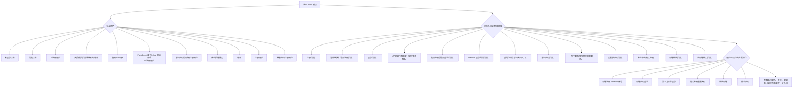

# Auth 粗粒度交互图

本图用于快速说明 Auth 模块有哪些参与角色、入口、主要能力和结果状态。它不展开每个控件的全部状态，详细交互见 [auth-detailed-interaction-diagram.md](./auth-detailed-interaction-diagram.md)。

```mermaid
flowchart TD
  Start["进入 Auth 模块"]
  Start --> Actors{"参与角色"}
  Actors --> A1["未登录访客"]
  Actors --> A2["受邀访客"]
  Actors --> A3["已注册用户"]
  Actors --> A4["从受保护页面跳转来的访客"]
  Actors --> A5["使用 Google"]
  Actors --> A6["Facebook 或 Wechat 的访客或<br/>已注册用户"]
  Actors --> A7["忘记密码的邮箱注册用户"]
  Actors --> A7B["邮件投递服务"]
  Actors --> A8["访客"]
  Actors --> A9["注册用户"]
  Actors --> A10["邮箱密码注册用户"]
  Start --> Entry{"可见入口或页面区域"}
  Entry --> E1["注册页面。"]
  Entry --> E2["邀请链接引导到注册页面。"]
  Entry --> E3["登录页面。"]
  Entry --> E4["从受保护页面被引导到登录页面。"]
  Entry --> E5["邀请链接引导到登录页面。"]
  Entry --> E6["Wechat 登录回调页面。"]
  Entry --> E7["登录页中的忘记密码入口。"]
  Entry --> E8["忘记密码页面。"]
  Entry --> E9["用户邮箱中的密码重置邮件。"]
  Entry --> E10["设置新密码页面。"]
  Entry --> E11["邮件中的确认链接。"]
  Entry --> E12["邮箱确认页面。"]
  Entry --> E13["新邮箱确认页面。"]
  Entry --> Capabilities{"用户可执行的主要操作"}
  Capabilities --> UC1["邮箱注册 BoardX 账号"]
  Capabilities --> UC2["邮箱密码登录"]
  Capabilities --> UC3["第三方账号登录"]
  Capabilities --> UC4["通过邮箱重置密码"]
  Capabilities --> UC5["确认邮箱"]
  Capabilities --> UC6["修改密码"]
  Capabilities --> Result["界面显示成功、失败、空状态、权限状态或下一步入口"]
```
