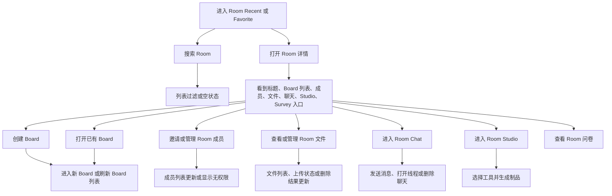

# Room 交互图

```mermaid
flowchart TD
  RoomList["进入 Room Recent 或 Favorite"] --> Search["搜索 Room"]
  Search --> RoomResult["列表过滤或空状态"]
  RoomList --> OpenRoom["打开 Room 详情"]
  OpenRoom --> RoomDetail["看到标题、Board 列表、成员、文件、聊天、Studio、Survey 入口"]
  RoomDetail --> CreateBoard["创建 Board"]
  CreateBoard --> Board["进入新 Board 或刷新 Board 列表"]
  RoomDetail --> OpenBoard["打开已有 Board"]
  OpenBoard --> Board
  RoomDetail --> ManageMembers["邀请或管理 Room 成员"]
  ManageMembers --> MemberResult["成员列表更新或显示无权限"]
  RoomDetail --> Files["查看或管理 Room 文件"]
  Files --> FileResult["文件列表、上传状态或删除结果更新"]
  RoomDetail --> Chat["进入 Room Chat"]
  Chat --> RoomChat["发送消息、打开线程或删除聊天"]
  RoomDetail --> Studio["进入 Room Studio"]
  Studio --> Artifact["选择工具并生成制品"]
  RoomDetail --> Surveys["查看 Room 问卷"]
```

