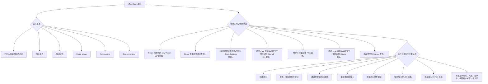

# Room 粗粒度交互图

本图用于快速说明 Room 模块有哪些参与角色、入口、主要能力和结果状态。它不展开每个控件的全部状态，详细交互见 [room-detailed-interaction-diagram.md](./room-detailed-interaction-diagram.md)。

```mermaid
flowchart TD
  Start["进入 Room 模块"]
  Start --> Actors{"参与角色"}
  Actors --> A1["已加入当前团队的用户"]
  Actors --> A2["团队成员"]
  Actors --> A3["房间成员"]
  Actors --> A4["Room owner"]
  Actors --> A5["Room admin"]
  Actors --> A6["Room member"]
  Start --> Entry{"可见入口或页面区域"}
  Entry --> E1["Room 列表中的 New Room 加号按钮。"]
  Entry --> E2["Room 页面左侧房间列表。"]
  Entry --> E3["房间顶部设置按钮打开的 Room Settings <br/>弹窗。"]
  Entry --> E4["房间 Chat 页签中的聊天工作区左侧 Room F<br/>iles 面板。"]
  Entry --> E5["文件专用面板或 Files 区域。"]
  Entry --> E6["房间 Chat 页签中的聊天工作区右侧 Studio<br/> 面板。"]
  Entry --> E7["房间顶部的 Survey 页签。"]
  Entry --> Capabilities{"用户可执行的主要操作"}
  Capabilities --> UC1["创建房间"]
  Capabilities --> UC2["查看、搜索并打开房间"]
  Capabilities --> UC3["邀请并管理房间成员"]
  Capabilities --> UC4["更新或删除房间"]
  Capabilities --> UC5["管理房间文件面板"]
  Capabilities --> UC6["使用房间 Studio 面板"]
  Capabilities --> UC7["查看房间 Survey 页签"]
  Capabilities --> Result["界面显示成功、失败、空状态、权限状态或下一步入口"]
```
