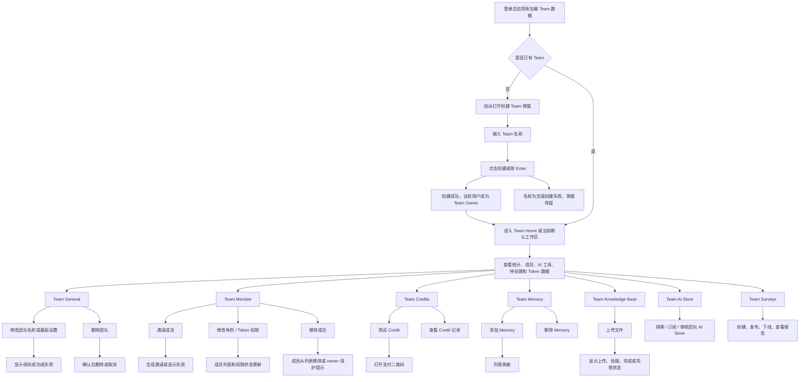

# Team 交互图

```mermaid
flowchart TD
  AppShell["登录后应用壳加载 Team 数据"] --> HasTeam{"是否已有 Team"}
  HasTeam -->|否| ForceCreate["自动打开创建 Team 弹窗"]
  ForceCreate --> CreateName["输入 Team 名称"]
  CreateName --> SubmitCreate["点击创建或按 Enter"]
  SubmitCreate --> CreateOk["创建成功，当前用户成为 Team Owner"]
  SubmitCreate --> CreateFail["名称为空或创建失败，弹窗保留"]
  CreateOk --> TeamHome["进入 Team Home 或当前默认工作区"]
  HasTeam -->|是| TeamHome
  TeamHome --> Dashboard["查看统计、成员、AI 工具、待处理和 Token 数据"]
  Dashboard --> General["Team General"]
  Dashboard --> Members["Team Member"]
  Dashboard --> Credits["Team Credits"]
  Dashboard --> Memory["Team Memory"]
  Dashboard --> Knowledge["Team Knowledge Base"]
  Dashboard --> Store["Team AI Store"]
  Dashboard --> Surveys["Team Surveys"]

  General --> EditTeam["修改团队名称或基础设置"]
  EditTeam --> TeamSaved["显示保存成功或失败"]
  General --> DeleteTeam["删除团队"]
  DeleteTeam --> DeleteConfirm["确认后删除或取消"]

  Members --> Invite["邀请成员"]
  Invite --> InviteResult["生成邀请或显示失败"]
  Members --> Role["修改角色 / Token 权限"]
  Role --> RoleResult["成员列表和权限状态更新"]
  Members --> Remove["移除成员"]
  Remove --> RemoveResult["成员从列表移除或 owner 保护提示"]

  Credits --> Purchase["购买 Credit"]
  Purchase --> Payment["打开支付二维码"]
  Credits --> Records["查看 Credit 记录"]

  Memory --> AddMemory["添加 Memory"]
  AddMemory --> MemoryList["列表刷新"]
  Memory --> DeleteMemory["删除 Memory"]

  Knowledge --> Upload["上传文件"]
  Upload --> FileStatus["显示上传、处理、完成或失败状态"]

  Store --> StoreExplore["探索 / 订阅 / 审核团队 AI Store"]
  Surveys --> SurveyManage["创建、发布、下线、查看报告"]
```
