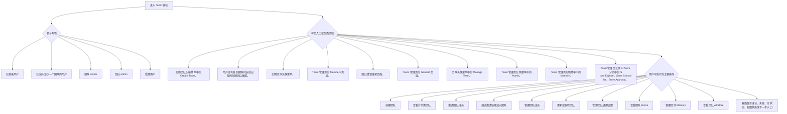

# Team 粗粒度交互图

本图用于快速说明 Team 模块有哪些参与角色、入口、主要能力和结果状态。它不展开每个控件的全部状态，详细交互见 [team-detailed-interaction-diagram.md](./team-detailed-interaction-diagram.md)。

```mermaid
flowchart TD
  Start["进入 Team 模块"]
  Start --> Actors{"参与角色"}
  Actors --> A1["已登录用户"]
  Actors --> A2["已加入至少一个团队的用户"]
  Actors --> A3["团队 owner"]
  Actors --> A4["团队 admin"]
  Actors --> A5["受邀用户"]
  Start --> Entry{"可见入口或页面区域"}
  Entry --> E1["左侧团队头像菜单中的 Create Team。"]
  Entry --> E2["用户没有任何团队时自动出现的创建团队弹窗。"]
  Entry --> E3["左侧团队头像菜单。"]
  Entry --> E4["Team 管理页的 Members 页面。"]
  Entry --> E5["团队邀请链接页面。"]
  Entry --> E6["Team 管理页的 General 页面。"]
  Entry --> E7["团队头像菜单中的 Manage Team。"]
  Entry --> E8["Team 管理页左侧菜单中的 Home。"]
  Entry --> E9["Team 管理页左侧菜单中的 Memory。"]
  Entry --> E10["Team 管理页左侧 AI Store 分组中的 S<br/>tore Explore、Store Subscri<br/>be、Store Approval。"]
  Entry --> Capabilities{"用户可执行的主要操作"}
  Capabilities --> UC1["创建团队"]
  Capabilities --> UC2["查看并切换团队"]
  Capabilities --> UC3["邀请团队成员"]
  Capabilities --> UC4["通过邀请链接加入团队"]
  Capabilities --> UC5["管理团队成员"]
  Capabilities --> UC6["更新或删除团队"]
  Capabilities --> UC7["管理团队通用设置"]
  Capabilities --> UC8["查看团队 Home"]
  Capabilities --> UC9["管理团队 Memory"]
  Capabilities --> UC10["查看团队 AI Store"]
  Capabilities --> Result["界面显示成功、失败、空状态、权限状态或下一步入口"]
```
