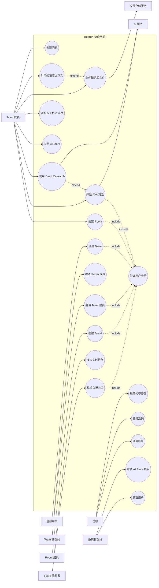

# BoardX Use Cases 总览

本文档定义 BoardX 用例的系统边界、Actor、用例分组和 Mermaid 图表关系。各目录下的单个 Markdown 文件是对应 Use Case Specification。

前端功能覆盖说明见：[boardx-web 功能覆盖说明](./boardx-web-coverage.md)。

界面、操作和结果清单见：[BoardX 界面-操作-结果清单](./interface-operation-inventory.md)。

Use Case 细化规范见：[BoardX Use Case 细化规范](./use-case-specification-standard.md)。

全系统角色视角用例图见：[BoardX 按角色拆分的 Use Case Diagram](./use-case-diagram.md)。

模块用户交互图见：[BoardX 模块交互图](./interaction-diagrams.md)。每个模块目录下应同时维护粗粒度图和详细图：粗粒度图说明角色、入口、主要能力和结果状态；详细图按 Use Case 主流程展开可见内容、可操作项和操作后状态。

顶层角色功能图见：[BoardX 顶层角色功能 Use Case Diagram](./top-level-role-function-diagram.md)。

模块访问权限图见：[BoardX 模块访问权限 Use Case Diagram](./module-access-diagrams.md)。

覆盖审计见：[BoardX Web Use Cases 覆盖审计](./boardx-web-use-case-coverage-audit.md)。

## 当前目录覆盖

当前 `docs/cn/use-cases` 下共有 168 个 `uc-*.md`，按目录统计如下：

## AI Ready 状态

当前 168 个 Use Case 已按 AI Ready 口径完成一轮细化：

- `interface-operation-inventory.md` 作为全系统界面索引，记录当前产品路由界面数量、每个界面的主要可见内容、可执行操作和操作后的可见结果。
- 每个文件都包含完整模板字段：Actor、目标、系统边界、前端入口、前置条件、触发条件、主流程、备选流程、异常流程、权限与可见性、后置条件、不包含、业务规则。
- 每个 `主流程` 都从用户视角描述可见入口、可执行动作、系统反馈和结果状态。
- 角色差异通过 `权限与可见性` 表达，覆盖 owner/admin/member/visitor/respondent/admin 等模块内角色。
- 不把视觉设计、API 或 E2E 验收写成独立技术章节；交互路径应能从界面清单、主流程、备选流程、异常流程、权限与可见性、后置条件中自然推导。
- 不写接口路径、源码路径、数据库字段、测试选择器或实现层细节。
- 未展示的入口不作为当前可操作能力；入口展示时必须具备对应的用户动作、状态反馈和权限约束。
- 每个模块目录维护两类 Mermaid 交互图：`*-overview-interaction-diagram.md` 用于模块级快速理解，`*-detailed-interaction-diagram.md` 用于从 UC 主流程推导完整交互。

当前产品路由界面为 53 个，不包含开发演示页 `components-demo`。Board 是单一路由，但内部包含 Header、Board Menu、Widget Menu、Context Menu、Canvas、协作状态、Board Chat、Board Memory 等多个用户可见操作区，因此在界面清单中单独展开。

| 目录 | 用例数 | 范围 |
| --- | ---: | --- |
| `admin/` | 5 | 后台首页、用户、Team、AI Store 审核与精选 |
| `ai-store/` | 6 | 浏览、创建维护、订阅使用、收藏、共享管理、审核精选 |
| `auth/` | 6 | 注册、登录、社交登录、找回密码、邮箱确认、修改密码 |
| `ava/` | 10 | 对话、线程、消息、分享、Deep Research、设置、附件、语音、建议动作 |
| `billing/` | 2 | 升级计划与扫码支付 |
| `board/` | 77 | Board 核心、访问、Header、Board Menu、Canvas、协作、Context Menu、Widget Menu、Widgets、Local Workspace |
| `canvas/` | 5 | 旧版/通用画布导航、编辑、复制粘贴、撤销重做、实时协作 |
| `common/` | 4 | 全局搜索、语言、主题、带附件反馈 |
| `credits/` | 3 | 钱包、购买积分、积分记录 |
| `feedback/` | 1 | 提交反馈 |
| `home-page/` | 8 | Home Page、Agent 搜索、Agent 快速对话、推荐功能、最近 Board、Onboarding、最近页面 |
| `invite/` | 2 | 接受邀请链接、邀请好友 |
| `knowledge-base/` | 4 | 上传、列表下载、删除、在 AI 上下文中使用文件 |
| `presentations/` | 2 | 生成与修订演示文稿 |
| `profile/` | 4 | 查看与编辑资料、用户菜单、个人 Memory |
| `room/` | 7 | 创建、查看搜索、成员邀请管理、更新删除、文件、Studio、问卷 |
| `room-chat/` | 4 | 创建、列表打开、发送消息、删除聊天 |
| `share/` | 1 | 查看共享聊天 |
| `studio/` | 1 | 生成 Artifact |
| `survey/` | 6 | 创建、列表管理、答题、报告、模板、发布下线 |
| `team/` | 10 | 创建、切换、邀请加入、成员、设置、首页、Memory、Team AI Store |

Board 子目录统计：

| 子目录 | 用例数 |
| --- | ---: |
| `board/` 根目录 | 8 |
| `board/access/` | 2 |
| `board/board-menu/` | 12 |
| `board/canvas/` | 4 |
| `board/collaboration/` | 3 |
| `board/context-menu/` | 6 |
| `board/header/` | 15 |
| `board/local-workspace/` | 3 |
| `board/widget-menu/` | 14 |
| `board/widgets/` | 10 |

## 系统边界

系统边界：BoardX 协作空间

BoardX 向外部 Actor 提供账号、团队、房间、白板、画布协作、AVA、AI Store、知识库、问卷和后台管理等能力。Use Case 只描述 Actor 与 BoardX 的业务交互，不描述系统内部实现。

## Actor

- 访客：尚未登录但可注册、登录、访问公开邀请或公开问卷的人。
- 注册用户：已拥有账号并可进入个人或团队空间的人。
- Team 成员：属于某个 Team 的注册用户。
- Team 管理员：在 Team 中拥有 owner 或 admin 角色的人。
- Room 成员：属于某个 Room 的 Team 成员。
- Board 编辑者：对某个 Board 有编辑权限的人。
- 系统管理员：拥有平台后台管理权限的人。
- AI 服务：BoardX 外部或边界外的智能生成服务。
- 文件存储服务：BoardX 用于保存文件和媒体资源的外部服务。
- 支付系统：处理订阅或充值支付的外部系统。

## Actor 泛化

```mermaid
classDiagram
direction LR
class "访客" as Guest
class "注册用户" as User
class "Team 成员" as TeamMember
class "Team 管理员" as TeamAdmin
class "Room 成员" as RoomMember
class "Board 编辑者" as BoardEditor
class "系统管理员" as SysAdmin

User <|-- TeamMember
TeamMember <|-- TeamAdmin
TeamMember <|-- RoomMember
RoomMember <|-- BoardEditor
User <|-- SysAdmin
```

## 核心用例关系

虚线标注 `include` / `extend` 对应 UML 用例关系。



## 编写规则

- Use Case 名称使用“动词 + 名词”，表达 Actor 的目标。
- Actor 必须位于 BoardX 系统边界之外。
- 主流程描述 Actor 与系统之间的交互，不描述代码、接口路径、数据库或组件。
- 业务规则描述业务约束，不写技术实现。
- Use Case 不单独写接口路径、数据模型或测试脚本；主流程、权限、异常和后置条件必须足够明确，使后续设计与验证可以自然推导。
- 入口只写用户可感知的页面、导航或业务入口；除非用于覆盖审计，不在用例正文中列源码组件、测试选择器或接口路径。

## 本轮已核对模块

- Admin：后台首页、Users、Teams、AI Store Approval、AI Store Featured 按系统管理员权限描述；Team Owner/Admin/Member 不因团队角色获得 Admin Panel 权限。
- Knowledge Base：个人、Team、Room、Agent、AI Tool 上下文按可见范围隔离，补充上传、处理状态、下载、删除和 AI 引用反馈。
- Credits/Billing：Team Credits 管理页当前只对 Team Owner/Admin 展示钱包、流水和购买；Team Member 看到无权限提示；扫码支付以二维码、pending、刷新状态和支付成功反馈为主。
- Presentations/Studio/Share：补充演示文稿创建器、方案确认、生成进度、PDF/缩略图/下载/重试，以及公开聊天分享的只读访问边界。
