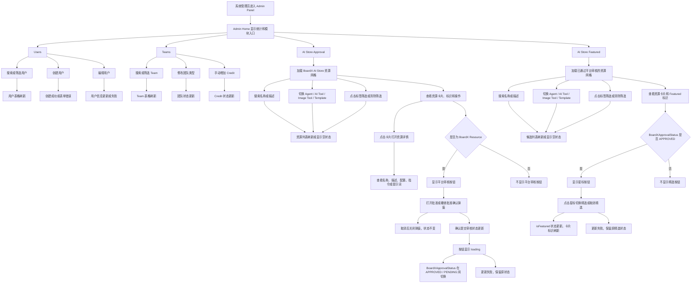

# Admin 交互图

```mermaid
flowchart TD
  Admin["系统管理员进入 Admin Panel"] --> Home["Admin Home 显示统计和模块入口"]
  Home --> Users["Users"]
  Users --> SearchUser["搜索或筛选用户"]
  SearchUser --> UserTable["用户表格刷新"]
  Users --> CreateUser["创建用户"]
  CreateUser --> CreateResult["创建成功或表单错误"]
  Users --> EditUser["编辑用户"]
  EditUser --> UserSaved["用户信息更新或失败"]
  Home --> Teams["Teams"]
  Teams --> SearchTeam["搜索或筛选 Team"]
  SearchTeam --> TeamTable["Team 表格刷新"]
  Teams --> TeamType["修改团队类型"]
  TeamType --> TeamUpdated["团队状态更新"]
  Teams --> AddCredit["手动增加 Credit"]
  AddCredit --> CreditUpdated["Credit 状态更新"]
  Home --> StoreApproval["AI Store Approval"]
  StoreApproval --> ApprovalGrid["加载 BoardX AI Store 资源网格"]
  ApprovalGrid --> ApprovalSearch["搜索名称或描述"]
  ApprovalSearch --> ApprovalFiltered["资源列表刷新或显示空状态"]
  ApprovalGrid --> ApprovalType["切换 Agent / AI Tool / Image Tool / Template"]
  ApprovalType --> ApprovalFiltered
  ApprovalGrid --> ApprovalTags["点击标签筛选或清除筛选"]
  ApprovalTags --> ApprovalFiltered
  ApprovalGrid --> ApprovalCard["查看资源卡片、标识和操作"]
  ApprovalCard --> ApprovalDetail["点击卡片打开资源详情"]
  ApprovalDetail --> ApprovalDetailState["查看名称、描述、配置、指令或提示词"]
  ApprovalCard --> ApprovalVisible{"是否为 BoardX Resource"}
  ApprovalVisible -->|是| ApprovalAction["显示平台审核按钮"]
  ApprovalVisible -->|否| ApprovalNoAction["不显示平台审核按钮"]
  ApprovalAction --> ApprovalConfirm["打开批准或撤销批准确认弹窗"]
  ApprovalConfirm --> ApprovalCancel["取消后关闭弹窗，状态不变"]
  ApprovalConfirm --> ApprovalSubmit["确认提交审核状态更新"]
  ApprovalSubmit --> ApprovalLoading["按钮显示 loading"]
  ApprovalLoading --> ApprovalUpdated["BoardXApprovalStatus 在 APPROVED / PENDING 间切换"]
  ApprovalLoading --> ApprovalFailed["更新失败，保留原状态"]
  Home --> Featured["AI Store Featured"]
  Featured --> FeaturedGrid["加载已通过平台审核的资源网格"]
  FeaturedGrid --> FeaturedSearch["搜索名称或描述"]
  FeaturedSearch --> FeaturedFiltered["候选列表刷新或显示空状态"]
  FeaturedGrid --> FeaturedType["切换 Agent / AI Tool / Image Tool / Template"]
  FeaturedType --> FeaturedFiltered
  FeaturedGrid --> FeaturedTags["点击标签筛选或清除筛选"]
  FeaturedTags --> FeaturedFiltered
  FeaturedGrid --> FeaturedCard["查看资源卡片和 Featured 标识"]
  FeaturedCard --> FeaturedAllowed{"BoardXApprovalStatus 是否 APPROVED"}
  FeaturedAllowed -->|是| FeatureAction["显示星标按钮"]
  FeaturedAllowed -->|否| FeatureHidden["不显示精选按钮"]
  FeatureAction --> ToggleFeatured["点击星标切换精选或取消精选"]
  ToggleFeatured --> FeaturedUpdated["isFeatured 状态更新，卡片标识刷新"]
  ToggleFeatured --> FeaturedFailed["更新失败，保留原精选状态"]
```
