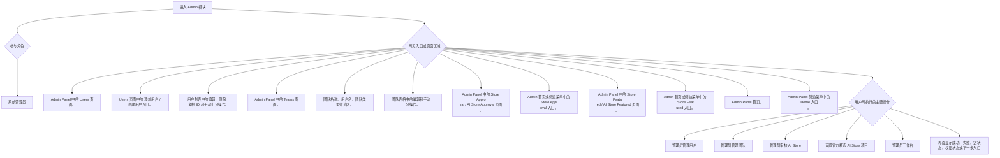

# Admin 粗粒度交互图

本图用于快速说明 Admin 模块有哪些参与角色、入口、主要能力和结果状态。它不展开每个控件的全部状态，详细交互见 [admin-detailed-interaction-diagram.md](./admin-detailed-interaction-diagram.md)。

```mermaid
flowchart TD
  Start["进入 Admin 模块"]
  Start --> Actors{"参与角色"}
  Actors --> A1["系统管理员"]
  Start --> Entry{"可见入口或页面区域"}
  Entry --> E1["Admin Panel 中的 Users 页面。"]
  Entry --> E2["Users 页面中的 添加用户 / 创建用户入口。"]
  Entry --> E3["用户列表中的编辑、删除、复制 ID 和手动上分操作。"]
  Entry --> E4["Admin Panel 中的 Teams 页面。"]
  Entry --> E5["团队名称、用户名、团队类型筛选区。"]
  Entry --> E6["团队表格中的编辑和手动上分操作。"]
  Entry --> E7["Admin Panel 中的 Store Appro<br/>val / AI Store Approval 页面<br/>。"]
  Entry --> E8["Admin 首页或侧边菜单中的 Store Appr<br/>oval 入口。"]
  Entry --> E9["Admin Panel 中的 Store Featu<br/>red / AI Store Featured 页面<br/>。"]
  Entry --> E10["Admin 首页或侧边菜单中的 Store Feat<br/>ured 入口。"]
  Entry --> E11["Admin Panel 首页。"]
  Entry --> E12["Admin Panel 侧边菜单中的 Home 入口<br/>。"]
  Entry --> Capabilities{"用户可执行的主要操作"}
  Capabilities --> UC1["管理员管理用户"]
  Capabilities --> UC2["管理员管理团队"]
  Capabilities --> UC3["管理员审核 AI Store"]
  Capabilities --> UC4["设置官方精选 AI Store 项目"]
  Capabilities --> UC5["管理员工作台"]
  Capabilities --> Result["界面显示成功、失败、空状态、权限状态或下一步入口"]
```
