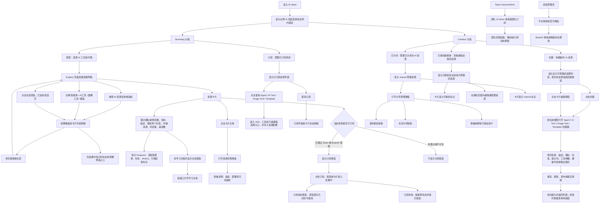

# AI Store 交互图

```mermaid
flowchart TD
  Store["进入 AI Store"] --> Shell["显示左侧 AI 商店菜单和右侧内容区"]
  Shell --> Browsing["Browsing 分组"]
  Shell --> Creation["Creation 分组"]

  Browsing --> ExploreNav["探索：发现 AI 工具和代理"]
  Browsing --> SubscribeNav["订阅：管理已订阅项目"]
  Creation --> CreateNav["创建：构建新的 AI 资源"]
  Creation --> AuthorizedNav["已授权智能体：查看授权给我的资源"]
  Creation --> SharedNav["已分享：管理已分享的 AI 资源"]

  ExploreNav --> Explore["Explore 页面加载资源网格"]
  Explore --> Search["搜索 AI 资源名称或描述"]
  Search --> Result["结果数量和卡片列表刷新"]
  Explore --> TypeTabs["切换 智能体 / AI工具 / 图像工具 / 模板"]
  TypeTabs --> Result
  Explore --> TagFilter["点击标签筛选；已选标签高亮"]
  TagFilter --> Result
  Result --> ClearFilters["清空搜索或标签"]
  ClearFilters --> Explore
  Result --> Empty["无结果时显示空状态和调整筛选入口"]
  Explore --> Card["资源卡片"]

  Card --> CardContent["展示图标或预览图、名称、描述、最多两个标签、作者/来源、浏览量、喜欢数"]
  CardContent --> Badges["显示 Featured、深度智能体、专家、shared、已授权等标识"]
  CardContent --> Help["有学习文档时显示文档按钮"]
  Help --> OpenDoc["新窗口打开学习文档"]
  Card --> OpenDetail["点击卡片主体"]
  OpenDetail --> Detail["打开资源详情弹窗"]
  Detail --> DetailInfo["查看说明、描述、配置和可用操作"]

  Card --> SubscribeAction{"当前资源是否可订阅"}
  SubscribeAction -->|已通过 Team 或 BoardX 审核| Subscribe["显示订阅按钮"]
  SubscribeAction -->|未通过或不可见| NoSubscribe["不显示订阅按钮"]
  Subscribe --> Submitting["点击订阅，按钮或卡片进入处理中"]
  Submitting --> Subscribed["订阅状态更新，按钮变为已订阅/可取消"]
  Submitting --> SubscribeFailed["订阅失败，保留原状态并提示错误"]

  SubscribeNav --> SubscribedList["显示已订阅资源列表"]
  SubscribedList --> UseItem["点击使用 Agent / AI Tool / Image Tool / Template"]
  UseItem --> AvaOrTool["进入 AVA、工具执行或模板选择入口，并带入资源配置"]
  SubscribedList --> CancelSub["取消订阅"]
  CancelSub --> CancelResult["订阅列表或卡片状态刷新"]

  CreateNav --> ManageList["显示自己可管理的资源列表、发布状态筛选和创建按钮"]
  ManageList --> CreateButton["点击创建"]
  CreateButton --> TypeCreator["按当前类型打开 Agent / AI Tool / Image Tool / Template 创建器"]
  ManageList --> EditAction["点击卡片编辑按钮"]
  EditAction --> TypeCreator
  TypeCreator --> Form["填写名称、描述、图标、标签、提示词、工具参数、模板内容或输出格式"]
  Form --> Save["保存、更新、发布或提交审核"]
  Save --> SaveResult["成功提示并返回列表；失败时保留表单和错误"]

  AuthorizedNav --> AuthorizedList["显示已授权给当前用户管理的资源"]
  AuthorizedList --> AuthorizedBadge["卡片显示已授权标识"]
  AuthorizedList --> AuthorizedEdit["在授权范围内编辑或管理资源"]

  SharedNav --> SharedList["显示 shared 管理资源"]
  SharedList --> SharedBadge["卡片显示 shared 标识"]
  SharedList --> ShareManage["打开分享管理弹窗"]
  ShareManage --> CopyLink["复制授权链接"]
  ShareManage --> CloseShare["关闭分享链接"]
  ShareManage --> AuthorizedUsers["查看或移除已授权用户"]

  TeamAdmin["Team Owner/Admin"] --> TeamApproval["团队 AI Store 审核和团队订阅"]
  TeamApproval --> TeamApprovalResult["团队范围批准、撤销或订阅状态更新"]
  SysAdmin["系统管理员"] --> PlatformApproval["平台审核和官方精选"]
  PlatformApproval --> PlatformResult["BoardX 审核或精选状态更新"]
```
