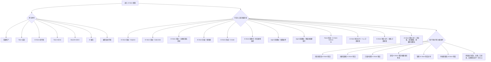

# Ai Store 粗粒度交互图

本图用于快速说明 Ai Store 模块有哪些参与角色、入口、主要能力和结果状态。它不展开每个控件的全部状态，详细交互见 [ai-store-detailed-interaction-diagram.md](./ai-store-detailed-interaction-diagram.md)。

```mermaid
flowchart TD
  Start["进入 Ai Store 模块"]
  Start --> Actors{"参与角色"}
  Actors --> A1["普通用户"]
  Actors --> A2["Team 成员"]
  Actors --> A3["AI Store 创作者"]
  Actors --> A4["Team Admin"]
  Actors --> A5["BoardX Admin"]
  Actors --> A6["AI 服务"]
  Actors --> A7["被授权协作者"]
  Start --> Entry{"可见入口或页面区域"}
  Entry --> E1["AI Store 页面 > Explore"]
  Entry --> E2["AI Store 页面 > Subscribe"]
  Entry --> E3["AI Store 页面 > 分类和筛选区域"]
  Entry --> E4["AI Store 页面 > 搜索框"]
  Entry --> E5["AI Store 页面 > Create"]
  Entry --> E6["AI Store 创建页 > 项目类型选择"]
  Entry --> E7["Agent 创建器 > 配置表单"]
  Entry --> E8["Agent 创建器 > 智能体创建助手"]
  Entry --> E9["Team 页面 > AI Store Subscri<br/>be"]
  Entry --> E10["AI Store 项目卡片 > 个人订阅按钮"]
  Entry --> E11["AI Store 项目卡片 > 团队订阅按钮"]
  Entry --> E12["AI Store 项目卡片 > 浏览量、喜欢数量、收<br/>藏状态图标"]
  Entry --> Capabilities{"用户可执行的主要操作"}
  Capabilities --> UC1["浏览和筛选 AI Store 项目"]
  Capabilities --> UC2["创建或更新 AI Store 项目"]
  Capabilities --> UC3["订阅并使用 AI Store 项目"]
  Capabilities --> UC4["查看 AI Store 项目收藏/喜欢状态"]
  Capabilities --> UC5["管理 AI Store 项目分享"]
  Capabilities --> UC6["审核和精选 AI Store 项目"]
  Capabilities --> Result["界面显示成功、失败、空状态、权限状态或下一步入口"]
```
