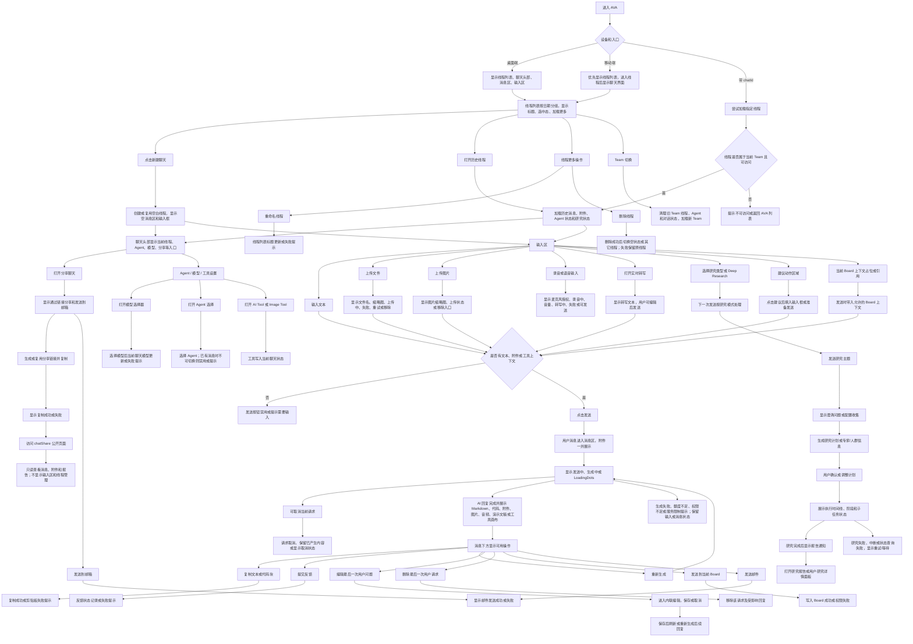

# AVA 交互图

```mermaid
flowchart TD
  Ava["进入 AVA"] --> Layout{"设备和入口"}
  Layout -->|桌面端| Desktop["显示线程列表、聊天头部、消息区、输入区"]
  Layout -->|移动端| Mobile["优先显示线程列表，进入线程后显示聊天界面"]
  Layout -->|带 chatId| DirectThread["尝试加载指定线程"]
  DirectThread --> ThreadCheck{"线程是否属于当前 Team 且可访问"}
  ThreadCheck -->|是| Messages
  ThreadCheck -->|否| ThreadDenied["提示不可访问或返回 AVA 列表"]

  Desktop --> ThreadList["线程列表按日期分组，显示标题、选中态、加载更多"]
  Mobile --> ThreadList
  ThreadList --> NewThread["点击新建聊天"]
  NewThread --> EmptyChat["创建或复用空白线程，显示空消息区和输入框"]
  ThreadList --> OpenThread["打开历史线程"]
  OpenThread --> Messages["加载历史消息、附件、Agent 状态和研究状态"]
  ThreadList --> ThreadMenu["线程更多操作"]
  ThreadMenu --> RenameThread["重命名线程"]
  RenameThread --> ThreadListUpdated["线程列表标题更新或失败提示"]
  ThreadMenu --> DeleteThread["删除线程"]
  DeleteThread --> DeleteThreadResult["删除成功后切换空状态或其它线程；失败保留原线程"]
  ThreadList --> TeamSwitch["Team 切换"]
  TeamSwitch --> ResetAva["清理旧 Team 线程、Agent 和对话状态，加载新 Team"]

  EmptyChat --> ChatHeader["聊天头部显示当前线程、Agent、模型、分享等入口"]
  Messages --> ChatHeader
  ChatHeader --> Share["打开分享聊天"]
  Share --> SharePanel["显示通过链接分享和发送到邮箱"]
  SharePanel --> CopyShare["生成或复用分享链接并复制"]
  CopyShare --> ShareLink["显示复制成功或失败"]
  SharePanel --> SendEmail["发送到邮箱"]
  SendEmail --> EmailResult["显示邮件发送成功或失败"]

  ChatHeader --> AgentModel["Agent / 模型 / 工具设置"]
  AgentModel --> ModelSelect["打开模型选择器"]
  ModelSelect --> ModelChanged["选择模型后当前聊天模型更新或失败提示"]
  AgentModel --> AgentSelect["打开 Agent 选择"]
  AgentSelect --> AgentChanged["选择 Agent；已有消息时不可切换则禁用或提示"]
  AgentModel --> ToolSelect["打开 AI Tool 或 Image Tool"]
  ToolSelect --> ToolChanged["工具写入当前聊天状态"]

  EmptyChat --> Composer["输入区"]
  Messages --> Composer
  Composer --> TextInput["输入文本"]
  Composer --> AddFile["上传文件"]
  AddFile --> FilePreview["显示文件名、缩略图、上传中、失败、重试或移除"]
  Composer --> AddImage["上传图片"]
  AddImage --> ImagePreview["显示图片缩略图、上传状态或移除入口"]
  Composer --> RecordAudio["录音或语音输入"]
  RecordAudio --> AudioState["显示麦克风授权、录音中、音量、转写中、失败或可发送"]
  Composer --> RealtimeTranscription["打开实时转写"]
  RealtimeTranscription --> Transcript["显示转写文本，用户可编辑后发送"]
  Composer --> ResearchSelector["选择研究类型或 Deep Research"]
  ResearchSelector --> ResearchArmed["下一次发送按研究模式处理"]
  Composer --> Suggested["建议动作区域"]
  Suggested --> SuggestedToInput["点击建议后填入输入框或准备发送"]
  Composer --> BoardContext["当前 Board 上下文占位或引用"]
  BoardContext --> ContextReady["发送时带入允许的 Board 上下文"]

  TextInput --> SendReady{"是否有文本、附件或工具上下文"}
  FilePreview --> SendReady
  ImagePreview --> SendReady
  Transcript --> SendReady
  SuggestedToInput --> SendReady
  ContextReady --> SendReady
  SendReady -->|否| DisabledSend["发送按钮禁用或提示需要输入"]
  SendReady -->|是| Send["点击发送"]
  Send --> UserMessage["用户消息进入消息区，附件一并展示"]
  UserMessage --> Generating["显示发送中、生成中或 LoadingDots"]
  Generating --> Cancel["可取消当前请求"]
  Cancel --> Canceled["请求取消，保留已产生内容或显示取消状态"]
  Generating --> Reply["AI 回复完成并展示 Markdown、代码、附件、图片、音频、演示文稿或工具画布"]
  Generating --> Fail["生成失败、额度不足、权限不足或服务限制提示；保留输入或消息状态"]

  Reply --> MessageFooter["消息下方显示可用操作"]
  MessageFooter --> Copy["复制文本或代码块"]
  Copy --> CopyResult["复制成功或剪贴板失败提示"]
  MessageFooter --> Feedback["提交反馈"]
  Feedback --> FeedbackResult["反馈状态记录或失败提示"]
  MessageFooter --> Regenerate["重新生成"]
  Regenerate --> Generating
  MessageFooter --> EditQuestion["编辑最后一次用户问题"]
  EditQuestion --> InlineEdit["进入内联编辑，保存或取消"]
  InlineEdit --> ReplyRefresh["保存后刷新或重新生成后续回复"]
  MessageFooter --> DeleteLast["删除最后一次用户请求"]
  DeleteLast --> DeleteResult["移除该请求及受影响回复"]
  MessageFooter --> SendToBoard["发送到当前 Board"]
  SendToBoard --> BoardResult["写入 Board 成功或权限失败"]
  MessageFooter --> SendMail["发送邮件"]
  SendMail --> EmailResult

  ResearchArmed --> DeepResearch["发送研究主题"]
  DeepResearch --> Clarify["显示澄清问题或配置收集"]
  Clarify --> Plan["生成研究计划或专家/人群信息"]
  Plan --> ApprovePlan["用户确认或调整计划"]
  ApprovePlan --> Timeline["展示执行时间线、阶段和子任务状态"]
  Timeline --> ReportNotice["研究完成后显示报告通知"]
  ReportNotice --> ReportDetail["打开研究报告或用户研究详情面板"]
  Timeline --> ResearchFail["研究失败、中断或状态查询失败，显示重试/等待"]

  ShareLink --> PublicShare["访问 chatShare 公开页面"]
  PublicShare --> ReadOnly["只读查看消息、附件和报告；不显示输入区和线程管理"]
```
