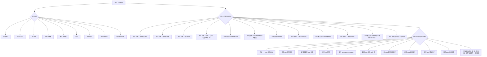

# Ava 粗粒度交互图

本图用于快速说明 Ava 模块有哪些参与角色、入口、主要能力和结果状态。它不展开每个控件的全部状态，详细交互见 [ava-detailed-interaction-diagram.md](./ava-detailed-interaction-diagram.md)。

```mermaid
flowchart TD
  Start["进入 Ava 模块"]
  Start --> Actors{"参与角色"}
  Actors --> A1["普通用户"]
  Actors --> A2["Team 成员"]
  Actors --> A3["AI 服务"]
  Actors --> A4["消息创建者"]
  Actors --> A5["聊天创建者"]
  Actors --> A6["访客"]
  Actors --> A7["注册用户"]
  Actors --> A8["Team Admin"]
  Actors --> A9["语音转写服务"]
  Start --> Entry{"可见入口或页面区域"}
  Entry --> E1["AVA 页面 > 新建聊天按钮"]
  Entry --> E2["AVA 页面 > 聊天输入框"]
  Entry --> E3["AVA 页面 > 发送按钮"]
  Entry --> E4["AVA 页面 > 模型、Agent、工具和附件入口"]
  Entry --> E5["AVA 页面 > 左侧线程列表"]
  Entry --> E6["AVA 页面 > 按日期分组的历史聊天"]
  Entry --> E7["AVA 页面 > 线程项"]
  Entry --> E8["AVA 聊天页 > 用户消息卡片"]
  Entry --> E9["AVA 聊天页 > 消息更多操作"]
  Entry --> E10["AVA 聊天页 > 编辑问题入口"]
  Entry --> E11["AVA 聊天页 > 删除最后一条用户消息入口"]
  Entry --> E12["AVA 聊天页 > 顶部分享按钮"]
  Entry --> Capabilities{"用户可执行的主要操作"}
  Capabilities --> UC1["开始一个 AVA 聊天会话"]
  Capabilities --> UC2["管理 AVA 聊天线程"]
  Capabilities --> UC3["编辑或删除 AVA 消息"]
  Capabilities --> UC4["分享 AVA 聊天"]
  Capabilities --> UC5["使用 AVA Deep Research"]
  Capabilities --> UC6["配置 AVA 聊天 AI 设置"]
  Capabilities --> UC7["向 AVA 聊天附加文件"]
  Capabilities --> UC8["使用 AVA 语音输入"]
  Capabilities --> UC9["使用 AVA 建议动作"]
  Capabilities --> UC10["操作 AVA 消息结果"]
  Capabilities --> Result["界面显示成功、失败、空状态、权限状态或下一步入口"]
```
