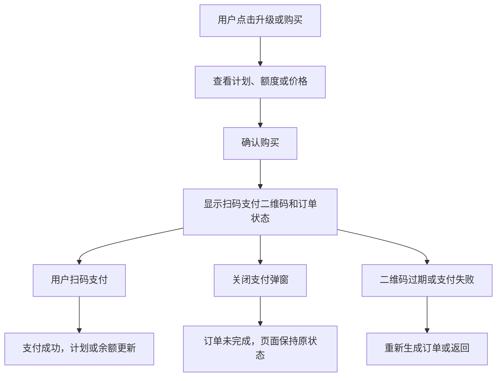

# Billing 交互图

```mermaid
flowchart TD
  Upgrade["用户点击升级或购买"] --> Plan["查看计划、额度或价格"]
  Plan --> Confirm["确认购买"]
  Confirm --> QR["显示扫码支付二维码和订单状态"]
  QR --> Scan["用户扫码支付"]
  Scan --> Success["支付成功，计划或余额更新"]
  QR --> Close["关闭支付弹窗"]
  Close --> Pending["订单未完成，页面保持原状态"]
  QR --> Expired["二维码过期或支付失败"]
  Expired --> Retry["重新生成订单或返回"]
```

