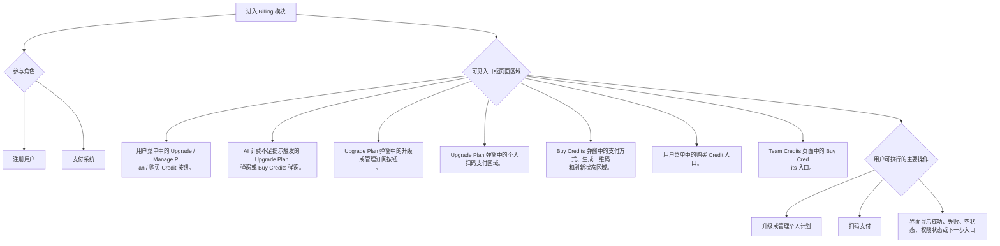

# Billing 粗粒度交互图

本图用于快速说明 Billing 模块有哪些参与角色、入口、主要能力和结果状态。它不展开每个控件的全部状态，详细交互见 [billing-detailed-interaction-diagram.md](./billing-detailed-interaction-diagram.md)。

```mermaid
flowchart TD
  Start["进入 Billing 模块"]
  Start --> Actors{"参与角色"}
  Actors --> A1["注册用户"]
  Actors --> A2["支付系统"]
  Start --> Entry{"可见入口或页面区域"}
  Entry --> E1["用户菜单中的 Upgrade / Manage Pl<br/>an / 购买 Credit 按钮。"]
  Entry --> E2["AI 计费不足提示触发的 Upgrade Plan <br/>弹窗或 Buy Credits 弹窗。"]
  Entry --> E3["Upgrade Plan 弹窗中的升级或管理订阅按钮<br/>。"]
  Entry --> E4["Upgrade Plan 弹窗中的个人扫码支付区域。"]
  Entry --> E5["Buy Credits 弹窗中的支付方式、生成二维码<br/>和刷新状态区域。"]
  Entry --> E6["用户菜单中的购买 Credit 入口。"]
  Entry --> E7["Team Credits 页面中的 Buy Cred<br/>its 入口。"]
  Entry --> Capabilities{"用户可执行的主要操作"}
  Capabilities --> UC1["升级或管理个人计划"]
  Capabilities --> UC2["扫码支付"]
  Capabilities --> Result["界面显示成功、失败、空状态、权限状态或下一步入口"]
```
