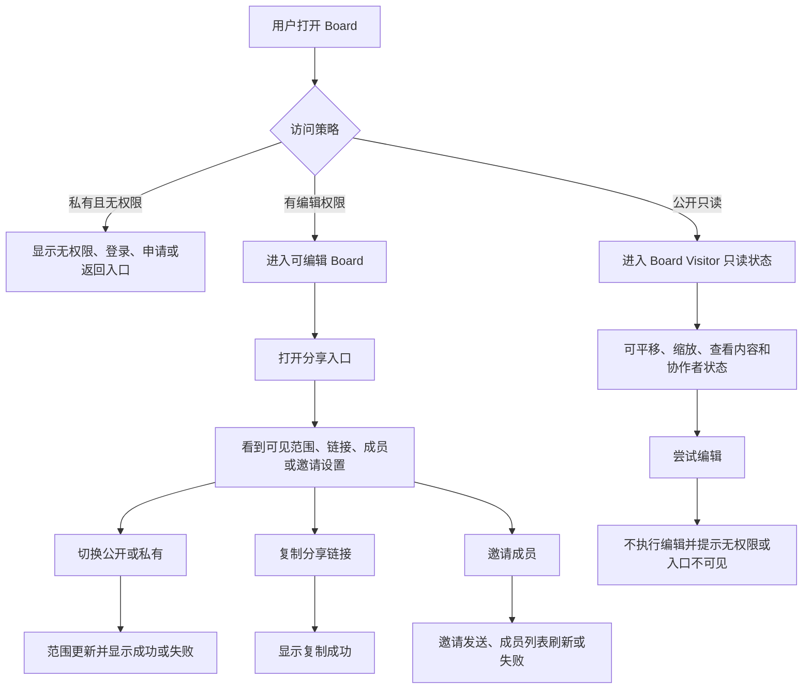

# Board Access 交互图

```mermaid
flowchart TD
  User["用户打开 Board"] --> Access{"访问策略"}
  Access -->|私有且无权限| Denied["显示无权限、登录、申请或返回入口"]
  Access -->|公开只读| Visitor["进入 Board Visitor 只读状态"]
  Access -->|有编辑权限| Editor["进入可编辑 Board"]
  Editor --> Share["打开分享入口"]
  Share --> SharePanel["看到可见范围、链接、成员或邀请设置"]
  SharePanel --> ChangeVisibility["切换公开或私有"]
  ChangeVisibility --> VisibilitySaved["范围更新并显示成功或失败"]
  SharePanel --> CopyLink["复制分享链接"]
  CopyLink --> Copied["显示复制成功"]
  SharePanel --> InviteMember["邀请成员"]
  InviteMember --> InviteResult["邀请发送、成员列表刷新或失败"]
  Visitor --> ViewOnly["可平移、缩放、查看内容和协作者状态"]
  ViewOnly --> EditAttempt["尝试编辑"]
  EditAttempt --> ReadonlyFeedback["不执行编辑并提示无权限或入口不可见"]
```

