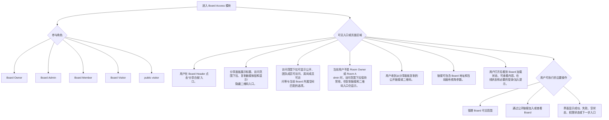

# Board Access 粗粒度交互图

本图用于快速说明 Board Access 模块有哪些参与角色、入口、主要能力和结果状态。它不展开每个控件的全部状态，详细交互见 [board-access-detailed-interaction-diagram.md](./board-access-detailed-interaction-diagram.md)。

```mermaid
flowchart TD
  Start["进入 Board Access 模块"]
  Start --> Actors{"参与角色"}
  Actors --> A1["Board Owner"]
  Actors --> A2["Board Admin"]
  Actors --> A3["Board Member"]
  Actors --> A4["Board Visitor"]
  Actors --> A5["public visitor"]
  Start --> Entry{"可见入口或页面区域"}
  Entry --> E1["用户在 Board Header 点击“分享白板”入<br/>口。"]
  Entry --> E2["分享面板展示标题、访问范围下拉、复制链接按钮和显示/<br/>隐藏二维码入口。"]
  Entry --> E3["访问范围下拉可显示公开、团队成员可访问、房间成员可访<br/>问等与当前 Board 所属空间匹配的选项。"]
  Entry --> E4["当前用户不是 Room Owner 或 Room A<br/>dmin 时，访问范围下拉保持禁用，但复制链接和二维<br/>码入口仍显示。"]
  Entry --> E5["用户收到从分享面板复制的公开链接或二维码。"]
  Entry --> E6["链接可包含 Board 地址和当前画布视角参数。"]
  Entry --> E7["用户打开后看到 Board 加载状态、可查看内容、在<br/>线状态和必要的登录/加入提示。"]
  Entry --> Capabilities{"用户可执行的主要操作"}
  Capabilities --> UC1["管理 Board 可见范围"]
  Capabilities --> UC2["通过公开链接加入或查看 Board"]
  Capabilities --> Result["界面显示成功、失败、空状态、权限状态或下一步入口"]
```
