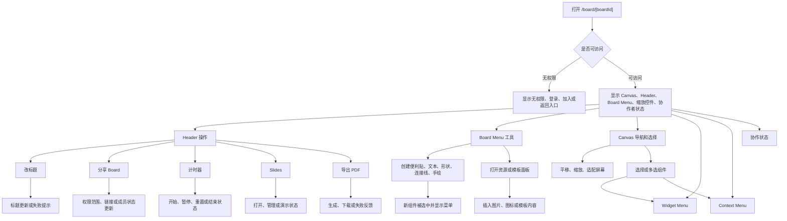

# Board 顶层交互图

```mermaid
flowchart TD
  OpenBoard["打开 /board/[boardId]"] --> Load{"是否可访问"}
  Load -->|无权限| Denied["显示无权限、登录、加入或返回入口"]
  Load -->|可访问| Board["显示 Canvas、Header、Board Menu、缩放控件、协作者状态"]
  Board --> Header["Header 操作"]
  Board --> Tool["Board Menu 工具"]
  Board --> Canvas["Canvas 导航和选择"]
  Board --> WidgetMenu["Widget Menu"]
  Board --> Context["Context Menu"]
  Board --> Collaboration["协作状态"]

  Header --> Title["改标题"]
  Title --> TitleSaved["标题更新或失败提示"]
  Header --> Share["分享 Board"]
  Share --> ShareState["权限范围、链接或成员状态更新"]
  Header --> Timer["计时器"]
  Timer --> TimerState["开始、暂停、重置或结束状态"]
  Header --> Slides["Slides"]
  Slides --> SlideState["打开、管理或演示状态"]
  Header --> Export["导出 PDF"]
  Export --> ExportState["生成、下载或失败反馈"]

  Tool --> CreateWidget["创建便利贴、文本、形状、连接线、手绘"]
  CreateWidget --> WidgetSelected["新组件被选中并显示菜单"]
  Tool --> Resources["打开资源或模板面板"]
  Resources --> InsertAsset["插入图片、图标或模板内容"]

  Canvas --> PanZoom["平移、缩放、适配屏幕"]
  Canvas --> Select["选择或多选组件"]
  Select --> WidgetMenu
  Select --> Context
```

