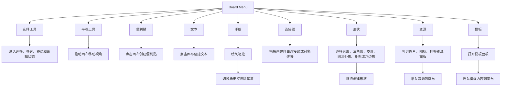

# Board Menu 交互图

```mermaid
flowchart TD
  Menu["Board Menu"] --> Select["选择工具"]
  Menu --> Pan["平移工具"]
  Menu --> Sticky["便利贴"]
  Menu --> Draw["手绘"]
  Menu --> Text["文本"]
  Menu --> Connector["连接线"]
  Menu --> Shape["形状"]
  Menu --> Resources["资源"]
  Menu --> Template["模板"]

  Select --> SelectionMode["进入选择、多选、移动和编辑状态"]
  Pan --> PanMode["拖动画布移动视角"]
  Sticky --> StickyCreate["点击画布创建便利贴"]
  Text --> TextCreate["点击画布创建文本"]
  Shape --> ShapePicker["选择圆形、三角形、菱形、圆角矩形、矩形或六边形"]
  ShapePicker --> ShapeCreate["拖拽创建形状"]
  Connector --> ConnectorCreate["拖拽创建自由连接线或对象连接"]
  Draw --> DrawMode["绘制笔迹"]
  DrawMode --> Eraser["切换橡皮擦擦除笔迹"]
  Resources --> ResourcePanel["打开图片、图标、标签资源面板"]
  ResourcePanel --> InsertResource["插入资源到画布"]
  Template --> TemplatePanel["打开模板面板"]
  TemplatePanel --> InsertTemplate["插入模板内容到画布"]
```

