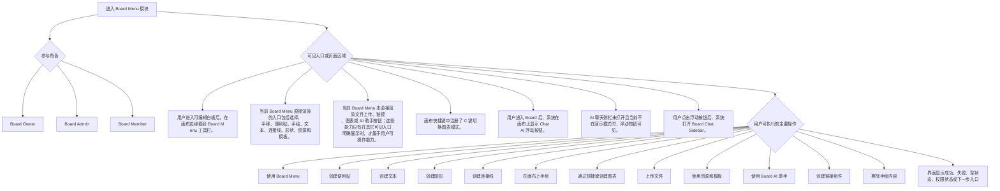

# Board Menu 粗粒度交互图

本图用于快速说明 Board Menu 模块有哪些参与角色、入口、主要能力和结果状态。它不展开每个控件的全部状态，详细交互见 [board-menu-detailed-interaction-diagram.md](./board-menu-detailed-interaction-diagram.md)。

```mermaid
flowchart TD
  Start["进入 Board Menu 模块"]
  Start --> Actors{"参与角色"}
  Actors --> A1["Board Owner"]
  Actors --> A2["Board Admin"]
  Actors --> A3["Board Member"]
  Start --> Entry{"可见入口或页面区域"}
  Entry --> E1["用户进入可编辑白板后，在画布边缘看到 Board M<br/>enu 工具栏。"]
  Entry --> E2["当前 Board Menu 直接渲染的入口包括选择、<br/>平移、便利贴、手绘、文本、连接线、形状、资源和模板。"]
  Entry --> E3["当前 Board Menu 未直接渲染文件上传、链接<br/>、图表或 AI 助手按钮；这些能力只有在其它可见入口<br/>明确展示时，才属于用户可操作能力。"]
  Entry --> E4["画布快捷键中注册了 C 键切换图表模式。"]
  Entry --> E5["用户进入 Board 后，系统在画布上显示 Chat<br/> AI 浮动按钮。"]
  Entry --> E6["AI 聊天侧栏未打开且当前不在演示模式时，浮动按钮可<br/>见。"]
  Entry --> E7["用户点击浮动按钮后，系统打开 Board Chat <br/>Sidebar。"]
  Entry --> Capabilities{"用户可执行的主要操作"}
  Capabilities --> UC1["使用 Board Menu"]
  Capabilities --> UC2["创建便利贴"]
  Capabilities --> UC3["创建文本"]
  Capabilities --> UC4["创建图形"]
  Capabilities --> UC5["创建连接线"]
  Capabilities --> UC6["在画布上手绘"]
  Capabilities --> UC7["通过快捷键创建图表"]
  Capabilities --> UC8["上传文件"]
  Capabilities --> UC9["使用资源和模板"]
  Capabilities --> UC10["使用 Board AI 助手"]
  Capabilities --> UC11["创建链接组件"]
  Capabilities --> UC12["擦除手绘内容"]
  Capabilities --> Result["界面显示成功、失败、空状态、权限状态或下一步入口"]
```
