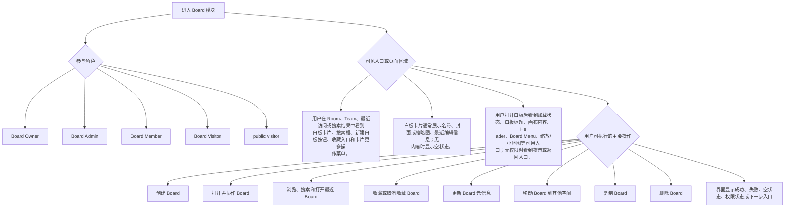

# Board 粗粒度交互图

本图用于快速说明 Board 模块有哪些参与角色、入口、主要能力和结果状态。它不展开每个控件的全部状态，详细交互见 [board-detailed-interaction-diagram.md](./board-detailed-interaction-diagram.md)。

```mermaid
flowchart TD
  Start["进入 Board 模块"]
  Start --> Actors{"参与角色"}
  Actors --> A1["Board Owner"]
  Actors --> A2["Board Admin"]
  Actors --> A3["Board Member"]
  Actors --> A4["Board Visitor"]
  Actors --> A5["public visitor"]
  Start --> Entry{"可见入口或页面区域"}
  Entry --> E1["用户在 Room、Team、最近访问或搜索结果中看到<br/>白板卡片、搜索框、新建白板按钮、收藏入口和卡片更多操<br/>作菜单。"]
  Entry --> E2["白板卡片通常展示名称、封面或缩略图、最近编辑信息；无<br/>内容时显示空状态。"]
  Entry --> E3["用户打开白板后看到加载状态、白板标题、画布内容、He<br/>ader、Board Menu、缩放/小地图等可用入<br/>口；无权限时看到提示或返回入口。"]
  Entry --> Capabilities{"用户可执行的主要操作"}
  Capabilities --> UC1["创建 Board"]
  Capabilities --> UC2["打开并协作 Board"]
  Capabilities --> UC3["浏览、搜索和打开最近 Board"]
  Capabilities --> UC4["收藏或取消收藏 Board"]
  Capabilities --> UC5["更新 Board 元信息"]
  Capabilities --> UC6["移动 Board 到其他空间"]
  Capabilities --> UC7["复制 Board"]
  Capabilities --> UC8["删除 Board"]
  Capabilities --> Result["界面显示成功、失败、空状态、权限状态或下一步入口"]
```
