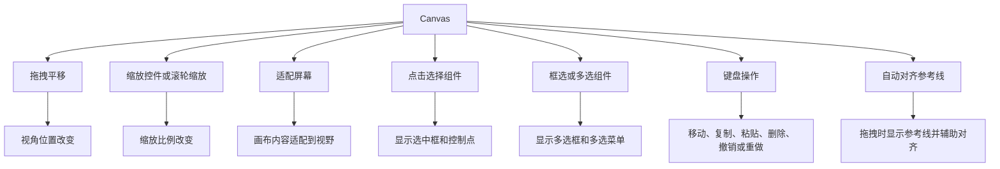

# Board Canvas 交互图

```mermaid
flowchart TD
  Canvas["Canvas"] --> Pan["拖拽平移"]
  Canvas --> Zoom["缩放控件或滚轮缩放"]
  Canvas --> Fit["适配屏幕"]
  Canvas --> Select["点击选择组件"]
  Canvas --> MultiSelect["框选或多选组件"]
  Canvas --> Keyboard["键盘操作"]
  Canvas --> Guidelines["自动对齐参考线"]

  Pan --> ViewChanged["视角位置改变"]
  Zoom --> ZoomChanged["缩放比例改变"]
  Fit --> FitResult["画布内容适配到视野"]
  Select --> SelectionBox["显示选中框和控制点"]
  MultiSelect --> MultiState["显示多选框和多选菜单"]
  Keyboard --> KeyboardResult["移动、复制、粘贴、删除、撤销或重做"]
  Guidelines --> SnapResult["拖拽时显示参考线并辅助对齐"]
```

