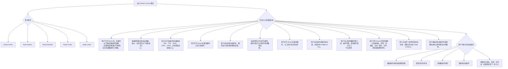

# Board Canvas 粗粒度交互图

本图用于快速说明 Board Canvas 模块有哪些参与角色、入口、主要能力和结果状态。它不展开每个控件的全部状态，详细交互见 [board-canvas-detailed-interaction-diagram.md](./board-canvas-detailed-interaction-diagram.md)。

```mermaid
flowchart TD
  Start["进入 Board Canvas 模块"]
  Start --> Actors{"参与角色"}
  Actors --> A1["Board Owner"]
  Actors --> A2["Board Admin"]
  Actors --> A3["Board Member"]
  Actors --> A4["Board Visitor"]
  Actors --> A5["public visitor"]
  Start --> Entry{"可见入口或页面区域"}
  Entry --> E1["用户打开 Board 后，在画布右下角看到缩放控制条<br/>；当前界面没有展示可拖拽定位的缩略画布小地图。"]
  Entry --> E2["缩放控制条包含适应屏幕、缩小、当前百分比下拉和放大入<br/>口。"]
  Entry --> E3["百分比下拉展示固定缩放值 50%、70%、100%、<br/>150%、200%，并提供适应屏幕入口。"]
  Entry --> E4["用户打开 Board 后看到画布上的已有组件。"]
  Entry --> E5["用户选中并拖动组件时，画布显示选中框和移动反馈。"]
  Entry --> E6["当组件靠近可对齐位置时，画布可显示对齐参考线或吸附反<br/>馈。"]
  Entry --> E7["用户打开 Board 后看到画布、主工具栏和已有组件<br/>。"]
  Entry --> E8["用户选中组件后看到选中框、控制点和 Widget M<br/>enu。"]
  Entry --> E9["用户可以使用键盘切换工具、临时平移、取消操作或打开上<br/>下文菜单。"]
  Entry --> E10["用户打开 Board 后看到画布上的便利贴、形状、连<br/>接线、文本、图片、文件、手绘或图表等组件。"]
  Entry --> E11["用户点击单个组件时看到选中框、控制点和对应 Widg<br/>et Menu。"]
  Entry --> E12["用户框选或多选组件时看到整体选中边界和多选可用菜单。"]
  Entry --> Capabilities{"用户可执行的主要操作"}
  Capabilities --> UC1["缩放画布并使用缩放控制条"]
  Capabilities --> UC2["使用对齐参考线"]
  Capabilities --> UC3["用键盘操作组件"]
  Capabilities --> UC4["选择和多选组件"]
  Capabilities --> Result["界面显示成功、失败、空状态、权限状态或下一步入口"]
```
