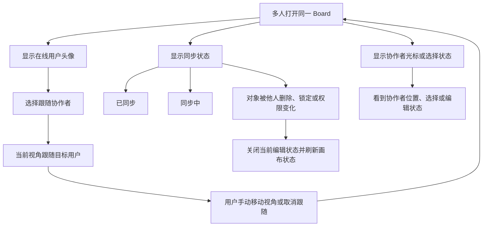

# Board Collaboration 交互图

```mermaid
flowchart TD
  Board["多人打开同一 Board"] --> Sync["显示同步状态"]
  Board --> Online["显示在线用户头像"]
  Board --> Cursor["显示协作者光标或选择状态"]
  Online --> Follow["选择跟随协作者"]
  Follow --> Following["当前视角跟随目标用户"]
  Following --> StopFollow["用户手动移动视角或取消跟随"]
  StopFollow --> Board
  Sync --> Synced["已同步"]
  Sync --> Syncing["同步中"]
  Sync --> Conflict["对象被他人删除、锁定或权限变化"]
  Conflict --> Refresh["关闭当前编辑状态并刷新画布状态"]
  Cursor --> Awareness["看到协作者位置、选择或编辑状态"]
```

