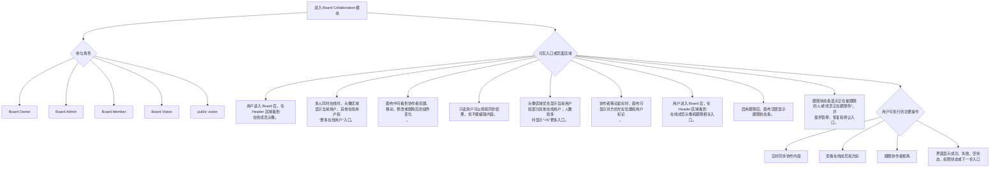

# Board Collaboration 粗粒度交互图

本图用于快速说明 Board Collaboration 模块有哪些参与角色、入口、主要能力和结果状态。它不展开每个控件的全部状态，详细交互见 [board-collaboration-detailed-interaction-diagram.md](./board-collaboration-detailed-interaction-diagram.md)。

