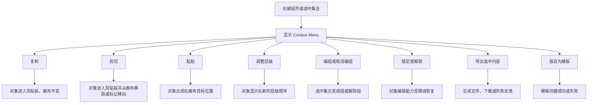

# Context Menu 交互图

```mermaid
flowchart TD
  RightClick["右键组件或选中集合"] --> Menu["显示 Context Menu"]
  Menu --> Copy["复制"]
  Menu --> Cut["剪切"]
  Menu --> Paste["粘贴"]
  Menu --> Layer["调整层级"]
  Menu --> Group["编组或取消编组"]
  Menu --> Lock["锁定或解锁"]
  Menu --> Export["导出选中内容"]
  Menu --> Template["保存为模板"]

  Copy --> Clipboard["对象进入剪贴板，画布不变"]
  Cut --> CutState["对象进入剪贴板并从画布移除或标记移动"]
  Paste --> Pasted["对象出现在画布目标位置"]
  Layer --> LayerResult["对象显示在新的层级顺序"]
  Group --> GroupResult["选中集合变成组或解除组"]
  Lock --> LockResult["对象编辑能力受限或恢复"]
  Export --> ExportResult["生成文件、下载或失败反馈"]
  Template --> TemplateResult["模板创建成功或失败"]
```

