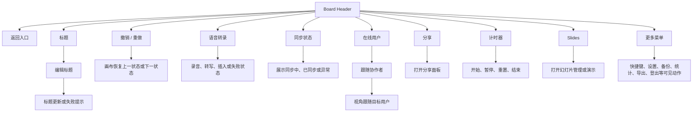

# Board Header 详细交互图

本图按 Board Header 模块当前 Use Case 的主流程展开，重点表达每个界面能看到什么、能操作什么、操作后出现什么状态。若某个 UC 继续细化，应该同步更新该 UC 的主流程和本图。

## 模块交互展开

该部分保留当前模块已有交互图，用于表达模块内主要页面区域之间的流转。

```mermaid
flowchart TD
  Header["Board Header"] --> Back["返回入口"]
  Header --> Title["标题"]
  Header --> UndoRedo["撤销 / 重做"]
  Header --> Voice["语音转录"]
  Header --> Sync["同步状态"]
  Header --> Users["在线用户"]
  Header --> Share["分享"]
  Header --> Timer["计时器"]
  Header --> Slides["Slides"]
  Header --> More["更多菜单"]

  Title --> EditTitle["编辑标题"]
  EditTitle --> TitleResult["标题更新或失败提示"]
  UndoRedo --> HistoryResult["画布恢复上一状态或下一状态"]
  Voice --> VoiceState["录音、转写、插入或失败状态"]
  Sync --> SyncState["展示同步中、已同步或异常"]
  Users --> Follow["跟随协作者"]
  Follow --> FollowState["视角跟随目标用户"]
  Share --> SharePanel["打开分享面板"]
  Timer --> TimerState["开始、暂停、重置、结束"]
  Slides --> SlidePanel["打开幻灯片管理或演示"]
  More --> MoreActions["快捷键、设置、备份、统计、导出、登出等可见动作"]
```

## Use Case 主流程展开

```mermaid
flowchart TD
  subgraph D1G["查看 Board Header 并进入允许操作"]
    D1Start["Actor：Board Owner、Board Admin、Board Memb<br/>er、Board Visitor、public visitor"]
    D1Entry["可见入口/区域：用户进入白板后，在顶部左侧看到返回、白板标题、撤销、重做、语音录制、模式切换和同步状<br/>态；窄屏下标题和左侧部分入口收起或不显示。；顶部右侧显示在线成员、分享、跟随、计时器<br/>、幻灯片和更多菜单。；更多菜单包含备份、快捷键、白板设置、语言切换和登出；分享面板包<br/>含访问范围、复制链接和二维码开关。"]
    D1Start --> D1Entry
    D1S1["1. 用户打开白板后，系统在画布上方显示左右两组 Header 工具；左侧包含返回、白板<br/>标题、撤销、重做、语音录制、模式切换和同步状态，右侧包含在线成员、分享、跟随、计时器、幻<br/>灯片和更多菜单。"]
    D1Entry --> D1S1
    D1S2["2. 用户在 Header 中查看当前白板标题、Beta 标识、在线成员头像或列表、同步<br/>图标；窄屏时部分左侧入口隐藏，用户仍可看到右侧主要协作入口。"]
    D1S1 --> D1S2
    D1S3["3. 用户悬停任一图标按钮，系统显示工具提示，例如返回、撤销、重做、同步数据状态、幻灯片<br/>或更多。"]
    D1S2 --> D1S3
    D1S4["4. 用户点击标题、分享、计时器、幻灯片或更多菜单等入口，系统打开对应输入框、弹窗、侧栏<br/>、下拉菜单或面板，并高亮当前选中的入口。"]
    D1S3 --> D1S4
    D1S5["5. 用户执行操作时，系统用按钮禁用、加载图标、Toast、侧栏开合、面板展开、画布变化<br/>或同步图标旋转反馈进度。"]
    D1S4 --> D1S5
    D1S6["6. 操作完成后，系统更新 Header、画布或列表状态；用户可继续在同一白板中编辑、查<br/>看或协作。"]
    D1S5 --> D1S6
    D1S7["7. 当用户权限不足、功能入口受配置控制或处于移动窄屏时，系统隐藏或禁用相应入口，不扩大<br/>用户可执行能力。"]
    D1S6 --> D1S7
    D1Alt{"备选：1. 计时器运行中时，计时器入口不可再次打开设置，按钮保持禁用或不可操作。；2. 幻灯片<br/>创建或截图过程中，幻灯片侧栏不能立即关闭，系统保持创建状态。；3. 窄屏时部分入口折叠或<br/>隐藏，但不扩大用户权限。"}
    D1S7 --> D1Alt
    D1Err{"异常：1. 权限不足时，系统隐藏、禁用或提示无权限。；2. 麦克风、复制链接、备份、导出或保存<br/>失败时，系统保留原状态并显示失败提示。；3. 同步异常时，系统展示同步中或异常反馈，避免<br/>用户误判为已保存。"}
    D1S7 --> D1Err
    D1Perm["权限/可见性：1. Board Owner：可以进入 Board、编辑内容、管理标题和内容生命周期，并<br/>可在当前 Board、Room、Team 权限允许范围内管理分享范围、删除、移动、复制等<br/>高风险操作。；2. Board Admin：可以编辑内容并使用多数协作入口；涉及可见范围<br/>、删除、移动、备份恢复等管理动作时，需要具备对应 Room/Team/Board 管理权<br/>限。；3. Board Member：可以在有编辑权限的 Board 中创建、修改、移动<br/>、复制和删除自己可操作的内容；不默认拥有权限策略和 Board 生命周期管理能力。；4.<br/> Board Visitor：可以查看允许访问的内容，使用平移、缩放、查看同步状态和在线<br/>状态等查看能力；不能创建、编辑、删除或改变分享范围。；5. Public visitor<br/>：通过公开链接进入时只能获得公开策略允许的查看能力；如需要保存、编辑、加入协作或访问非公<br/>开 Board，系统应引导登录、加入空间或提示无权限。"]
    D1S7 --> D1Perm
  end
  subgraph D2G["管理 Board 标题"]
    D2Start["Actor：Board Owner、Board Admin、Board Memb<br/>er、Board Visitor、public visitor"]
    D2Entry["可见入口/区域：用户进入白板后，在顶部左侧看到返回、白板标题、撤销、重做、语音录制、模式切换和同步状<br/>态；窄屏下标题和左侧部分入口收起或不显示。；顶部右侧显示在线成员、分享、跟随、计时器<br/>、幻灯片和更多菜单。；更多菜单包含备份、快捷键、白板设置、语言切换和登出；分享面板包<br/>含访问范围、复制链接和二维码开关。"]
    D2Start --> D2Entry
    D2S1["1. 用户在 Header 左侧看到当前白板标题输入框；标题过长时，输入框以截断形式显示<br/>，悬停时可通过提示查看完整标题。"]
    D2Entry --> D2S1
    D2S2["2. 用户点击标题输入框，系统进入编辑状态，并选中或定位到当前白板名称。"]
    D2S1 --> D2S2
    D2S3["3. 用户输入新的白板名称，最多可输入系统允许的长度；如果输入为空并离开输入框，系统使用<br/>默认白板名称。"]
    D2S2 --> D2S3
    D2S4["4. 用户按 Enter、点击其他区域或让输入框失焦后，系统开始保存新标题，并在保存期间<br/>禁用输入或降低输入框可操作状态。"]
    D2S3 --> D2S4
    D2S5["5. 保存成功后，Header 标题和浏览器标题更新为新名称。"]
    D2S4 --> D2S5
    D2S6["6. 保存失败时，系统恢复为保存前的名称，并显示失败反馈；用户仍停留在当前白板。"]
    D2S5 --> D2S6
    D2S7["7. 如果保存失败，系统恢复输入框中的原名称，用户仍停留在当前白板。"]
    D2S6 --> D2S7
    D2Alt{"备选：1. 计时器运行中时，计时器入口不可再次打开设置，按钮保持禁用或不可操作。；2. 幻灯片<br/>创建或截图过程中，幻灯片侧栏不能立即关闭，系统保持创建状态。；3. 窄屏时部分入口折叠或<br/>隐藏，但不扩大用户权限。"}
    D2S7 --> D2Alt
    D2Err{"异常：1. 权限不足时，系统隐藏、禁用或提示无权限。；2. 麦克风、复制链接、备份、导出或保存<br/>失败时，系统保留原状态并显示失败提示。；3. 同步异常时，系统展示同步中或异常反馈，避免<br/>用户误判为已保存。"}
    D2S7 --> D2Err
    D2Perm["权限/可见性：1. Board Owner：可以进入 Board、编辑内容、管理标题和内容生命周期，并<br/>可在当前 Board、Room、Team 权限允许范围内管理分享范围、删除、移动、复制等<br/>高风险操作。；2. Board Admin：可以编辑内容并使用多数协作入口；涉及可见范围<br/>、删除、移动、备份恢复等管理动作时，需要具备对应 Room/Team/Board 管理权<br/>限。；3. Board Member：可以在有编辑权限的 Board 中创建、修改、移动<br/>、复制和删除自己可操作的内容；不默认拥有权限策略和 Board 生命周期管理能力。；4.<br/> Board Visitor：可以查看允许访问的内容，使用平移、缩放、查看同步状态和在线<br/>状态等查看能力；不能创建、编辑、删除或改变分享范围。；5. Public visitor<br/>：通过公开链接进入时只能获得公开策略允许的查看能力；如需要保存、编辑、加入协作或访问非公<br/>开 Board，系统应引导登录、加入空间或提示无权限。"]
    D2S7 --> D2Perm
  end
  subgraph D3G["分享 Board"]
    D3Start["Actor：Board Owner、Board Admin、Board Memb<br/>er、Board Visitor、public visitor"]
    D3Entry["可见入口/区域：用户进入白板后，在顶部左侧看到返回、白板标题、撤销、重做、语音录制、模式切换和同步状<br/>态；窄屏下标题和左侧部分入口收起或不显示。；顶部右侧显示在线成员、分享、跟随、计时器<br/>、幻灯片和更多菜单。；更多菜单包含备份、快捷键、白板设置、语言切换和登出；分享面板包<br/>含访问范围、复制链接和二维码开关。"]
    D3Start --> D3Entry
    D3S1["1. 用户点击 Header 右侧“分享”按钮，系统打开“分享白板”面板。"]
    D3Entry --> D3S1
    D3S2["2. 面板顶部显示“分享白板”，并展示访问范围下拉框、复制链接按钮和二维码显示开关。"]
    D3S1 --> D3S2
    D3S3["3. 当前用户是 Room Owner 或 Room Admin 时，可以打开访问范围下<br/>拉框，选择公开、团队成员可访问，或在入口显示时选择房间成员可访问；其他用户访问范围下拉框<br/>禁用但仍可查看当前范围。"]
    D3S2 --> D3S3
    D3S4["4. 用户切换访问范围后，系统立即更新面板中的选中值，并将当前分享范围同步到白板状态。"]
    D3S3 --> D3S4
    D3S5["5. 用户点击“复制链接”，系统生成包含当前画布视图位置的链接并复制到剪贴板；成功时提示<br/>已复制，失败时提示复制失败。"]
    D3S4 --> D3S5
    D3S6["6. 用户点击“显示二维码”，系统展开二维码区域并绘制二维码；再次点击“隐藏二维码”时二<br/>维码区域收起。"]
    D3S5 --> D3S6
    D3S7["7. 用户点击面板外部或再次关闭分享入口，系统收起分享面板；白板内容不发生变化。"]
    D3S6 --> D3S7
    D3Alt{"备选：1. 计时器运行中时，计时器入口不可再次打开设置，按钮保持禁用或不可操作。；2. 幻灯片<br/>创建或截图过程中，幻灯片侧栏不能立即关闭，系统保持创建状态。；3. 窄屏时部分入口折叠或<br/>隐藏，但不扩大用户权限。"}
    D3S7 --> D3Alt
    D3Err{"异常：1. 权限不足时，系统隐藏、禁用或提示无权限。；2. 麦克风、复制链接、备份、导出或保存<br/>失败时，系统保留原状态并显示失败提示。；3. 同步异常时，系统展示同步中或异常反馈，避免<br/>用户误判为已保存。"}
    D3S7 --> D3Err
    D3Perm["权限/可见性：1. Board Owner：可以进入 Board、编辑内容、管理标题和内容生命周期，并<br/>可在当前 Board、Room、Team 权限允许范围内管理分享范围、删除、移动、复制等<br/>高风险操作。；2. Board Admin：可以编辑内容并使用多数协作入口；涉及可见范围<br/>、删除、移动、备份恢复等管理动作时，需要具备对应 Room/Team/Board 管理权<br/>限。；3. Board Member：可以在有编辑权限的 Board 中创建、修改、移动<br/>、复制和删除自己可操作的内容；不默认拥有权限策略和 Board 生命周期管理能力。；4.<br/> Board Visitor：可以查看允许访问的内容，使用平移、缩放、查看同步状态和在线<br/>状态等查看能力；不能创建、编辑、删除或改变分享范围。；5. Public visitor<br/>：通过公开链接进入时只能获得公开策略允许的查看能力；如需要保存、编辑、加入协作或访问非公<br/>开 Board，系统应引导登录、加入空间或提示无权限。"]
    D3S7 --> D3Perm
  end
  subgraph D4G["使用计时器"]
    D4Start["Actor：Board Owner、Board Admin、Board Memb<br/>er、Board Visitor、public visitor"]
    D4Entry["可见入口/区域：用户进入白板后，在顶部左侧看到返回、白板标题、撤销、重做、语音录制、模式切换和同步状<br/>态；窄屏下标题和左侧部分入口收起或不显示。；顶部右侧显示在线成员、分享、跟随、计时器<br/>、幻灯片和更多菜单。；更多菜单包含备份、快捷键、白板设置、语言切换和登出；分享面板包<br/>含访问范围、复制链接和二维码开关。"]
    D4Start --> D4Entry
    D4S1["1. 用户点击 Header 右侧计时器图标；当没有计时器运行时，系统打开计时器设置面板<br/>并高亮计时器入口。"]
    D4Entry --> D4S1
    D4S2["2. 用户在面板中看到快速预设，例如 1 分钟、5 分钟、休息计时、会议计时，也看到自定<br/>义时长区域、分钟输入框、滑块和“开始”按钮。"]
    D4S1 --> D4S2
    D4S3["3. 用户点击预设、拖动滑块或在分钟输入框输入 1 到 60 分钟，系统更新当前时长，并<br/>用选中样式或数值变化反馈选择结果。"]
    D4S2 --> D4S3
    D4S4["4. 用户点击“开始”或按 Enter，系统显示开始中的加载状态，并启动计时器。"]
    D4S3 --> D4S4
    D4S5["5. 计时器运行后，用户在画布上看到倒计时浮层、进度环和剩余时间；时间较少时系统用警示颜<br/>色或状态提示强调。"]
    D4S4 --> D4S5
    D4S6["6. 用户可以使用暂停、继续、停止、加一分钟、静音或声音相关控制；系统即时更新倒计时状态<br/>和按钮图标。"]
    D4S5 --> D4S6
    D4S7["7. 计时结束、暂停、继续或停止后，系统显示相应状态反馈；计时器运行期间 Header <br/>计时器入口保持不可重新打开设置或处于禁用状态。"]
    D4S6 --> D4S7
    D4Alt{"备选：1. 计时器运行中时，计时器入口不可再次打开设置，按钮保持禁用或不可操作。；2. 幻灯片<br/>创建或截图过程中，幻灯片侧栏不能立即关闭，系统保持创建状态。；3. 窄屏时部分入口折叠或<br/>隐藏，但不扩大用户权限。"}
    D4S7 --> D4Alt
    D4Err{"异常：1. 权限不足时，系统隐藏、禁用或提示无权限。；2. 麦克风、复制链接、备份、导出或保存<br/>失败时，系统保留原状态并显示失败提示。；3. 同步异常时，系统展示同步中或异常反馈，避免<br/>用户误判为已保存。"}
    D4S7 --> D4Err
    D4Perm["权限/可见性：1. Board Owner：可以进入 Board、编辑内容、管理标题和内容生命周期，并<br/>可在当前 Board、Room、Team 权限允许范围内管理分享范围、删除、移动、复制等<br/>高风险操作。；2. Board Admin：可以编辑内容并使用多数协作入口；涉及可见范围<br/>、删除、移动、备份恢复等管理动作时，需要具备对应 Room/Team/Board 管理权<br/>限。；3. Board Member：可以在有编辑权限的 Board 中创建、修改、移动<br/>、复制和删除自己可操作的内容；不默认拥有权限策略和 Board 生命周期管理能力。；4.<br/> Board Visitor：可以查看允许访问的内容，使用平移、缩放、查看同步状态和在线<br/>状态等查看能力；不能创建、编辑、删除或改变分享范围。；5. Public visitor<br/>：通过公开链接进入时只能获得公开策略允许的查看能力；如需要保存、编辑、加入协作或访问非公<br/>开 Board，系统应引导登录、加入空间或提示无权限。"]
    D4S7 --> D4Perm
  end
```

```mermaid
flowchart TD
  subgraph D5G["管理幻灯片"]
    D5Start["Actor：Board Owner、Board Admin、Board Memb<br/>er、Board Visitor、public visitor"]
    D5Entry["可见入口/区域：用户进入白板后，在顶部左侧看到返回、白板标题、撤销、重做、语音录制、模式切换和同步状<br/>态；窄屏下标题和左侧部分入口收起或不显示。；顶部右侧显示在线成员、分享、跟随、计时器<br/>、幻灯片和更多菜单。；更多菜单包含备份、快捷键、白板设置、语言切换和登出；分享面板包<br/>含访问范围、复制链接和二维码开关。"]
    D5Start --> D5Entry
    D5S1["1. 用户点击 Header 右侧幻灯片图标，系统在白板右侧打开幻灯片侧栏，并高亮幻灯片<br/>入口。"]
    D5Entry --> D5S1
    D5S2["2. 侧栏顶部显示展示、添加幻灯片、下载为 PDF 和关闭等图标按钮；列表为空时，系统显<br/>示引导内容，提示点击加号后在白板上拖拽定义幻灯片区域。"]
    D5S1 --> D5S2
    D5S3["3. 用户点击加号，系统进入创建幻灯片模式，画布上出现可拖拽定义区域的操作状态，顶部显示<br/>“创建幻灯片模式”和“停止”入口。"]
    D5S2 --> D5S3
    D5S4["4. 用户在画布上拖拽选择区域后，系统生成幻灯片缩略图并把它加入侧栏列表；每张幻灯片显示<br/>序号和缩略图。"]
    D5S3 --> D5S4
    D5S5["5. 用户点击某张幻灯片缩略图，系统将画布移动或缩放到该幻灯片记录的区域，并更新当前幻灯<br/>片序号高亮。"]
    D5S4 --> D5S5
    D5S6["6. 用户拖拽幻灯片卡片可以调整顺序；也可以打开幻灯片更多菜单，选择移动到开头、移动到末<br/>尾或删除，系统更新列表顺序或移除该项。"]
    D5S5 --> D5S6
    D5S7["7. 用户点击展示进入演示流程，点击下载触发 PDF 导出；创建或截图过程中用户关闭侧栏<br/>时，系统先取消或阻止关闭并保持创建状态提示。"]
    D5S6 --> D5S7
    D5Alt{"备选：1. 计时器运行中时，计时器入口不可再次打开设置，按钮保持禁用或不可操作。；2. 幻灯片<br/>创建或截图过程中，幻灯片侧栏不能立即关闭，系统保持创建状态。；3. 窄屏时部分入口折叠或<br/>隐藏，但不扩大用户权限。"}
    D5S7 --> D5Alt
    D5Err{"异常：1. 权限不足时，系统隐藏、禁用或提示无权限。；2. 麦克风、复制链接、备份、导出或保存<br/>失败时，系统保留原状态并显示失败提示。；3. 同步异常时，系统展示同步中或异常反馈，避免<br/>用户误判为已保存。"}
    D5S7 --> D5Err
    D5Perm["权限/可见性：1. Board Owner：可以进入 Board、编辑内容、管理标题和内容生命周期，并<br/>可在当前 Board、Room、Team 权限允许范围内管理分享范围、删除、移动、复制等<br/>高风险操作。；2. Board Admin：可以编辑内容并使用多数协作入口；涉及可见范围<br/>、删除、移动、备份恢复等管理动作时，需要具备对应 Room/Team/Board 管理权<br/>限。；3. Board Member：可以在有编辑权限的 Board 中创建、修改、移动<br/>、复制和删除自己可操作的内容；不默认拥有权限策略和 Board 生命周期管理能力。；4.<br/> Board Visitor：可以查看允许访问的内容，使用平移、缩放、查看同步状态和在线<br/>状态等查看能力；不能创建、编辑、删除或改变分享范围。；5. Public visitor<br/>：通过公开链接进入时只能获得公开策略允许的查看能力；如需要保存、编辑、加入协作或访问非公<br/>开 Board，系统应引导登录、加入空间或提示无权限。"]
    D5S7 --> D5Perm
  end
  subgraph D6G["使用语音转录"]
    D6Start["Actor：Board Owner、Board Admin、Board Memb<br/>er、Board Visitor、public visitor"]
    D6Entry["可见入口/区域：用户进入白板后，在顶部左侧看到返回、白板标题、撤销、重做、语音录制、模式切换和同步状<br/>态；窄屏下标题和左侧部分入口收起或不显示。；顶部右侧显示在线成员、分享、跟随、计时器<br/>、幻灯片和更多菜单。；更多菜单包含备份、快捷键、白板设置、语言切换和登出；分享面板包<br/>含访问范围、复制链接和二维码开关。"]
    D6Start --> D6Entry
    D6S1["1. 用户点击 Header 左侧麦克风按钮，系统请求浏览器麦克风权限；如果用户授权，按<br/>钮进入录音状态并显示音频波形或录音可视化。"]
    D6Entry --> D6S1
    D6S2["2. 录音期间，用户可以看到录音状态，并可点击停止或取消；超过时长、文件大小或设备限制时<br/>，系统自动停止或提示用户。"]
    D6S1 --> D6S2
    D6S3["3. 用户点击停止后，系统进入处理中或转录中状态，按钮显示加载或处理反馈。"]
    D6S2 --> D6S3
    D6S4["4. 转录成功后，系统清理识别文本，并将文本作为可编辑内容展示或添加到画布中央附近的文本<br/>组件。"]
    D6S3 --> D6S4
    D6S5["5. 当实时转录面板显示时，用户可以看到连接中、错误、实时文本、展开/收起、拖拽移动、清<br/>空、确认添加和关闭入口。"]
    D6S4 --> D6S5
    D6S6["6. 用户在实时转录面板中修改文本并点击确认，系统把文本添加到白板并选中新内容；如果关闭<br/>时还有文本，系统提示是否先添加。"]
    D6S5 --> D6S6
    D6S7["7. 转录失败、网络离线、麦克风被拒绝、音频过短或没有识别到语音时，系统显示错误或重试入<br/>口；用户可点击重试或取消，取消后录音状态恢复。"]
    D6S6 --> D6S7
    D6Alt{"备选：1. 计时器运行中时，计时器入口不可再次打开设置，按钮保持禁用或不可操作。；2. 幻灯片<br/>创建或截图过程中，幻灯片侧栏不能立即关闭，系统保持创建状态。；3. 窄屏时部分入口折叠或<br/>隐藏，但不扩大用户权限。"}
    D6S7 --> D6Alt
    D6Err{"异常：1. 权限不足时，系统隐藏、禁用或提示无权限。；2. 麦克风、复制链接、备份、导出或保存<br/>失败时，系统保留原状态并显示失败提示。；3. 同步异常时，系统展示同步中或异常反馈，避免<br/>用户误判为已保存。"}
    D6S7 --> D6Err
    D6Perm["权限/可见性：1. Board Owner：可以进入 Board、编辑内容、管理标题和内容生命周期，并<br/>可在当前 Board、Room、Team 权限允许范围内管理分享范围、删除、移动、复制等<br/>高风险操作。；2. Board Admin：可以编辑内容并使用多数协作入口；涉及可见范围<br/>、删除、移动、备份恢复等管理动作时，需要具备对应 Room/Team/Board 管理权<br/>限。；3. Board Member：可以在有编辑权限的 Board 中创建、修改、移动<br/>、复制和删除自己可操作的内容；不默认拥有权限策略和 Board 生命周期管理能力。；4.<br/> Board Visitor：可以查看允许访问的内容，使用平移、缩放、查看同步状态和在线<br/>状态等查看能力；不能创建、编辑、删除或改变分享范围。；5. Public visitor<br/>：通过公开链接进入时只能获得公开策略允许的查看能力；如需要保存、编辑、加入协作或访问非公<br/>开 Board，系统应引导登录、加入空间或提示无权限。"]
    D6S7 --> D6Perm
  end
  subgraph D7G["管理 Board 备份"]
    D7Start["Actor：Board Owner、Board Admin、Board Memb<br/>er、Board Visitor、public visitor"]
    D7Entry["可见入口/区域：用户进入白板后，在顶部左侧看到返回、白板标题、撤销、重做、语音录制、模式切换和同步状<br/>态；窄屏下标题和左侧部分入口收起或不显示。；顶部右侧显示在线成员、分享、跟随、计时器<br/>、幻灯片和更多菜单。；更多菜单包含备份、快捷键、白板设置、语言切换和登出；分享面板包<br/>含访问范围、复制链接和二维码开关。"]
    D7Start --> D7Entry
    D7S1["1. 用户点击 Header 右侧更多菜单，并选择“备份”。"]
    D7Entry --> D7S1
    D7S2["2. 系统关闭更多菜单并打开“白板备份”弹窗；弹窗中显示“备份当前状态”按钮和历史备份列<br/>表区域。"]
    D7S1 --> D7S2
    D7S3["3. 如果没有历史备份，用户看到“未找到白板备份”之类的空状态；如果有备份，用户看到备份<br/>创建时间、缩略图和“恢复”按钮。"]
    D7S2 --> D7S3
    D7S4["4. 用户点击“备份当前状态”，系统将按钮切换为加载状态，并显示正在保存备份的提示。"]
    D7S3 --> D7S4
    D7S5["5. 备份成功后，系统提示已推送新备份，列表新增一条带时间和缩略图的备份；备份失败时提示<br/>失败并恢复按钮可点击。"]
    D7S4 --> D7S5
    D7S6["6. 用户点击某条备份的“恢复”，系统打开确认弹窗，说明恢复会用该备份覆盖当前白板状态。"]
    D7S5 --> D7S6
    D7S7["7. 用户确认恢复后，系统显示开始恢复、恢复成功或恢复失败反馈；恢复成功后关闭备份弹窗并<br/>刷新白板内容，协作者也能看到同步后的状态。"]
    D7S6 --> D7S7
    D7Alt{"备选：1. 计时器运行中时，计时器入口不可再次打开设置，按钮保持禁用或不可操作。；2. 幻灯片<br/>创建或截图过程中，幻灯片侧栏不能立即关闭，系统保持创建状态。；3. 窄屏时部分入口折叠或<br/>隐藏，但不扩大用户权限。"}
    D7S7 --> D7Alt
    D7Err{"异常：1. 权限不足时，系统隐藏、禁用或提示无权限。；2. 麦克风、复制链接、备份、导出或保存<br/>失败时，系统保留原状态并显示失败提示。；3. 同步异常时，系统展示同步中或异常反馈，避免<br/>用户误判为已保存。"}
    D7S7 --> D7Err
    D7Perm["权限/可见性：1. Board Owner：可以进入 Board、编辑内容、管理标题和内容生命周期，并<br/>可在当前 Board、Room、Team 权限允许范围内管理分享范围、删除、移动、复制等<br/>高风险操作。；2. Board Admin：可以编辑内容并使用多数协作入口；涉及可见范围<br/>、删除、移动、备份恢复等管理动作时，需要具备对应 Room/Team/Board 管理权<br/>限。；3. Board Member：可以在有编辑权限的 Board 中创建、修改、移动<br/>、复制和删除自己可操作的内容；不默认拥有权限策略和 Board 生命周期管理能力。；4.<br/> Board Visitor：可以查看允许访问的内容，使用平移、缩放、查看同步状态和在线<br/>状态等查看能力；不能创建、编辑、删除或改变分享范围。；5. Public visitor<br/>：通过公开链接进入时只能获得公开策略允许的查看能力；如需要保存、编辑、加入协作或访问非公<br/>开 Board，系统应引导登录、加入空间或提示无权限。"]
    D7S7 --> D7Perm
  end
  subgraph D8G["从 Board 返回上一层"]
    D8Start["Actor：Board Owner、Board Admin、Board Memb<br/>er、Board Visitor、public visitor"]
    D8Entry["可见入口/区域：用户进入白板后，在顶部左侧看到返回、白板标题、撤销、重做、语音录制、模式切换和同步状<br/>态；窄屏下标题和左侧部分入口收起或不显示。；顶部右侧显示在线成员、分享、跟随、计时器<br/>、幻灯片和更多菜单。；更多菜单包含备份、快捷键、白板设置、语言切换和登出；分享面板包<br/>含访问范围、复制链接和二维码开关。"]
    D8Start --> D8Entry
    D8S1["1. 用户在 Header 左侧看到返回按钮；悬停时系统显示“返回”、当前房间名称和团队<br/>名称。"]
    D8Entry --> D8S1
    D8S2["2. 用户点击返回按钮，系统先检查当前是否正在备份或保存离开前状态。"]
    D8S1 --> D8S2
    D8S3["3. 如果正在保存备份，系统显示“正在保存备份，请稍等片刻再离开页面”之类的提示，用户留<br/>在当前白板。"]
    D8S2 --> D8S3
    D8S4["4. 如果可以离开，系统执行离开前清理；需要用户确认时，用户看到确认提示并可以继续离开或<br/>取消。"]
    D8S3 --> D8S4
    D8S5["5. 用户确认离开后，系统导航回当前白板所属房间页面。"]
    D8S4 --> D8S5
    D8S6["6. 用户取消离开、清理失败或保存未完成时，系统停留在当前白板，画布内容和 Header<br/> 状态不变。"]
    D8S5 --> D8S6
    D8S7["7. 模板白板或窄屏场景下返回入口可被隐藏；入口不显示时，用户不能通过该 Header <br/>按钮返回。"]
    D8S6 --> D8S7
    D8Alt{"备选：1. 计时器运行中时，计时器入口不可再次打开设置，按钮保持禁用或不可操作。；2. 幻灯片<br/>创建或截图过程中，幻灯片侧栏不能立即关闭，系统保持创建状态。；3. 窄屏时部分入口折叠或<br/>隐藏，但不扩大用户权限。"}
    D8S7 --> D8Alt
    D8Err{"异常：1. 权限不足时，系统隐藏、禁用或提示无权限。；2. 麦克风、复制链接、备份、导出或保存<br/>失败时，系统保留原状态并显示失败提示。；3. 同步异常时，系统展示同步中或异常反馈，避免<br/>用户误判为已保存。"}
    D8S7 --> D8Err
    D8Perm["权限/可见性：1. Board Owner：可以进入 Board、编辑内容、管理标题和内容生命周期，并<br/>可在当前 Board、Room、Team 权限允许范围内管理分享范围、删除、移动、复制等<br/>高风险操作。；2. Board Admin：可以编辑内容并使用多数协作入口；涉及可见范围<br/>、删除、移动、备份恢复等管理动作时，需要具备对应 Room/Team/Board 管理权<br/>限。；3. Board Member：可以在有编辑权限的 Board 中创建、修改、移动<br/>、复制和删除自己可操作的内容；不默认拥有权限策略和 Board 生命周期管理能力。；4.<br/> Board Visitor：可以查看允许访问的内容，使用平移、缩放、查看同步状态和在线<br/>状态等查看能力；不能创建、编辑、删除或改变分享范围。；5. Public visitor<br/>：通过公开链接进入时只能获得公开策略允许的查看能力；如需要保存、编辑、加入协作或访问非公<br/>开 Board，系统应引导登录、加入空间或提示无权限。"]
    D8S7 --> D8Perm
  end
```

```mermaid
flowchart TD
  subgraph D9G["查看同步状态"]
    D9Start["Actor：Board Owner、Board Admin、Board Memb<br/>er、Board Visitor、public visitor"]
    D9Entry["可见入口/区域：用户进入白板后，在顶部左侧看到返回、白板标题、撤销、重做、语音录制、模式切换和同步状<br/>态；窄屏下标题和左侧部分入口收起或不显示。；顶部右侧显示在线成员、分享、跟随、计时器<br/>、幻灯片和更多菜单。；更多菜单包含备份、快捷键、白板设置、语言切换和登出；分享面板包<br/>含访问范围、复制链接和二维码开关。"]
    D9Start --> D9Entry
    D9S1["1. 用户在 Header 左侧看到同步状态图标，图标作为只读状态入口显示在模式切换附近<br/>。"]
    D9Entry --> D9S1
    D9S2["2. 当白板没有待同步变化时，系统显示成功状态图标，通常为绿色完成标识。"]
    D9S1 --> D9S2
    D9S3["3. 当用户或协作者触发内容更新，且系统仍在保存或同步时，图标切换为旋转的同步中状态。"]
    D9S2 --> D9S3
    D9S4["4. 用户悬停同步图标，系统显示“同步数据状态”提示，帮助用户理解当前图标含义。"]
    D9S3 --> D9S4
    D9S5["5. 同步完成后，图标从旋转状态恢复为完成状态；用户可以据此判断当前白板更新已处理完毕。"]
    D9S4 --> D9S5
    D9S6["6. 如果同步持续异常，系统保持同步中或异常相关反馈，避免用户误以为内容已经保存。"]
    D9S5 --> D9S6
    D9S7["7. 用户点击同步图标不改变画布内容；该入口只用于展示状态，不提供额外编辑权限。"]
    D9S6 --> D9S7
    D9Alt{"备选：1. 计时器运行中时，计时器入口不可再次打开设置，按钮保持禁用或不可操作。；2. 幻灯片<br/>创建或截图过程中，幻灯片侧栏不能立即关闭，系统保持创建状态。；3. 窄屏时部分入口折叠或<br/>隐藏，但不扩大用户权限。"}
    D9S7 --> D9Alt
    D9Err{"异常：1. 权限不足时，系统隐藏、禁用或提示无权限。；2. 麦克风、复制链接、备份、导出或保存<br/>失败时，系统保留原状态并显示失败提示。；3. 同步异常时，系统展示同步中或异常反馈，避免<br/>用户误判为已保存。"}
    D9S7 --> D9Err
    D9Perm["权限/可见性：1. Board Owner：可以进入 Board、编辑内容、管理标题和内容生命周期，并<br/>可在当前 Board、Room、Team 权限允许范围内管理分享范围、删除、移动、复制等<br/>高风险操作。；2. Board Admin：可以编辑内容并使用多数协作入口；涉及可见范围<br/>、删除、移动、备份恢复等管理动作时，需要具备对应 Room/Team/Board 管理权<br/>限。；3. Board Member：可以在有编辑权限的 Board 中创建、修改、移动<br/>、复制和删除自己可操作的内容；不默认拥有权限策略和 Board 生命周期管理能力。；4.<br/> Board Visitor：可以查看允许访问的内容，使用平移、缩放、查看同步状态和在线<br/>状态等查看能力；不能创建、编辑、删除或改变分享范围。；5. Public visitor<br/>：通过公开链接进入时只能获得公开策略允许的查看能力；如需要保存、编辑、加入协作或访问非公<br/>开 Board，系统应引导登录、加入空间或提示无权限。"]
    D9S7 --> D9Perm
  end
  subgraph D10G["撤销或重做 Board 操作"]
    D10Start["Actor：Board Owner、Board Admin、Board Memb<br/>er、Board Visitor、public visitor"]
    D10Entry["可见入口/区域：用户进入白板后，在顶部左侧看到返回、白板标题、撤销、重做、语音录制、模式切换和同步状<br/>态；窄屏下标题和左侧部分入口收起或不显示。；顶部右侧显示在线成员、分享、跟随、计时器<br/>、幻灯片和更多菜单。；更多菜单包含备份、快捷键、白板设置、语言切换和登出；分享面板包<br/>含访问范围、复制链接和二维码开关。"]
    D10Start --> D10Entry
    D10S1["1. 用户在 Header 左侧看到撤销和重做两个图标按钮，悬停时分别显示“撤销”和“重<br/>做”。"]
    D10Entry --> D10S1
    D10S2["2. 当当前白板没有可撤销记录时，撤销按钮显示禁用状态；没有可重做记录时，重做按钮显示禁<br/>用状态。"]
    D10S1 --> D10S2
    D10S3["3. 用户在画布上执行创建、移动、删除或编辑等可撤销操作后，撤销按钮变为可点击。"]
    D10S2 --> D10S3
    D10S4["4. 用户点击撤销，系统把画布恢复到上一个可见状态，并根据新的历史记录更新撤销和重做按钮<br/>状态。"]
    D10S3 --> D10S4
    D10S5["5. 撤销后如果存在可恢复记录，重做按钮变为可点击；用户点击重做后，系统恢复下一步可见状<br/>态。"]
    D10S4 --> D10S5
    D10S6["6. 每次撤销或重做都会触发同步状态变化，用户可看到同步图标短暂进入同步中并在完成后恢复<br/>。"]
    D10S5 --> D10S6
    D10S7["7. 只读用户或无编辑权限用户看不到可操作的撤销/重做能力，或按钮保持不可用。"]
    D10S6 --> D10S7
    D10Alt{"备选：1. 计时器运行中时，计时器入口不可再次打开设置，按钮保持禁用或不可操作。；2. 幻灯片<br/>创建或截图过程中，幻灯片侧栏不能立即关闭，系统保持创建状态。；3. 窄屏时部分入口折叠或<br/>隐藏，但不扩大用户权限。"}
    D10S7 --> D10Alt
    D10Err{"异常：1. 权限不足时，系统隐藏、禁用或提示无权限。；2. 麦克风、复制链接、备份、导出或保存<br/>失败时，系统保留原状态并显示失败提示。；3. 同步异常时，系统展示同步中或异常反馈，避免<br/>用户误判为已保存。"}
    D10S7 --> D10Err
    D10Perm["权限/可见性：1. Board Owner：可以进入 Board、编辑内容、管理标题和内容生命周期，并<br/>可在当前 Board、Room、Team 权限允许范围内管理分享范围、删除、移动、复制等<br/>高风险操作。；2. Board Admin：可以编辑内容并使用多数协作入口；涉及可见范围<br/>、删除、移动、备份恢复等管理动作时，需要具备对应 Room/Team/Board 管理权<br/>限。；3. Board Member：可以在有编辑权限的 Board 中创建、修改、移动<br/>、复制和删除自己可操作的内容；不默认拥有权限策略和 Board 生命周期管理能力。；4.<br/> Board Visitor：可以查看允许访问的内容，使用平移、缩放、查看同步状态和在线<br/>状态等查看能力；不能创建、编辑、删除或改变分享范围。；5. Public visitor<br/>：通过公开链接进入时只能获得公开策略允许的查看能力；如需要保存、编辑、加入协作或访问非公<br/>开 Board，系统应引导登录、加入空间或提示无权限。"]
    D10S7 --> D10Perm
  end
  subgraph D11G["打开快捷键帮助"]
    D11Start["Actor：Board Owner、Board Admin、Board Memb<br/>er、Board Visitor、public visitor"]
    D11Entry["可见入口/区域：用户进入白板后，在顶部左侧看到返回、白板标题、撤销、重做、语音录制、模式切换和同步状<br/>态；窄屏下标题和左侧部分入口收起或不显示。；顶部右侧显示在线成员、分享、跟随、计时器<br/>、幻灯片和更多菜单。；更多菜单包含备份、快捷键、白板设置、语言切换和登出；分享面板包<br/>含访问范围、复制链接和二维码开关。"]
    D11Start --> D11Entry
    D11S1["1. 用户点击 Header 右侧更多菜单，并选择“快捷键”。"]
    D11Entry --> D11S1
    D11S2["2. 系统关闭更多菜单并打开快捷键弹窗，标题显示快捷键相关文案。"]
    D11S1 --> D11S2
    D11S3["3. 弹窗顶部展示上下文相关提示，提醒用户快捷键会随当前选择、输入焦点或画布状态变化。"]
    D11S2 --> D11S3
    D11S4["4. 用户在弹窗中看到按分类排列的快捷键，例如工具、编辑、排列、视图、文本、帮助、系统和<br/>其他；每条快捷键显示操作说明和按键组合。"]
    D11S3 --> D11S4
    D11S5["5. 系统根据用户平台显示对应按键样式，例如 Mac 上显示 Command、Shift<br/> 等符号，其他平台显示 Ctrl、Shift、Alt 等文字。"]
    D11S4 --> D11S5
    D11S6["6. 用户滚动弹窗可以查看更多分类和快捷键；快捷键服务尚未加载完成时，系统只展示已可确认<br/>的内容或保持空白区域。"]
    D11S5 --> D11S6
    D11S7["7. 用户点击关闭、按 Esc 或点击弹窗外部后，系统关闭快捷键弹窗并回到白板，画布内容<br/>不改变。"]
    D11S6 --> D11S7
    D11Alt{"备选：1. 计时器运行中时，计时器入口不可再次打开设置，按钮保持禁用或不可操作。；2. 幻灯片<br/>创建或截图过程中，幻灯片侧栏不能立即关闭，系统保持创建状态。；3. 窄屏时部分入口折叠或<br/>隐藏，但不扩大用户权限。"}
    D11S7 --> D11Alt
    D11Err{"异常：1. 权限不足时，系统隐藏、禁用或提示无权限。；2. 麦克风、复制链接、备份、导出或保存<br/>失败时，系统保留原状态并显示失败提示。；3. 同步异常时，系统展示同步中或异常反馈，避免<br/>用户误判为已保存。"}
    D11S7 --> D11Err
    D11Perm["权限/可见性：1. Board Owner：可以进入 Board、编辑内容、管理标题和内容生命周期，并<br/>可在当前 Board、Room、Team 权限允许范围内管理分享范围、删除、移动、复制等<br/>高风险操作。；2. Board Admin：可以编辑内容并使用多数协作入口；涉及可见范围<br/>、删除、移动、备份恢复等管理动作时，需要具备对应 Room/Team/Board 管理权<br/>限。；3. Board Member：可以在有编辑权限的 Board 中创建、修改、移动<br/>、复制和删除自己可操作的内容；不默认拥有权限策略和 Board 生命周期管理能力。；4.<br/> Board Visitor：可以查看允许访问的内容，使用平移、缩放、查看同步状态和在线<br/>状态等查看能力；不能创建、编辑、删除或改变分享范围。；5. Public visitor<br/>：通过公开链接进入时只能获得公开策略允许的查看能力；如需要保存、编辑、加入协作或访问非公<br/>开 Board，系统应引导登录、加入空间或提示无权限。"]
    D11S7 --> D11Perm
  end
  subgraph D12G["管理 Board 设置"]
    D12Start["Actor：Board Owner、Board Admin、Board Memb<br/>er、Board Visitor、public visitor"]
    D12Entry["可见入口/区域：用户进入白板后，在顶部左侧看到返回、白板标题、撤销、重做、语音录制、模式切换和同步状<br/>态；窄屏下标题和左侧部分入口收起或不显示。；顶部右侧显示在线成员、分享、跟随、计时器<br/>、幻灯片和更多菜单。；更多菜单包含备份、快捷键、白板设置、语言切换和登出；分享面板包<br/>含访问范围、复制链接和二维码开关。"]
    D12Start --> D12Entry
    D12S1["1. 用户点击 Header 右侧更多菜单，并选择“白板设置”。"]
    D12Entry --> D12S1
    D12S2["2. 系统关闭更多菜单并打开“白板设置”弹窗。"]
    D12S1 --> D12S2
    D12S3["3. 用户看到“输入设备”设置，下拉框可选择自动、触控板或鼠标；当前已保存的选择会作为默<br/>认值显示。"]
    D12S2 --> D12S3
    D12S4["4. 用户打开输入设备下拉框并选择选项后，系统立即更新选择，并保存为后续白板交互偏好。"]
    D12S3 --> D12S4
    D12S5["5. 用户看到“上下文选择”开关；入口显示时，用户可打开或关闭是否把白板内容纳入 AI <br/>对话上下文。"]
    D12S4 --> D12S5
    D12S6["6. 用户切换上下文选择时，系统在保存期间禁用开关或保留当前状态；保存失败时恢复原值并显<br/>示保存失败。"]
    D12S5 --> D12S6
    D12S7["7. 用户点击“保存”关闭弹窗并保留设置；点击“取消”关闭弹窗，不再执行额外保存动作。"]
    D12S6 --> D12S7
    D12Alt{"备选：1. 计时器运行中时，计时器入口不可再次打开设置，按钮保持禁用或不可操作。；2. 幻灯片<br/>创建或截图过程中，幻灯片侧栏不能立即关闭，系统保持创建状态。；3. 窄屏时部分入口折叠或<br/>隐藏，但不扩大用户权限。"}
    D12S7 --> D12Alt
    D12Err{"异常：1. 权限不足时，系统隐藏、禁用或提示无权限。；2. 麦克风、复制链接、备份、导出或保存<br/>失败时，系统保留原状态并显示失败提示。；3. 同步异常时，系统展示同步中或异常反馈，避免<br/>用户误判为已保存。"}
    D12S7 --> D12Err
    D12Perm["权限/可见性：1. Board Owner：可以进入 Board、编辑内容、管理标题和内容生命周期，并<br/>可在当前 Board、Room、Team 权限允许范围内管理分享范围、删除、移动、复制等<br/>高风险操作。；2. Board Admin：可以编辑内容并使用多数协作入口；涉及可见范围<br/>、删除、移动、备份恢复等管理动作时，需要具备对应 Room/Team/Board 管理权<br/>限。；3. Board Member：可以在有编辑权限的 Board 中创建、修改、移动<br/>、复制和删除自己可操作的内容；不默认拥有权限策略和 Board 生命周期管理能力。；4.<br/> Board Visitor：可以查看允许访问的内容，使用平移、缩放、查看同步状态和在线<br/>状态等查看能力；不能创建、编辑、删除或改变分享范围。；5. Public visitor<br/>：通过公开链接进入时只能获得公开策略允许的查看能力；如需要保存、编辑、加入协作或访问非公<br/>开 Board，系统应引导登录、加入空间或提示无权限。"]
    D12S7 --> D12Perm
  end
```

```mermaid
flowchart TD
  subgraph D13G["查看欢迎引导"]
    D13Start["Actor：Board Owner、Board Admin、Board Memb<br/>er、Board Visitor、public visitor"]
    D13Entry["可见入口/区域：用户进入白板后，在顶部左侧看到返回、白板标题、撤销、重做、语音录制、模式切换和同步状<br/>态；窄屏下标题和左侧部分入口收起或不显示。；顶部右侧显示在线成员、分享、跟随、计时器<br/>、幻灯片和更多菜单。；当前 Header 的更多菜单包含备份、快捷键、白板设置、语言<br/>切换和登出；当前 Header 不展示欢迎引导入口。"]
    D13Start --> D13Entry
    D13S1["1. 用户进入 Board，系统显示 Header、画布和当前可访问内容。"]
    D13Entry --> D13S1
    D13S2["2. 用户查看 Header 左侧，系统显示返回、标题、撤销、重做、语音录制、模式切换和<br/>同步状态等入口。"]
    D13S1 --> D13S2
    D13S3["3. 用户查看 Header 右侧，系统显示在线成员、分享、跟随、计时器、幻灯片和更多菜<br/>单。"]
    D13S2 --> D13S3
    D13S4["4. 用户点击更多菜单，系统展开备份、快捷键、白板设置、语言切换和登出。"]
    D13S3 --> D13S4
    D13S5["5. 用户在更多菜单中查找欢迎引导，系统不展示欢迎引导菜单项。"]
    D13S4 --> D13S5
    D13S6["6. 用户点击快捷键或白板设置时，系统打开对应面板；这些面板不自动进入欢迎引导流程。"]
    D13S5 --> D13S6
    D13S7["7. 用户关闭更多菜单后，系统回到原 Board 状态，画布内容和用户权限不变。"]
    D13S6 --> D13S7
    D13Alt{"备选：1. 窄屏时部分 Header 入口折叠或隐藏，但不扩大用户权限。"}
    D13S7 --> D13Alt
    D13Err{"异常：1. 用户找不到欢迎引导入口时，系统不执行任何欢迎引导动作，白板保持原状态。"}
    D13S7 --> D13Err
    D13Perm["权限/可见性：1. Board Owner：可以进入 Board、编辑内容、管理标题和内容生命周期，并<br/>可在当前 Board、Room、Team 权限允许范围内管理分享范围、删除、移动、复制等<br/>高风险操作。；2. Board Admin：可以编辑内容并使用多数协作入口；涉及可见范围<br/>、删除、移动、备份恢复等管理动作时，需要具备对应 Room/Team/Board 管理权<br/>限。；3. Board Member：可以在有编辑权限的 Board 中创建、修改、移动<br/>、复制和删除自己可操作的内容；不默认拥有权限策略和 Board 生命周期管理能力。；4.<br/> Board Visitor：可以查看允许访问的内容，使用平移、缩放、查看同步状态和在线<br/>状态等查看能力；不能创建、编辑、删除或改变分享范围。；5. Public visitor<br/>：通过公开链接进入时只能获得公开策略允许的查看能力；如需要保存、编辑、加入协作或访问非公<br/>开 Board，系统应引导登录、加入空间或提示无权限。"]
    D13S7 --> D13Perm
  end
  subgraph D14G["查看 Board 统计信息"]
    D14Start["Actor：Board Owner、Board Admin、Board Memb<br/>er、Board Visitor、public visitor"]
    D14Entry["可见入口/区域：用户进入白板后，在顶部左侧看到返回、白板标题、撤销、重做、语音录制、模式切换和同步状<br/>态；窄屏下标题和左侧部分入口收起或不显示。；顶部右侧显示在线成员、分享、跟随、计时器<br/>、幻灯片和更多菜单。；更多菜单包含备份、快捷键、白板设置、语言切换和登出；分享面板包<br/>含访问范围、复制链接和二维码开关。"]
    D14Start --> D14Entry
    D14S1["1. 当统计入口显示时，用户在 Header 标题旁看到统计图标按钮；如果统计功能被配置<br/>关闭，系统不显示该入口。"]
    D14Entry --> D14S1
    D14S2["2. 用户点击统计图标，系统打开统计弹出面板，并开始计算或刷新白板统计数据。"]
    D14S1 --> D14S2
    D14S3["3. 数据加载中时，用户看到加载提示或刷新图标；加载失败时，面板显示错误信息。"]
    D14S2 --> D14S3
    D14S4["4. 加载成功后，用户看到白板统计摘要，例如组件总数、类型数量、画布边界、视口或组件类型<br/>分布等当前可计算信息。"]
    D14S3 --> D14S4
    D14S5["5. 用户点击刷新按钮，系统重新计算统计数据，并更新最后更新时间。"]
    D14S4 --> D14S5
    D14S6["6. 用户点击关闭按钮或弹窗外部，系统关闭统计面板；白板内容不改变。"]
    D14S5 --> D14S6
    D14S7["7. 如果统计入口不显示，用户仍可通过 Header 的同步状态和在线成员查看基础状态，<br/>系统不展示统计面板。"]
    D14S6 --> D14S7
    D14Alt{"备选：1. 计时器运行中时，计时器入口不可再次打开设置，按钮保持禁用或不可操作。；2. 幻灯片<br/>创建或截图过程中，幻灯片侧栏不能立即关闭，系统保持创建状态。；3. 窄屏时部分入口折叠或<br/>隐藏，但不扩大用户权限。"}
    D14S7 --> D14Alt
    D14Err{"异常：1. 权限不足时，系统隐藏、禁用或提示无权限。；2. 麦克风、复制链接、备份、导出或保存<br/>失败时，系统保留原状态并显示失败提示。；3. 同步异常时，系统展示同步中或异常反馈，避免<br/>用户误判为已保存。"}
    D14S7 --> D14Err
    D14Perm["权限/可见性：1. Board Owner：可以进入 Board、编辑内容、管理标题和内容生命周期，并<br/>可在当前 Board、Room、Team 权限允许范围内管理分享范围、删除、移动、复制等<br/>高风险操作。；2. Board Admin：可以编辑内容并使用多数协作入口；涉及可见范围<br/>、删除、移动、备份恢复等管理动作时，需要具备对应 Room/Team/Board 管理权<br/>限。；3. Board Member：可以在有编辑权限的 Board 中创建、修改、移动<br/>、复制和删除自己可操作的内容；不默认拥有权限策略和 Board 生命周期管理能力。；4.<br/> Board Visitor：可以查看允许访问的内容，使用平移、缩放、查看同步状态和在线<br/>状态等查看能力；不能创建、编辑、删除或改变分享范围。；5. Public visitor<br/>：通过公开链接进入时只能获得公开策略允许的查看能力；如需要保存、编辑、加入协作或访问非公<br/>开 Board，系统应引导登录、加入空间或提示无权限。"]
    D14S7 --> D14Perm
  end
  subgraph D15G["导出 Board PDF"]
    D15Start["Actor：Board Owner、Board Admin、Board Memb<br/>er、Board Visitor、public visitor"]
    D15Entry["可见入口/区域：用户进入白板后，在顶部左侧看到返回、白板标题、撤销、重做、语音录制、模式切换和同步状<br/>态；窄屏下标题和左侧部分入口收起或不显示。；顶部右侧显示在线成员、分享、跟随、计时器<br/>、幻灯片和更多菜单。；更多菜单包含备份、快捷键、白板设置、语言切换和登出；分享面板包<br/>含访问范围、复制链接和二维码开关。"]
    D15Start --> D15Entry
    D15S1["1. 用户点击 Header 右侧幻灯片图标，系统打开右侧幻灯片侧栏。"]
    D15Entry --> D15S1
    D15S2["2. 用户在侧栏中查看当前幻灯片列表；如果列表为空，系统显示引导，提示先点击加号并在白板<br/>上拖拽定义幻灯片区域。"]
    D15S1 --> D15S2
    D15S3["3. 用户创建一个或多个幻灯片后，侧栏显示幻灯片缩略图和序号；用户可点击缩略图确认每页导<br/>出的画布区域。"]
    D15S2 --> D15S3
    D15S4["4. 用户点击侧栏顶部“下载为PDF”图标按钮，系统开始根据幻灯片列表生成 PDF。"]
    D15S3 --> D15S4
    D15S5["5. 导出过程中，系统保持侧栏打开，并通过按钮状态、浏览器下载状态或失败提示反馈处理结果<br/>。"]
    D15S4 --> D15S5
    D15S6["6. 导出成功后，浏览器触发 PDF 文件下载；用户可继续留在白板中查看或编辑。"]
    D15S5 --> D15S6
    D15S7["7. 如果没有可导出的幻灯片、截图区域无效或生成失败，系统显示失败或无法导出的提示，不改<br/>变现有幻灯片列表。"]
    D15S6 --> D15S7
    D15Alt{"备选：1. 计时器运行中时，计时器入口不可再次打开设置，按钮保持禁用或不可操作。；2. 幻灯片<br/>创建或截图过程中，幻灯片侧栏不能立即关闭，系统保持创建状态。；3. 窄屏时部分入口折叠或<br/>隐藏，但不扩大用户权限。"}
    D15S7 --> D15Alt
    D15Err{"异常：1. 权限不足时，系统隐藏、禁用或提示无权限。；2. 麦克风、复制链接、备份、导出或保存<br/>失败时，系统保留原状态并显示失败提示。；3. 同步异常时，系统展示同步中或异常反馈，避免<br/>用户误判为已保存。"}
    D15S7 --> D15Err
    D15Perm["权限/可见性：1. Board Owner：可以进入 Board、编辑内容、管理标题和内容生命周期，并<br/>可在当前 Board、Room、Team 权限允许范围内管理分享范围、删除、移动、复制等<br/>高风险操作。；2. Board Admin：可以编辑内容并使用多数协作入口；涉及可见范围<br/>、删除、移动、备份恢复等管理动作时，需要具备对应 Room/Team/Board 管理权<br/>限。；3. Board Member：可以在有编辑权限的 Board 中创建、修改、移动<br/>、复制和删除自己可操作的内容；不默认拥有权限策略和 Board 生命周期管理能力。；4.<br/> Board Visitor：可以查看允许访问的内容，使用平移、缩放、查看同步状态和在线<br/>状态等查看能力；不能创建、编辑、删除或改变分享范围。；5. Public visitor<br/>：通过公开链接进入时只能获得公开策略允许的查看能力；如需要保存、编辑、加入协作或访问非公<br/>开 Board，系统应引导登录、加入空间或提示无权限。"]
    D15S7 --> D15Perm
  end
```

