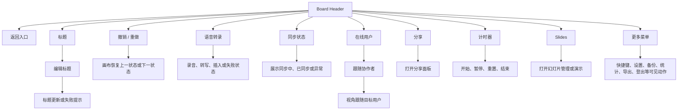

# Board Header 交互图

```mermaid
flowchart TD
  Header["Board Header"] --> Back["返回入口"]
  Header --> Title["标题"]
  Header --> UndoRedo["撤销 / 重做"]
  Header --> Voice["语音转录"]
  Header --> Sync["同步状态"]
  Header --> Users["在线用户"]
  Header --> Share["分享"]
  Header --> Timer["计时器"]
  Header --> Slides["Slides"]
  Header --> More["更多菜单"]

  Title --> EditTitle["编辑标题"]
  EditTitle --> TitleResult["标题更新或失败提示"]
  UndoRedo --> HistoryResult["画布恢复上一状态或下一状态"]
  Voice --> VoiceState["录音、转写、插入或失败状态"]
  Sync --> SyncState["展示同步中、已同步或异常"]
  Users --> Follow["跟随协作者"]
  Follow --> FollowState["视角跟随目标用户"]
  Share --> SharePanel["打开分享面板"]
  Timer --> TimerState["开始、暂停、重置、结束"]
  Slides --> SlidePanel["打开幻灯片管理或演示"]
  More --> MoreActions["快捷键、设置、备份、统计、导出、登出等可见动作"]
```

