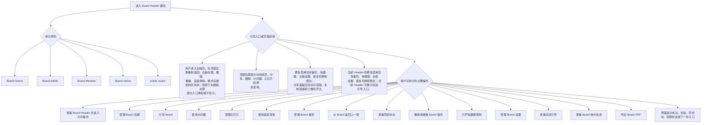

# Board Header 粗粒度交互图

本图用于快速说明 Board Header 模块有哪些参与角色、入口、主要能力和结果状态。它不展开每个控件的全部状态，详细交互见 [board-header-detailed-interaction-diagram.md](./board-header-detailed-interaction-diagram.md)。

```mermaid
flowchart TD
  Start["进入 Board Header 模块"]
  Start --> Actors{"参与角色"}
  Actors --> A1["Board Owner"]
  Actors --> A2["Board Admin"]
  Actors --> A3["Board Member"]
  Actors --> A4["Board Visitor"]
  Actors --> A5["public visitor"]
  Start --> Entry{"可见入口或页面区域"}
  Entry --> E1["用户进入白板后，在顶部左侧看到返回、白板标题、撤销、<br/>重做、语音录制、模式切换和同步状态；窄屏下标题和左侧<br/>部分入口收起或不显示。"]
  Entry --> E2["顶部右侧显示在线成员、分享、跟随、计时器、幻灯片和更<br/>多菜单。"]
  Entry --> E3["更多菜单包含备份、快捷键、白板设置、语言切换和登出；<br/>分享面板包含访问范围、复制链接和二维码开关。"]
  Entry --> E4["当前 Header 的更多菜单包含备份、快捷键、白板<br/>设置、语言切换和登出；当前 Header 不展示欢迎<br/>引导入口。"]
  Entry --> Capabilities{"用户可执行的主要操作"}
  Capabilities --> UC1["查看 Board Header 并进入允许操作"]
  Capabilities --> UC2["管理 Board 标题"]
  Capabilities --> UC3["分享 Board"]
  Capabilities --> UC4["使用计时器"]
  Capabilities --> UC5["管理幻灯片"]
  Capabilities --> UC6["使用语音转录"]
  Capabilities --> UC7["管理 Board 备份"]
  Capabilities --> UC8["从 Board 返回上一层"]
  Capabilities --> UC9["查看同步状态"]
  Capabilities --> UC10["撤销或重做 Board 操作"]
  Capabilities --> UC11["打开快捷键帮助"]
  Capabilities --> UC12["管理 Board 设置"]
  Capabilities --> UC13["查看欢迎引导"]
  Capabilities --> UC14["查看 Board 统计信息"]
  Capabilities --> UC15["导出 Board PDF"]
  Capabilities --> Result["界面显示成功、失败、空状态、权限状态或下一步入口"]
```
