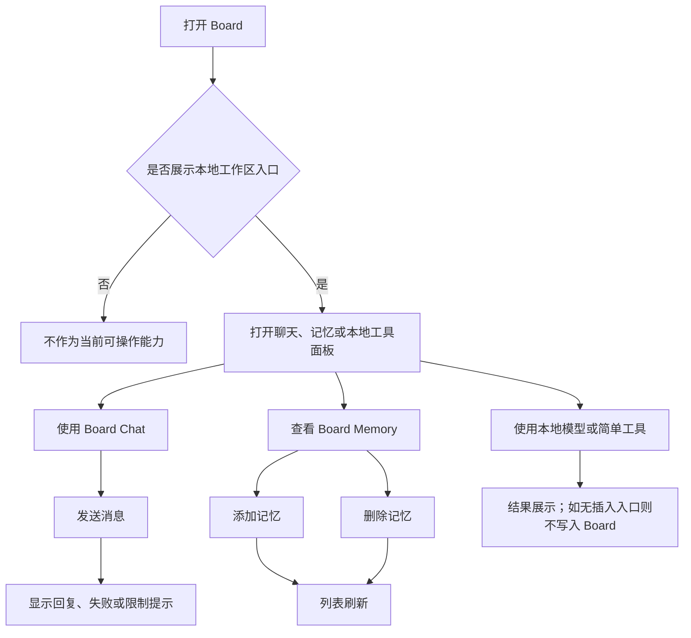

# Board Local Workspace 交互图

```mermaid
flowchart TD
  Board["打开 Board"] --> Entry{"是否展示本地工作区入口"}
  Entry -->|否| Hidden["不作为当前可操作能力"]
  Entry -->|是| Workspace["打开聊天、记忆或本地工具面板"]
  Workspace --> Chat["使用 Board Chat"]
  Chat --> Send["发送消息"]
  Send --> Reply["显示回复、失败或限制提示"]
  Workspace --> Memory["查看 Board Memory"]
  Memory --> Add["添加记忆"]
  Add --> MemoryList["列表刷新"]
  Memory --> Delete["删除记忆"]
  Delete --> MemoryList
  Workspace --> Tool["使用本地模型或简单工具"]
  Tool --> ToolResult["结果展示；如无插入入口则不写入 Board"]
```

