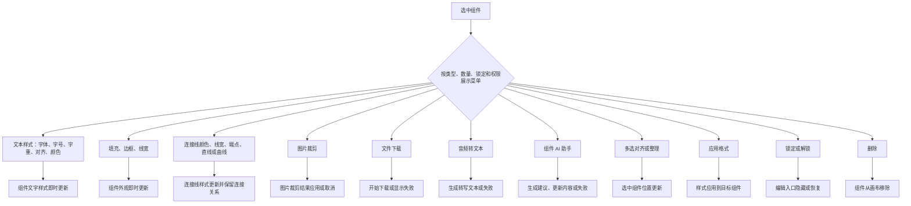

# Widget Menu 交互图

```mermaid
flowchart TD
  Select["选中组件"] --> Menu{"按类型、数量、锁定和权限展示菜单"}
  Menu --> TextStyle["文本样式：字体、字号、字重、对齐、颜色"]
  Menu --> Fill["填充、边框、线宽"]
  Menu --> ConnectorStyle["连接线颜色、线宽、端点、直线或曲线"]
  Menu --> ImageCrop["图片裁剪"]
  Menu --> FileDownload["文件下载"]
  Menu --> AudioText["音频转文本"]
  Menu --> AI["组件 AI 助手"]
  Menu --> Align["多选对齐或整理"]
  Menu --> Format["应用格式"]
  Menu --> Lock["锁定或解锁"]
  Menu --> Delete["删除"]

  TextStyle --> StyleResult["组件文字样式即时更新"]
  Fill --> FillResult["组件外观即时更新"]
  ConnectorStyle --> ConnectorResult["连接线样式更新并保留连接关系"]
  ImageCrop --> CropResult["图片裁剪结果应用或取消"]
  FileDownload --> DownloadResult["开始下载或显示失败"]
  AudioText --> TranscriptResult["生成转写文本或失败"]
  AI --> AIResult["生成建议、更新内容或失败"]
  Align --> AlignResult["选中组件位置更新"]
  Format --> FormatResult["样式应用到目标组件"]
  Lock --> LockResult["编辑入口隐藏或恢复"]
  Delete --> DeleteResult["组件从画布移除"]
```

