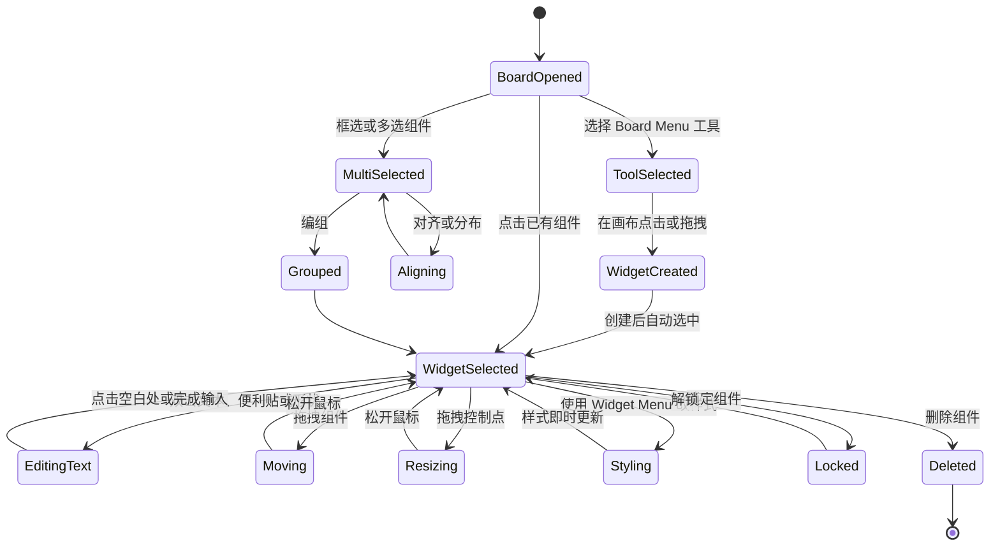
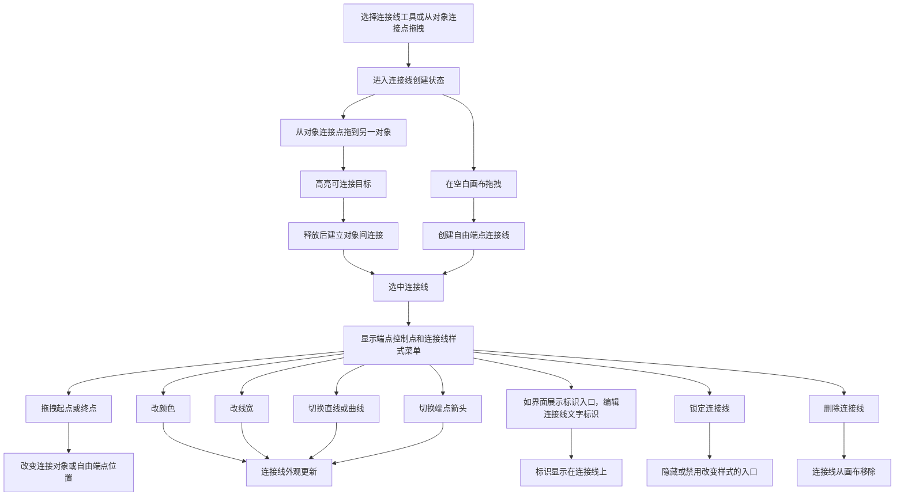

# Board Widgets 详细交互图

本图按 Board Widgets 模块当前 Use Case 的主流程展开，重点表达每个界面能看到什么、能操作什么、操作后出现什么状态。若某个 UC 继续细化，应该同步更新该 UC 的主流程和本图。

## 模块交互展开

该部分保留当前模块已有交互图，用于表达模块内主要页面区域之间的流转。

```mermaid
stateDiagram-v2
  [*] --> BoardOpened
  BoardOpened --> ToolSelected: 选择 Board Menu 工具
  ToolSelected --> WidgetCreated: 在画布点击或拖拽
  WidgetCreated --> WidgetSelected: 创建后自动选中
  BoardOpened --> WidgetSelected: 点击已有组件
  BoardOpened --> MultiSelected: 框选或多选组件
  WidgetSelected --> EditingText: 双击文本、便利贴或形状
  EditingText --> WidgetSelected: 点击空白处或完成输入
  WidgetSelected --> Moving: 拖拽组件
  Moving --> WidgetSelected: 松开鼠标
  WidgetSelected --> Resizing: 拖拽控制点
  Resizing --> WidgetSelected: 松开鼠标
  WidgetSelected --> Styling: 使用 Widget Menu 改样式
  Styling --> WidgetSelected: 样式即时更新
  WidgetSelected --> Locked: 锁定组件
  Locked --> WidgetSelected: 解锁
  WidgetSelected --> Deleted: 删除组件
  MultiSelected --> Aligning: 对齐或分布
  Aligning --> MultiSelected
  MultiSelected --> Grouped: 编组
  Grouped --> WidgetSelected
  Deleted --> [*]
```

```mermaid
flowchart TD
  Start["选择连接线工具或从对象连接点拖拽"] --> Mode["进入连接线创建状态"]
  Mode --> FreeLine["在空白画布拖拽"]
  FreeLine --> FreeLineCreated["创建自由端点连接线"]
  Mode --> ObjectLine["从对象连接点拖到另一对象"]
  ObjectLine --> Highlight["高亮可连接目标"]
  Highlight --> Connected["释放后建立对象间连接"]
  Connected --> SelectLine["选中连接线"]
  FreeLineCreated --> SelectLine
  SelectLine --> Menu["显示端点控制点和连接线样式菜单"]
  Menu --> MoveEndpoint["拖拽起点或终点"]
  MoveEndpoint --> Reconnect["改变连接对象或自由端点位置"]
  Menu --> ChangeColor["改颜色"]
  ChangeColor --> LineUpdated["连接线外观更新"]
  Menu --> ChangeWidth["改线宽"]
  ChangeWidth --> LineUpdated
  Menu --> ChangePath["切换直线或曲线"]
  ChangePath --> LineUpdated
  Menu --> ChangeArrow["切换端点箭头"]
  ChangeArrow --> LineUpdated
  Menu --> OptionalLabel["如界面展示标识入口，编辑连接线文字标识"]
  OptionalLabel --> LabelUpdated["标识显示在连接线上"]
  Menu --> Lock["锁定连接线"]
  Lock --> Locked["隐藏或禁用改变样式的入口"]
  Menu --> Delete["删除连接线"]
  Delete --> Removed["连接线从画布移除"]
```

## Use Case 主流程展开

```mermaid
flowchart TD
  subgraph D1G["使用 CanvasX Widgets"]
    D1Start["Actor：Board Owner、Board Admin、Board Memb<br/>er"]
    D1Entry["可见入口/区域：Board 主工具栏中的选择、便利贴、文本、形状、连接线、手绘、资源和模板入口；图片<br/>和图标从资源面板进入，文件入口只有实际显示时才可用。；画布上已有组件。；选中组件后出<br/>现的 Widget Menu。；右键或更多操作打开的 Context Menu。"]
    D1Start --> D1Entry
    D1S1["1. 用户从主工具栏、资源面板、模板面板、拖放或粘贴入口创建组件。"]
    D1Entry --> D1S1
    D1S2["2. 系统在画布中显示新组件，并根据组件类型展示文本光标、图片预览、文件状态、连接端点、<br/>手绘路径、形状边界或便利贴内容。"]
    D1S1 --> D1S2
    D1S3["3. 用户点击组件，系统显示选中框、控制点和该组件类型适用的 Widget Menu。"]
    D1S2 --> D1S3
    D1S4["4. 用户拖拽组件，系统移动组件位置。"]
    D1S3 --> D1S4
    D1S5["5. 用户拖拽控制点，系统按组件类型改变大小、路径或显示区域。"]
    D1S4 --> D1S5
    D1S6["6. 用户使用键盘移动、复制、粘贴、删除或撤销重做，系统更新选中组件状态。"]
    D1S5 --> D1S6
    D1S7["7. 用户通过 Widget Menu 修改组件类型支持的属性，例如文本样式、便利贴形态<br/>、形状颜色、连接线端点、图片裁剪、文件下载或音频转文本。"]
    D1S6 --> D1S7
    D1S8["8. 用户通过 Context Menu 执行通用管理动作，例如复制、剪切、粘贴、删除、<br/>锁定、解锁、置顶置底、对齐、编组、取消编组、导出选中内容或保存为模板。"]
    D1S7 --> D1S8
    D1S9["9. 用户多选组件时，系统进入多选状态，并只展示多选适用的移动、对齐、分布、锁定、删除、<br/>编组等动作。"]
    D1S8 --> D1S9
    D1S10["10. 操作完成后，组件保留在画布中，并参与协作同步、撤销重做、选择、多选、导出和权限控<br/>制。"]
    D1S9 --> D1S10
    D1Alt{"备选：1. 组件被锁定时，系统允许查看和受限选择，但不允许移动、缩放、改内容、改样式或删除。；<br/>2. 当前组件类型不支持某个菜单动作时，系统不显示该入口。；3. Visitor 或 P<br/>ublic visitor 进入 Board 时，系统只提供查看、平移、缩放和允许范围内<br/>的查看操作。；4. 图表组件在当前 Board Menu 中没有直接按钮；文件、链接等入<br/>口未在当前 Board Menu 直接渲染，未展示入口不能被当作当前可操作能力。"}
    D1S10 --> D1Alt
    D1Err{"异常：1. 用户没有编辑权限时，系统不创建组件，也不允许修改已有组件。；2. 文件处理、图片加<br/>载、AI 辅助或图表渲染失败时，系统提示失败，并保留原组件或可恢复状态。；3. 协作过程<br/>中组件被其他用户删除、锁定或权限改变时，系统关闭当前编辑状态并刷新画布。"}
    D1S10 --> D1Err
    D1Perm["权限/可见性：1. Board Owner：可以进入 Board、编辑内容、管理标题和内容生命周期，并<br/>可在当前 Board、Room、Team 权限允许范围内管理分享范围、删除、移动、复制等<br/>高风险操作。；2. Board Admin：可以编辑内容并使用多数协作入口；涉及可见范围<br/>、删除、移动、备份恢复等管理动作时，需要具备对应 Room/Team/Board 管理权<br/>限。；3. Board Member：可以在有编辑权限的 Board 中创建、修改、移动<br/>、复制和删除自己可操作的内容；不默认拥有权限策略和 Board 生命周期管理能力。；4.<br/> Board Visitor：可以查看允许访问的内容，使用平移、缩放、查看同步状态和在线<br/>状态等查看能力；不能创建、编辑、删除或改变分享范围。；5. Public visitor<br/>：通过公开链接进入时只能获得公开策略允许的查看能力；如需要保存、编辑、加入协作或访问非公<br/>开 Board，系统应引导登录、加入空间或提示无权限。"]
    D1S10 --> D1Perm
  end
  subgraph D2G["使用文件组件"]
    D2Start["Actor：Board Owner、Board Admin、Board Memb<br/>er"]
    D2Entry["可见入口/区域：Board 文件或资源入口。；从本地拖放到画布的文件。；画布上已有文件组件。；选中文<br/>件后出现的 Widget Menu 或 Context Menu。"]
    D2Start --> D2Entry
    D2S1["1. 用户通过文件入口或拖放方式添加文件。"]
    D2Entry --> D2S1
    D2S2["2. 系统在画布中创建文件组件，并展示文件名、文件类型或可识别的文件状态。"]
    D2S1 --> D2S2
    D2S3["3. 用户选中文件组件，系统显示选中框、控制点和文件可用菜单。"]
    D2S2 --> D2S3
    D2S4["4. 用户拖拽文件组件，系统移动文件卡片位置。"]
    D2S3 --> D2S4
    D2S5["5. 用户拖拽控制点，系统调整文件卡片显示大小。"]
    D2S4 --> D2S5
    D2S6["6. 用户点击文件名入口时，系统允许查看或编辑文件显示名称。"]
    D2S5 --> D2S6
    D2S7["7. 用户点击下载入口，系统开始下载文件，并展示下载中、成功或失败反馈。"]
    D2S6 --> D2S7
    D2S8["8. 用户选中音频文件并点击转文本入口，系统进入音频转文本处理流程；成功后在画布中生成或<br/>展示转写文本结果。"]
    D2S7 --> D2S8
    D2S9["9. 用户通过 Context Menu 对文件组件执行复制、剪切、粘贴、删除、锁定、解<br/>锁、置顶置底、编组或取消编组等动作。"]
    D2S8 --> D2S9
    D2S10["10. 用户点击 AI 辅助入口时，系统以文件组件或文件内容作为上下文进入 AI 辅助流<br/>程。"]
    D2S9 --> D2S10
    D2S11["11. 操作完成后，文件组件留在画布中，并参与协作同步、撤销重做、选择、多选和导出。"]
    D2S10 --> D2S11
    D2Alt{"备选：1. 文件仍在上传或处理中时，系统展示进行中状态，并限制依赖文件完成后的动作。；2. 非<br/>音频文件不显示音频转文本入口。；3. 多选文件和其它对象时，系统进入多选状态，只展示多选<br/>适用动作。；4. 文件组件被锁定时，系统允许查看和按策略下载，但不允许移动、缩放、重命名<br/>、删除或转写。"}
    D2S11 --> D2Alt
    D2Err{"异常：1. 文件上传或读取失败时，系统展示失败反馈，并允许用户删除或重试。；2. 文件下载失败<br/>时，系统提示下载失败，并保留原文件组件。；3. 音频转文本失败时，系统保留原音频文件组件<br/>，并提示用户重试。；4. 用户没有编辑权限时，系统不添加文件，也不允许修改已有文件组件。<br/>；5. 协作过程中文件组件被其他用户删除或锁定时，系统关闭当前编辑状态并刷新画布。"}
    D2S11 --> D2Err
    D2Perm["权限/可见性：1. Board Owner：可以进入 Board、编辑内容、管理标题和内容生命周期，并<br/>可在当前 Board、Room、Team 权限允许范围内管理分享范围、删除、移动、复制等<br/>高风险操作。；2. Board Admin：可以编辑内容并使用多数协作入口；涉及可见范围<br/>、删除、移动、备份恢复等管理动作时，需要具备对应 Room/Team/Board 管理权<br/>限。；3. Board Member：可以在有编辑权限的 Board 中创建、修改、移动<br/>、复制和删除自己可操作的内容；不默认拥有权限策略和 Board 生命周期管理能力。；4.<br/> Board Visitor：可以查看允许访问的内容，使用平移、缩放、查看同步状态和在线<br/>状态等查看能力；不能创建、编辑、删除或改变分享范围。；5. Public visitor<br/>：通过公开链接进入时只能获得公开策略允许的查看能力；如需要保存、编辑、加入协作或访问非公<br/>开 Board，系统应引导登录、加入空间或提示无权限。"]
    D2S11 --> D2Perm
  end
  subgraph D3G["使用便利贴组件"]
    D3Start["Actor：Board Owner、Board Admin、Board Memb<br/>er"]
    D3Entry["可见入口/区域：Board 左侧或底部主工具栏中的便利贴入口。；画布上已有便利贴。；选中便利贴后出现<br/>的 Widget Menu。；对便利贴右键或打开更多菜单后的 Context Men<br/>u。"]
    D3Start --> D3Entry
    D3S1["1. 用户点击便利贴工具，系统显示可创建便利贴的状态。"]
    D3Entry --> D3S1
    D3S2["2. 用户在画布目标位置点击，系统在该位置创建默认尺寸的便利贴，并显示便利贴边界、选中框<br/>和可用菜单。"]
    D3S1 --> D3S2
    D3S3["3. 用户输入或修改便利贴文本，系统在便利贴内显示文字内容，并根据便利贴尺寸进行排版。"]
    D3S2 --> D3S3
    D3S4["4. 用户拖拽便利贴本体，系统移动便利贴位置，并在移动过程中显示当前位置反馈。"]
    D3S3 --> D3S4
    D3S5["5. 用户拖拽便利贴边角或控制点，系统改变便利贴大小，文字区域随尺寸变化重新排布。"]
    D3S4 --> D3S5
    D3S6["6. 用户通过 Widget Menu 切换便利贴形态，系统在矩形、圆形或形状便利贴等可<br/>用样式之间切换，并保留原文本内容。"]
    D3S5 --> D3S6
    D3S7["7. 用户调整背景色，系统更新便利贴填充颜色。"]
    D3S6 --> D3S7
    D3S8["8. 用户调整字体颜色、字体、字号、加粗和文本对齐方式，系统更新便利贴中的文字样式。"]
    D3S7 --> D3S8
    D3S9["9. 用户调整边框或线条样式，系统更新便利贴边框的显示效果。"]
    D3S8 --> D3S9
    D3S10["10. 用户使用应用格式能力时，系统把当前便利贴的可复用样式应用到用户后续指定的其它可兼<br/>容组件。"]
    D3S9 --> D3S10
    D3S11["11. 用户选中便利贴后，可以通过拖拽、键盘移动、复制、剪切、粘贴、删除、锁定、解锁、置<br/>顶置底、编组或取消编组等通用组件操作管理便利贴。"]
    D3S10 --> D3S11
    D3S12["12. 用户需要与其它内容建立关系时，可以从便利贴附近创建或连接连接线；系统显示连接反馈<br/>，并在连接成功后保留连接关系。"]
    D3S11 --> D3S12
    D3S13["13. 用户点击 AI 辅助入口时，系统以当前便利贴内容作为上下文进入 AI 辅助流程；<br/>处理结果按用户确认后的动作更新或生成内容。"]
    D3S12 --> D3S13
    D3S14["14. 操作完成后，便利贴停留在画布中，并参与协作同步、撤销重做、选择、多选和导出。"]
    D3S13 --> D3S14
    D3Alt{"备选：1. 用户双击已有便利贴时，系统进入文本编辑状态；用户点击画布空白处后结束编辑。；2. <br/>用户只选中便利贴但不进入文本编辑时，系统允许移动、缩放、复制、删除和样式调整。；3. 多<br/>选便利贴时，系统进入多选状态，只展示多选适用的移动、对齐、锁定、删除、编组等动作。；4.<br/> 便利贴被锁定时，系统允许查看和选择受限状态，但不允许编辑文本、移动、缩放、改色或删除。"}
    D3S14 --> D3Alt
    D3Err{"异常：1. 用户没有编辑权限时，系统不创建便利贴，也不允许修改已有便利贴。；2. AI 辅助失<br/>败时，系统保留原便利贴内容和样式，并提示用户重试。；3. 协作过程中便利贴被其他用户删除<br/>或锁定时，系统关闭当前编辑状态并刷新画布。；4. 文本过长或字号过大导致显示受限时，系统<br/>仍保留文本内容，并按当前便利贴尺寸展示可见部分或自动排版。"}
    D3S14 --> D3Err
    D3Perm["权限/可见性：1. Board Owner：可以进入 Board、编辑内容、管理标题和内容生命周期，并<br/>可在当前 Board、Room、Team 权限允许范围内管理分享范围、删除、移动、复制等<br/>高风险操作。；2. Board Admin：可以编辑内容并使用多数协作入口；涉及可见范围<br/>、删除、移动、备份恢复等管理动作时，需要具备对应 Room/Team/Board 管理权<br/>限。；3. Board Member：可以在有编辑权限的 Board 中创建、修改、移动<br/>、复制和删除自己可操作的内容；不默认拥有权限策略和 Board 生命周期管理能力。；4.<br/> Board Visitor：可以查看允许访问的内容，使用平移、缩放、查看同步状态和在线<br/>状态等查看能力；不能创建、编辑、删除或改变分享范围。；5. Public visitor<br/>：通过公开链接进入时只能获得公开策略允许的查看能力；如需要保存、编辑、加入协作或访问非公<br/>开 Board，系统应引导登录、加入空间或提示无权限。"]
    D3S14 --> D3Perm
  end
  subgraph D4G["使用形状组件"]
    D4Start["Actor：Board Owner、Board Admin、Board Memb<br/>er"]
    D4Entry["可见入口/区域：Board 主工具栏中的形状入口。；形状入口旁的形状类型下拉菜单。；画布上已有形状。<br/>；选中形状后出现的 Widget Menu。；对形状右键或打开更多菜单后的 Cont<br/>ext Menu。"]
    D4Start --> D4Entry
    D4S1["1. 用户打开形状入口，系统展示当前可创建的形状类型下拉菜单。"]
    D4Entry --> D4S1
    D4S2["2. 系统当前确认展示的形状类型包括圆形、三角形、菱形、圆角矩形、矩形和六边形。"]
    D4S1 --> D4S2
    D4S3["3. 用户选择一种形状，系统把该形状设为当前形状工具，并在形状按钮上显示对应图标。"]
    D4S2 --> D4S3
    D4S4["4. 用户再次使用形状工具时，系统默认沿用上次选择的形状类型。"]
    D4S3 --> D4S4
    D4S5["5. 用户在画布上按下并拖拽，系统按拖拽范围创建所选类型的形状，并显示选中框、缩放控制点<br/>和可编辑区域；尺寸过小时不保留新形状。"]
    D4S4 --> D4S5
    D4S6["6. 用户拖拽形状本体，系统移动形状位置。"]
    D4S5 --> D4S6
    D4S7["7. 用户拖拽边角或控制点，系统改变形状大小。"]
    D4S6 --> D4S7
    D4S8["8. 用户输入或修改形状内文本，系统在形状内展示文字，并根据形状尺寸重新排版。"]
    D4S7 --> D4S8
    D4S9["9. 用户调整背景色，系统更新形状填充颜色。"]
    D4S8 --> D4S9
    D4S10["10. 用户调整边框颜色和边框粗细，系统更新形状轮廓显示。"]
    D4S9 --> D4S10
    D4S11["11. 用户调整字体颜色、字体、字号、加粗和文本对齐方式，系统更新形状内文本样式。"]
    D4S10 --> D4S11
    D4S12["12. 用户通过连接线入口把形状与其它对象连接，系统显示连接点或连接反馈，并保留连接关系<br/>。"]
    D4S11 --> D4S12
    D4S13["13. 用户通过 Context Menu 对形状执行复制、剪切、粘贴、删除、锁定、解锁<br/>、置顶置底、编组、取消编组、对齐或保存为模板等动作。"]
    D4S12 --> D4S13
    D4S14["14. 用户点击 AI 辅助入口时，系统以形状文本或选中内容作为上下文进入 AI 辅助流<br/>程。"]
    D4S13 --> D4S14
    D4S15["15. 操作完成后，形状留在画布中，并参与协作同步、撤销重做、选择、多选和导出。"]
    D4S14 --> D4S15
    D4Alt{"备选：1. 用户只创建空形状时，系统保留空形状，用户稍后仍可输入文本。；2. 用户只切换形状类<br/>型但不在画布创建时，系统仅更新当前形状工具状态，不创建新对象。；3. 用户选中已有形状时<br/>，系统允许修改内容、颜色、边框、字体、位置、大小和层级；已有形状类型切换只有在 Widg<br/>et Menu 明确展示该入口时才可操作。；4. 多选形状时，系统进入多选状态，只展示多<br/>选适用的移动、对齐、分布、锁定、删除、编组等动作。；5. 形状被锁定时，系统允许查看，但<br/>不允许移动、缩放、改色、改文本或删除。"}
    D4S15 --> D4Alt
    D4Err{"异常：1. 用户没有编辑权限时，系统不创建形状，也不允许修改已有形状。；2. AI 辅助失败时<br/>，系统保留原形状内容和样式。；3. 协作过程中形状被其他用户删除或锁定时，系统关闭当前编<br/>辑状态并刷新画布。"}
    D4S15 --> D4Err
    D4Perm["权限/可见性：1. Board Owner：可以进入 Board、编辑内容、管理标题和内容生命周期，并<br/>可在当前 Board、Room、Team 权限允许范围内管理分享范围、删除、移动、复制等<br/>高风险操作。；2. Board Admin：可以编辑内容并使用多数协作入口；涉及可见范围<br/>、删除、移动、备份恢复等管理动作时，需要具备对应 Room/Team/Board 管理权<br/>限。；3. Board Member：可以在有编辑权限的 Board 中创建、修改、移动<br/>、复制和删除自己可操作的内容；不默认拥有权限策略和 Board 生命周期管理能力。；4.<br/> Board Visitor：可以查看允许访问的内容，使用平移、缩放、查看同步状态和在线<br/>状态等查看能力；不能创建、编辑、删除或改变分享范围。；5. Public visitor<br/>：通过公开链接进入时只能获得公开策略允许的查看能力；如需要保存、编辑、加入协作或访问非公<br/>开 Board，系统应引导登录、加入空间或提示无权限。"]
    D4S15 --> D4Perm
  end
```

```mermaid
flowchart TD
  subgraph D5G["使用连接线组件"]
    D5Start["Actor：Board Owner、Board Admin、Board Memb<br/>er"]
    D5Entry["可见入口/区域：Board 主工具栏中的连接线入口。；画布对象附近的连接点或连接操作入口。；画布上已<br/>有连接线。；选中连接线后出现的 Widget Menu。；对连接线右键或打开更多菜单<br/>后的 Context Menu。"]
    D5Start --> D5Entry
    D5S1["1. 用户选择连接线工具，系统进入连接线创建状态。"]
    D5Entry --> D5S1
    D5S2["2. 用户在画布空白处拖拽，系统创建自由连接线，并显示起点、终点和路径反馈。"]
    D5S1 --> D5S2
    D5S3["3. 用户从一个对象的连接点拖拽到另一个对象，系统高亮可连接目标，并在释放后建立对象间连<br/>接关系。"]
    D5S2 --> D5S3
    D5S4["4. 用户选中连接线，系统显示连接线选中状态、端点控制点和可用的连接线样式菜单。"]
    D5S3 --> D5S4
    D5S5["5. 用户拖拽连接线起点或终点，系统改变连接对象或端点位置。"]
    D5S4 --> D5S5
    D5S6["6. 用户拖拽连接线路径或控制点，系统改变连接线走向。"]
    D5S5 --> D5S6
    D5S7["7. 用户调整线条颜色和线宽，系统更新连接线外观。"]
    D5S6 --> D5S7
    D5S8["8. 用户打开连接线样式菜单，系统展示当前可用的线宽、路径形态和端点样式入口；颜色等其它<br/>入口只有实际显示时才可操作。"]
    D5S7 --> D5S8
    D5S9["9. 用户调整线条颜色和线宽时，系统立即更新连接线外观。"]
    D5S8 --> D5S9
    D5S10["10. 用户调整路径形态，系统在当前可用的直线、曲线等路径之间切换，并保持原起点和终点。"]
    D5S9 --> D5S10
    D5S11["11. 用户调整连接线端点样式，系统按当前可见选项更新箭头或无箭头状态。"]
    D5S10 --> D5S11
    D5S12["12. 当连接线样式菜单提供实线/虚线、折线或文字标识入口时，用户才可以操作这些能力；未<br/>展示入口不能写成当前必然可用。"]
    D5S11 --> D5S12
    D5S13["13. 用户通过 Context Menu 对连接线执行复制、剪切、粘贴、删除、锁定、解<br/>锁、置顶置底等动作。"]
    D5S12 --> D5S13
    D5S14["14. 操作完成后，连接线留在画布中，并在被连接对象移动时保持可理解的关系表达。"]
    D5S13 --> D5S14
    D5Alt{"备选：1. 用户只连接到空白画布时，系统保留自由端点连接线。；2. 用户移动被连接对象时，系统<br/>保持连接线跟随或刷新连接关系。；3. 用户没有输入标识时，系统只显示连接线本身，不强制显<br/>示默认文字。；4. 连接线文字标识入口未显示时，系统只显示连接线本身，不提供标识编辑。；<br/>5. 多选连接线和其它对象时，系统进入多选状态，只展示多选适用动作。；6. 连接线被锁定<br/>时，系统允许查看，但不允许拖动端点、改样式、改标识或删除。"}
    D5S14 --> D5Alt
    D5Err{"异常：1. 用户没有编辑权限时，系统不创建连接线，也不允许修改已有连接线。；2. 目标对象被删<br/>除时，系统移除连接关系或把连接线端点保留为自由端点。；3. 协作过程中连接线被其他用户删<br/>除或锁定时，系统关闭当前编辑状态并刷新画布。"}
    D5S14 --> D5Err
    D5Perm["权限/可见性：1. Board Owner：可以进入 Board、编辑内容、管理标题和内容生命周期，并<br/>可在当前 Board、Room、Team 权限允许范围内管理分享范围、删除、移动、复制等<br/>高风险操作。；2. Board Admin：可以编辑内容并使用多数协作入口；涉及可见范围<br/>、删除、移动、备份恢复等管理动作时，需要具备对应 Room/Team/Board 管理权<br/>限。；3. Board Member：可以在有编辑权限的 Board 中创建、修改、移动<br/>、复制和删除自己可操作的内容；不默认拥有权限策略和 Board 生命周期管理能力。；4.<br/> Board Visitor：可以查看允许访问的内容，使用平移、缩放、查看同步状态和在线<br/>状态等查看能力；不能创建、编辑、删除或改变分享范围。；5. Public visitor<br/>：通过公开链接进入时只能获得公开策略允许的查看能力；如需要保存、编辑、加入协作或访问非公<br/>开 Board，系统应引导登录、加入空间或提示无权限。"]
    D5S14 --> D5Perm
  end
  subgraph D6G["使用手绘组件"]
    D6Start["Actor：Board Owner、Board Admin、Board Memb<br/>er"]
    D6Entry["可见入口/区域：Board 主工具栏中的手绘或画笔入口。；Board 主工具栏中的橡皮擦入口。；画布<br/>上已有手绘笔迹。；选中手绘笔迹后出现的 Widget Menu 或 Context <br/>Menu。"]
    D6Start --> D6Entry
    D6S1["1. 用户点击手绘工具，系统进入绘制状态。"]
    D6Entry --> D6S1
    D6S2["2. 用户在画布上按住并拖动，系统实时显示笔迹路径。"]
    D6S1 --> D6S2
    D6S3["3. 用户松开后，系统把本次笔迹保存为画布上的手绘对象。"]
    D6S2 --> D6S3
    D6S4["4. 用户选中手绘对象，系统显示边界、控制点和可用样式菜单。"]
    D6S3 --> D6S4
    D6S5["5. 用户拖拽手绘对象，系统移动笔迹位置。"]
    D6S4 --> D6S5
    D6S6["6. 用户拖拽控制点，系统缩放手绘对象。"]
    D6S5 --> D6S6
    D6S7["7. 用户调整笔迹颜色或线宽，系统更新手绘对象的显示效果。"]
    D6S6 --> D6S7
    D6S8["8. 用户使用橡皮擦擦除绘制内容时，系统移除命中的笔迹或笔迹片段，并保留其它未命中的内容<br/>。"]
    D6S7 --> D6S8
    D6S9["9. 用户通过 Context Menu 对手绘对象执行复制、剪切、粘贴、删除、锁定、解<br/>锁、置顶置底等动作。"]
    D6S8 --> D6S9
    D6S10["10. 操作完成后，手绘内容留在画布中，并参与协作同步、撤销重做、选择、多选和导出。"]
    D6S9 --> D6S10
    D6Alt{"备选：1. 用户取消绘制或没有形成有效笔迹时，系统不创建手绘对象。；2. 多选手绘对象时，系统<br/>进入多选状态，只展示多选适用动作。；3. 手绘对象被锁定时，系统允许查看，但不允许移动、<br/>缩放、改色、擦除或删除。"}
    D6S10 --> D6Alt
    D6Err{"异常：1. 用户没有编辑权限时，系统不进入绘制状态，也不允许擦除或修改已有笔迹。；2. 协作过<br/>程中手绘对象被其他用户删除或锁定时，系统关闭当前编辑状态并刷新画布。"}
    D6S10 --> D6Err
    D6Perm["权限/可见性：1. Board Owner：可以进入 Board、编辑内容、管理标题和内容生命周期，并<br/>可在当前 Board、Room、Team 权限允许范围内管理分享范围、删除、移动、复制等<br/>高风险操作。；2. Board Admin：可以编辑内容并使用多数协作入口；涉及可见范围<br/>、删除、移动、备份恢复等管理动作时，需要具备对应 Room/Team/Board 管理权<br/>限。；3. Board Member：可以在有编辑权限的 Board 中创建、修改、移动<br/>、复制和删除自己可操作的内容；不默认拥有权限策略和 Board 生命周期管理能力。；4.<br/> Board Visitor：可以查看允许访问的内容，使用平移、缩放、查看同步状态和在线<br/>状态等查看能力；不能创建、编辑、删除或改变分享范围。；5. Public visitor<br/>：通过公开链接进入时只能获得公开策略允许的查看能力；如需要保存、编辑、加入协作或访问非公<br/>开 Board，系统应引导登录、加入空间或提示无权限。"]
    D6S10 --> D6Perm
  end
  subgraph D7G["使用文本组件"]
    D7Start["Actor：Board Owner、Board Admin、Board Memb<br/>er"]
    D7Entry["可见入口/区域：Board 主工具栏中的文本入口。；画布上已有文本组件。；选中文本后出现的 Widg<br/>et Menu。；对文本右键或打开更多菜单后的 Context Menu。"]
    D7Start --> D7Entry
    D7S1["1. 用户点击文本工具并在画布目标位置点击，系统创建文本组件并显示文本光标。"]
    D7Entry --> D7S1
    D7S2["2. 用户输入文字，系统在画布上显示文本内容。"]
    D7S1 --> D7S2
    D7S3["3. 用户选中文本组件，系统显示选中框、缩放控制点和文本相关 Widget Menu。"]
    D7S2 --> D7S3
    D7S4["4. 用户拖拽文本组件，系统移动文本位置。"]
    D7S3 --> D7S4
    D7S5["5. 用户拖拽控制点，系统改变文本框宽高或排版区域。"]
    D7S4 --> D7S5
    D7S6["6. 用户调整字体、字号、加粗、字体颜色、背景色、文本对齐方式和边框显示，系统更新文本外<br/>观。"]
    D7S5 --> D7S6
    D7S7["7. 用户使用“转换为多个便利贴”能力时，系统把文本内容拆分为多个便利贴，并在画布上生成<br/>对应便利贴。"]
    D7S6 --> D7S7
    D7S8["8. 用户通过 Context Menu 对文本执行复制、剪切、粘贴、删除、锁定、解锁、<br/>置顶置底、编组或取消编组等动作。"]
    D7S7 --> D7S8
    D7S9["9. 用户点击 AI 辅助入口时，系统以当前文本内容作为上下文进入 AI 辅助流程。"]
    D7S8 --> D7S9
    D7S10["10. 操作完成后，文本组件留在画布中，并参与协作同步、撤销重做、选择、多选和导出。"]
    D7S9 --> D7S10
    D7Alt{"备选：1. 用户创建空文本后离开编辑状态，系统必须给出可感知结果：保留空文本选中状态，或移除空<br/>对象并回到选择状态。；2. 多选文本组件时，系统进入多选状态，只展示多选适用动作。；3.<br/> 文本被锁定时，系统允许查看，但不允许输入、移动、缩放、改样式或删除。"}
    D7S10 --> D7Alt
    D7Err{"异常：1. 用户没有编辑权限时，系统不创建文本，也不允许修改已有文本。；2. 转换为便利贴失败<br/>时，系统保留原文本组件。；3. AI 辅助失败时，系统保留原文本内容和样式。；4. 协作<br/>过程中文本被其他用户删除或锁定时，系统关闭当前编辑状态并刷新画布。"}
    D7S10 --> D7Err
    D7Perm["权限/可见性：1. Board Owner：可以进入 Board、编辑内容、管理标题和内容生命周期，并<br/>可在当前 Board、Room、Team 权限允许范围内管理分享范围、删除、移动、复制等<br/>高风险操作。；2. Board Admin：可以编辑内容并使用多数协作入口；涉及可见范围<br/>、删除、移动、备份恢复等管理动作时，需要具备对应 Room/Team/Board 管理权<br/>限。；3. Board Member：可以在有编辑权限的 Board 中创建、修改、移动<br/>、复制和删除自己可操作的内容；不默认拥有权限策略和 Board 生命周期管理能力。；4.<br/> Board Visitor：可以查看允许访问的内容，使用平移、缩放、查看同步状态和在线<br/>状态等查看能力；不能创建、编辑、删除或改变分享范围。；5. Public visitor<br/>：通过公开链接进入时只能获得公开策略允许的查看能力；如需要保存、编辑、加入协作或访问非公<br/>开 Board，系统应引导登录、加入空间或提示无权限。"]
    D7S10 --> D7Perm
  end
  subgraph D8G["使用图表组件"]
    D8Start["Actor：Board Owner、Board Admin、Board Memb<br/>er"]
    D8Entry["可见入口/区域：Board 中已有图表组件。；选中图表后出现的 Widget Menu 或 Cont<br/>ext Menu。；Board Menu 当前不直接渲染图表按钮；通过快捷键创建图表<br/>由 Board Menu 对应用例描述。"]
    D8Start --> D8Entry
    D8S1["1. 用户点击画布上的已有图表组件。"]
    D8Entry --> D8S1
    D8S2["2. 系统在画布中显示图表内容、图表边界和选中反馈。"]
    D8S1 --> D8S2
    D8S3["3. 用户拖拽图表组件，系统移动图表位置。"]
    D8S2 --> D8S3
    D8S4["4. 用户拖拽控制点，系统调整图表组件的显示大小。"]
    D8S3 --> D8S4
    D8S5["5. 用户选中图表后，系统展示图表组件适用的菜单入口。"]
    D8S4 --> D8S5
    D8S6["6. 用户可以锁定或解锁图表组件，系统更新锁定状态。"]
    D8S5 --> D8S6
    D8S7["7. 用户可以删除图表组件，系统从画布移除该图表。"]
    D8S6 --> D8S7
    D8S8["8. 用户点击 AI 辅助入口时，系统以图表组件或其上下文作为对象进入 AI 辅助流程。"]
    D8S7 --> D8S8
    D8S9["9. 用户通过 Context Menu 对图表执行复制、剪切、粘贴、置顶置底、编组或取<br/>消编组等通用动作。"]
    D8S8 --> D8S9
    D8S10["10. 操作完成后，图表组件留在画布中，并参与协作同步、撤销重做、选择、多选和导出。"]
    D8S9 --> D8S10
    D8Alt{"备选：1. 用户没有编辑权限时，系统允许查看图表内容，但不允许移动、缩放、删除或改写图表状态。<br/>；2. 多选图表和其它对象时，系统进入多选状态，只展示多选适用动作。；3. 图表被锁定时<br/>，系统允许查看，但不允许移动、缩放、删除或触发会改变图表的动作。"}
    D8S10 --> D8Alt
    D8Err{"异常：1. 图表内容加载或渲染失败时，系统展示失败反馈，并保留图表组件的可识别状态。；2. 用<br/>户没有编辑权限时，系统不创建图表，也不允许修改已有图表组件。；3. AI 辅助失败时，系<br/>统保留原图表组件。；4. 协作过程中图表被其他用户删除或锁定时，系统关闭当前编辑状态并刷<br/>新画布。"}
    D8S10 --> D8Err
    D8Perm["权限/可见性：1. Board Owner：可以进入 Board、编辑内容、管理标题和内容生命周期，并<br/>可在当前 Board、Room、Team 权限允许范围内管理分享范围、删除、移动、复制等<br/>高风险操作。；2. Board Admin：可以编辑内容并使用多数协作入口；涉及可见范围<br/>、删除、移动、备份恢复等管理动作时，需要具备对应 Room/Team/Board 管理权<br/>限。；3. Board Member：可以在有编辑权限的 Board 中创建、修改、移动<br/>、复制和删除自己可操作的内容；不默认拥有权限策略和 Board 生命周期管理能力。；4.<br/> Board Visitor：可以查看允许访问的内容，使用平移、缩放、查看同步状态和在线<br/>状态等查看能力；不能创建、编辑、删除或改变分享范围。；5. Public visitor<br/>：通过公开链接进入时只能获得公开策略允许的查看能力；如需要保存、编辑、加入协作或访问非公<br/>开 Board，系统应引导登录、加入空间或提示无权限。"]
    D8S10 --> D8Perm
  end
```

```mermaid
flowchart TD
  subgraph D9G["使用图片组件"]
    D9Start["Actor：Board Owner、Board Admin、Board Memb<br/>er"]
    D9Entry["可见入口/区域：Board 资源或图片入口。；从本地拖放或粘贴到画布的图片。；画布上已有图片组件。；<br/>选中图片后出现的 Widget Menu 或 Context Menu。"]
    D9Start --> D9Entry
    D9S1["1. 用户通过图片入口、拖放或粘贴添加图片。"]
    D9Entry --> D9S1
    D9S2["2. 系统在画布中展示图片预览；加载中时展示加载状态。"]
    D9S1 --> D9S2
    D9S3["3. 用户选中图片，系统显示选中框、缩放控制点和图片可用菜单。"]
    D9S2 --> D9S3
    D9S4["4. 用户拖拽图片本体，系统移动图片位置。"]
    D9S3 --> D9S4
    D9S5["5. 用户拖拽边角或控制点，系统改变图片显示大小。"]
    D9S4 --> D9S5
    D9S6["6. 用户点击裁剪入口，系统进入图片裁剪状态，并显示裁剪边界或裁剪控制点。"]
    D9S5 --> D9S6
    D9S7["7. 用户调整裁剪区域并确认，系统更新图片可见区域。"]
    D9S6 --> D9S7
    D9S8["8. 用户取消裁剪，系统恢复到裁剪前的图片显示状态。"]
    D9S7 --> D9S8
    D9S9["9. 用户通过 Context Menu 对图片执行复制、剪切、粘贴、删除、锁定、解锁、<br/>置顶置底、编组或取消编组等动作。"]
    D9S8 --> D9S9
    D9S10["10. 用户点击 AI 辅助入口时，系统以选中图片作为上下文进入 AI 辅助流程。"]
    D9S9 --> D9S10
    D9S11["11. 操作完成后，图片留在画布中，并参与协作同步、撤销重做、选择、多选和导出。"]
    D9S10 --> D9S11
    D9Alt{"备选：1. 图片仍在加载时，用户可以等待加载完成；系统不应把未加载完成的图片误显示为可裁剪完成<br/>状态。；2. 多选图片和其它对象时，系统进入多选状态，只展示多选适用动作。；3. 图片被<br/>锁定时，系统允许查看，但不允许移动、缩放、裁剪、删除或替换。"}
    D9S11 --> D9Alt
    D9Err{"异常：1. 图片加载失败时，系统展示失败反馈，并保留可删除或重试的状态。；2. 用户没有编辑权<br/>限时，系统不添加图片，也不允许修改已有图片。；3. AI 辅助失败时，系统保留原图片。；<br/>4. 协作过程中图片被其他用户删除或锁定时，系统关闭当前编辑状态并刷新画布。"}
    D9S11 --> D9Err
    D9Perm["权限/可见性：1. Board Owner：可以进入 Board、编辑内容、管理标题和内容生命周期，并<br/>可在当前 Board、Room、Team 权限允许范围内管理分享范围、删除、移动、复制等<br/>高风险操作。；2. Board Admin：可以编辑内容并使用多数协作入口；涉及可见范围<br/>、删除、移动、备份恢复等管理动作时，需要具备对应 Room/Team/Board 管理权<br/>限。；3. Board Member：可以在有编辑权限的 Board 中创建、修改、移动<br/>、复制和删除自己可操作的内容；不默认拥有权限策略和 Board 生命周期管理能力。；4.<br/> Board Visitor：可以查看允许访问的内容，使用平移、缩放、查看同步状态和在线<br/>状态等查看能力；不能创建、编辑、删除或改变分享范围。；5. Public visitor<br/>：通过公开链接进入时只能获得公开策略允许的查看能力；如需要保存、编辑、加入协作或访问非公<br/>开 Board，系统应引导登录、加入空间或提示无权限。"]
    D9S11 --> D9Perm
  end
  subgraph D10G["使用多选组合状态"]
    D10Start["Actor：Board Owner、Board Admin、Board Memb<br/>er"]
    D10Entry["可见入口/区域：画布选择工具。；框选多个组件形成的多选状态。；按住辅助键逐个选择多个组件形成的多选状<br/>态。；多选状态下出现的 Widget Menu 或 Context Menu。"]
    D10Start --> D10Entry
    D10S1["1. 用户启用选择工具，并在画布上框选多个组件，或逐个追加选择多个组件。"]
    D10Entry --> D10S1
    D10S2["2. 系统显示包含多个组件的多选边界，并标识当前已选对象集合。"]
    D10S1 --> D10S2
    D10S3["3. 用户拖拽多选边界或其中可拖动区域，系统整体移动所选组件。"]
    D10S2 --> D10S3
    D10S4["4. 用户拖拽多选控制点，系统按当前界面规则整体缩放或调整所选组件集合。"]
    D10S3 --> D10S4
    D10S5["5. 用户点击对齐或分布入口，系统按用户选择的方向对所选组件进行左对齐、右对齐、顶对齐、<br/>底对齐、水平居中、垂直居中或分布。"]
    D10S4 --> D10S5
    D10S6["6. 用户点击编组，系统把所选组件组成一个组；用户点击取消编组，系统把组恢复为可独立选择<br/>的组件。"]
    D10S5 --> D10S6
    D10S7["7. 用户点击锁定或解锁，系统批量更新所选组件的锁定状态。"]
    D10S6 --> D10S7
    D10S8["8. 用户点击删除，系统批量删除所选组件。"]
    D10S7 --> D10S8
    D10S9["9. 用户使用复制、剪切、粘贴、置顶置底、导出选中内容或保存为模板等动作时，系统对当前选<br/>中集合执行操作。"]
    D10S8 --> D10S9
    D10S10["10. 操作完成后，系统保留更新后的组件状态，并允许用户继续单选或多选。"]
    D10S9 --> D10S10
    D10Alt{"备选：1. 所选集合中包含锁定组件时，系统仅允许不会改变锁定组件的动作，或提示部分对象不可操作<br/>。；2. 所选集合中对象类型不一致时，系统只展示所有对象共同支持或多选支持的动作。；3.<br/> 用户点击空白画布时，系统退出多选状态。；4. 用户双击组内对象时，系统可进入组内选择或<br/>单对象选择状态。"}
    D10S10 --> D10Alt
    D10Err{"异常：1. 用户没有编辑权限时，系统不允许批量移动、缩放、删除、编组或改样式。；2. 批量操作<br/>过程中部分对象被其他协作者删除、锁定或权限改变时，系统跳过不可操作对象或刷新选择状态。；<br/>3. 保存为模板或导出选中内容失败时，系统保留原多选内容，并提示用户重试。"}
    D10S10 --> D10Err
    D10Perm["权限/可见性：1. Board Owner：可以进入 Board、编辑内容、管理标题和内容生命周期，并<br/>可在当前 Board、Room、Team 权限允许范围内管理分享范围、删除、移动、复制等<br/>高风险操作。；2. Board Admin：可以编辑内容并使用多数协作入口；涉及可见范围<br/>、删除、移动、备份恢复等管理动作时，需要具备对应 Room/Team/Board 管理权<br/>限。；3. Board Member：可以在有编辑权限的 Board 中创建、修改、移动<br/>、复制和删除自己可操作的内容；不默认拥有权限策略和 Board 生命周期管理能力。；4.<br/> Board Visitor：可以查看允许访问的内容，使用平移、缩放、查看同步状态和在线<br/>状态等查看能力；不能创建、编辑、删除或改变分享范围。；5. Public visitor<br/>：通过公开链接进入时只能获得公开策略允许的查看能力；如需要保存、编辑、加入协作或访问非公<br/>开 Board，系统应引导登录、加入空间或提示无权限。"]
    D10S10 --> D10Perm
  end
```

