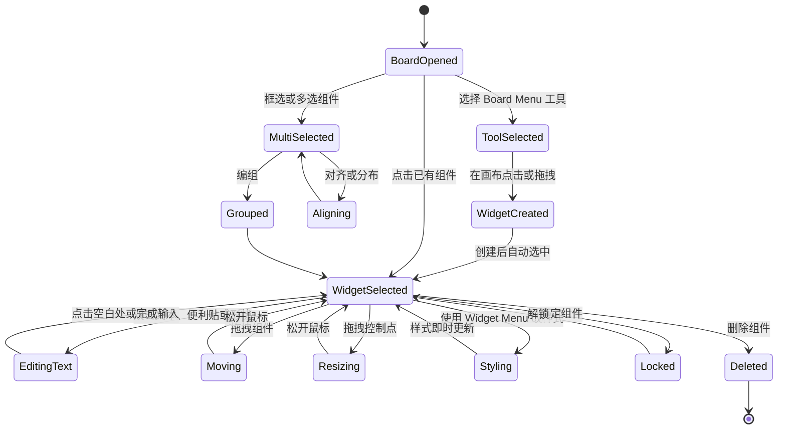
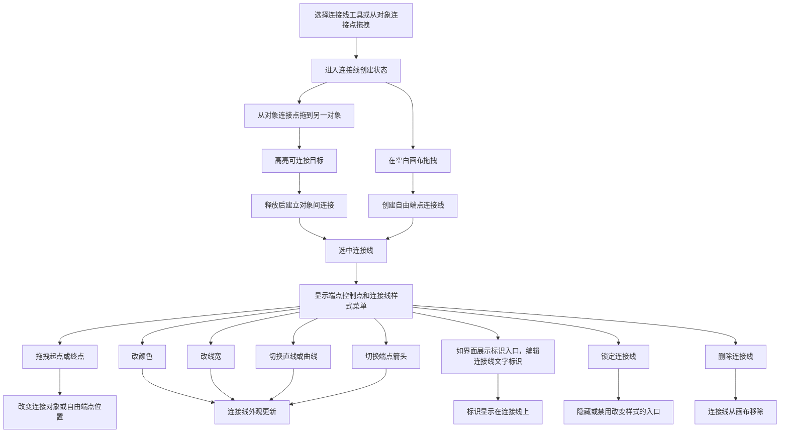

# Board Widgets 交互图

```mermaid
stateDiagram-v2
  [*] --> BoardOpened
  BoardOpened --> ToolSelected: 选择 Board Menu 工具
  ToolSelected --> WidgetCreated: 在画布点击或拖拽
  WidgetCreated --> WidgetSelected: 创建后自动选中
  BoardOpened --> WidgetSelected: 点击已有组件
  BoardOpened --> MultiSelected: 框选或多选组件
  WidgetSelected --> EditingText: 双击文本、便利贴或形状
  EditingText --> WidgetSelected: 点击空白处或完成输入
  WidgetSelected --> Moving: 拖拽组件
  Moving --> WidgetSelected: 松开鼠标
  WidgetSelected --> Resizing: 拖拽控制点
  Resizing --> WidgetSelected: 松开鼠标
  WidgetSelected --> Styling: 使用 Widget Menu 改样式
  Styling --> WidgetSelected: 样式即时更新
  WidgetSelected --> Locked: 锁定组件
  Locked --> WidgetSelected: 解锁
  WidgetSelected --> Deleted: 删除组件
  MultiSelected --> Aligning: 对齐或分布
  Aligning --> MultiSelected
  MultiSelected --> Grouped: 编组
  Grouped --> WidgetSelected
  Deleted --> [*]
```

## 连接线交互

```mermaid
flowchart TD
  Start["选择连接线工具或从对象连接点拖拽"] --> Mode["进入连接线创建状态"]
  Mode --> FreeLine["在空白画布拖拽"]
  FreeLine --> FreeLineCreated["创建自由端点连接线"]
  Mode --> ObjectLine["从对象连接点拖到另一对象"]
  ObjectLine --> Highlight["高亮可连接目标"]
  Highlight --> Connected["释放后建立对象间连接"]
  Connected --> SelectLine["选中连接线"]
  FreeLineCreated --> SelectLine
  SelectLine --> Menu["显示端点控制点和连接线样式菜单"]
  Menu --> MoveEndpoint["拖拽起点或终点"]
  MoveEndpoint --> Reconnect["改变连接对象或自由端点位置"]
  Menu --> ChangeColor["改颜色"]
  ChangeColor --> LineUpdated["连接线外观更新"]
  Menu --> ChangeWidth["改线宽"]
  ChangeWidth --> LineUpdated
  Menu --> ChangePath["切换直线或曲线"]
  ChangePath --> LineUpdated
  Menu --> ChangeArrow["切换端点箭头"]
  ChangeArrow --> LineUpdated
  Menu --> OptionalLabel["如界面展示标识入口，编辑连接线文字标识"]
  OptionalLabel --> LabelUpdated["标识显示在连接线上"]
  Menu --> Lock["锁定连接线"]
  Lock --> Locked["隐藏或禁用改变样式的入口"]
  Menu --> Delete["删除连接线"]
  Delete --> Removed["连接线从画布移除"]
```

