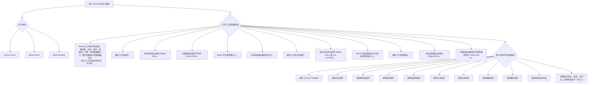

# Board Widgets 粗粒度交互图

本图用于快速说明 Board Widgets 模块有哪些参与角色、入口、主要能力和结果状态。它不展开每个控件的全部状态，详细交互见 [board-widgets-detailed-interaction-diagram.md](./board-widgets-detailed-interaction-diagram.md)。

```mermaid
flowchart TD
  Start["进入 Board Widgets 模块"]
  Start --> Actors{"参与角色"}
  Actors --> A1["Board Owner"]
  Actors --> A2["Board Admin"]
  Actors --> A3["Board Member"]
  Start --> Entry{"可见入口或页面区域"}
  Entry --> E1["Board 主工具栏中的选择、便利贴、文本、形状、连<br/>接线、手绘、资源和模板入口；图片和图标从资源面板进入<br/>，文件入口只有实际显示时才可用。"]
  Entry --> E2["画布上已有组件。"]
  Entry --> E3["选中组件后出现的 Widget Menu。"]
  Entry --> E4["右键或更多操作打开的 Context Menu。"]
  Entry --> E5["Board 文件或资源入口。"]
  Entry --> E6["从本地拖放到画布的文件。"]
  Entry --> E7["画布上已有文件组件。"]
  Entry --> E8["选中文件后出现的 Widget Menu 或 Con<br/>text Menu。"]
  Entry --> E9["Board 左侧或底部主工具栏中的便利贴入口。"]
  Entry --> E10["画布上已有便利贴。"]
  Entry --> E11["选中便利贴后出现的 Widget Menu。"]
  Entry --> E12["对便利贴右键或打开更多菜单后的 Context Me<br/>nu。"]
  Entry --> Capabilities{"用户可执行的主要操作"}
  Capabilities --> UC1["使用 CanvasX Widgets"]
  Capabilities --> UC2["使用文件组件"]
  Capabilities --> UC3["使用便利贴组件"]
  Capabilities --> UC4["使用形状组件"]
  Capabilities --> UC5["使用连接线组件"]
  Capabilities --> UC6["使用手绘组件"]
  Capabilities --> UC7["使用文本组件"]
  Capabilities --> UC8["使用图表组件"]
  Capabilities --> UC9["使用图片组件"]
  Capabilities --> UC10["使用多选组合状态"]
  Capabilities --> Result["界面显示成功、失败、空状态、权限状态或下一步入口"]
```
