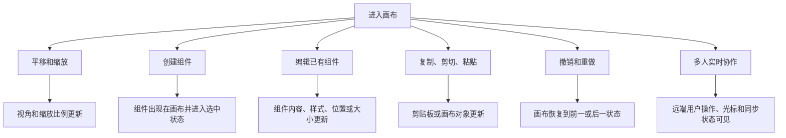
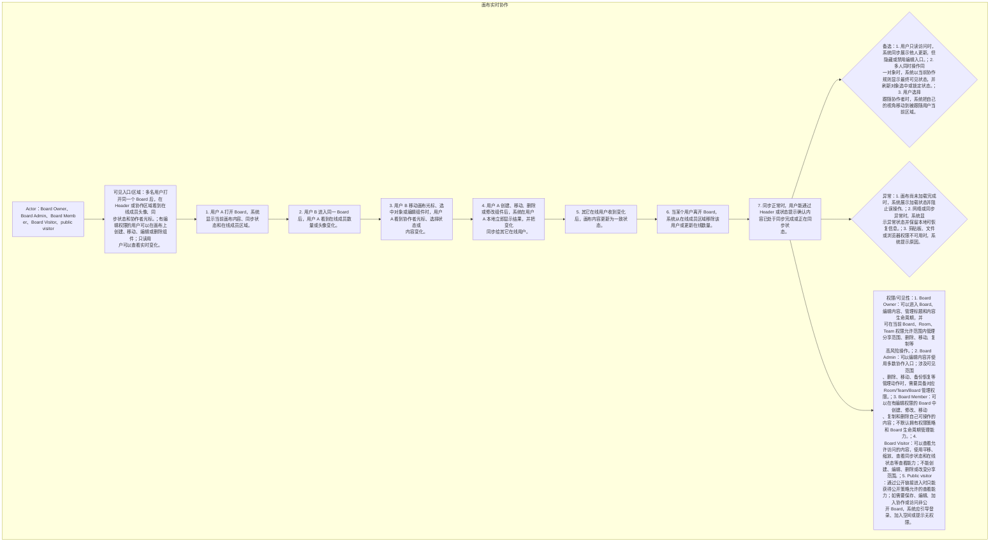

# Canvas 详细交互图

本图按 Canvas 模块当前 Use Case 的主流程展开，重点表达每个界面能看到什么、能操作什么、操作后出现什么状态。若某个 UC 继续细化，应该同步更新该 UC 的主流程和本图。

## 模块交互展开

该部分保留当前模块已有交互图，用于表达模块内主要页面区域之间的流转。

```mermaid
flowchart TD
  Canvas["进入画布"] --> Navigate["平移和缩放"]
  Canvas --> Create["创建组件"]
  Canvas --> Edit["编辑已有组件"]
  Canvas --> Clipboard["复制、剪切、粘贴"]
  Canvas --> History["撤销和重做"]
  Canvas --> Realtime["多人实时协作"]

  Navigate --> ViewState["视角和缩放比例更新"]
  Create --> Created["组件出现在画布并进入选中状态"]
  Edit --> Edited["组件内容、样式、位置或大小更新"]
  Clipboard --> ClipboardState["剪贴板或画布对象更新"]
  History --> HistoryState["画布恢复到前一或后一状态"]
  Realtime --> RemoteState["远端用户操作、光标和同步状态可见"]
```

## Use Case 主流程展开

```mermaid
flowchart TD
  subgraph D1G["平移、缩放和导航画布"]
    D1Start["Actor：Board Owner、Board Admin、Board Memb<br/>er、Board Visitor、public visitor"]
    D1Entry["可见入口/区域：用户打开 Board 后看到无限画布、已有组件、Header、Board Menu、<br/>缩放状态和可用的导航控件。；用户可以通过鼠标滚轮、触控板、缩放控件、平移工具、空格临<br/>时平移或小地图改变画布视角。"]
    D1Start --> D1Entry
    D1S1["1. 用户进入 Board，系统显示当前画布视角、已有组件和缩放比例。"]
    D1Entry --> D1S1
    D1S2["2. 用户滚动鼠标滚轮或使用触控板缩放，系统以当前视角为中心放大或缩小画布，并更新缩放比<br/>例。"]
    D1S1 --> D1S2
    D1S3["3. 用户点击 Board Menu 的平移工具，或按住空格临时进入平移状态，系统把光标<br/>切换为可拖动画布的状态。"]
    D1S2 --> D1S3
    D1S4["4. 用户拖动画布空白区域，系统移动视角但不改变任何组件内容。"]
    D1S3 --> D1S4
    D1S5["5. 用户点击适应屏幕、缩小、放大或当前百分比下拉入口，系统按用户选择更新缩放级别。"]
    D1S4 --> D1S5
    D1S6["6. 用户通过小地图或导航区域定位画布其它区域时，系统同步移动主画布视角。"]
    D1S5 --> D1S6
    D1S7["7. 用户松开空格、切回选择工具或停止操作后，系统保留新的视角和缩放状态。"]
    D1S6 --> D1S7
    D1Alt{"备选：1. 用户处于文本输入状态时，滚轮、键盘和空格优先遵守当前输入控件的交互边界。；2. 用<br/>户使用触屏设备时，系统支持单指移动或双指缩放等移动端导航方式。；3. 只读用户仍可平移、<br/>缩放和查看画布，但不能借由导航动作修改内容。"}
    D1S7 --> D1Alt
    D1Err{"异常：1. 画布尚未加载完成时，系统展示加载状态并阻止误操作。；2. 网络或同步异常时，系统显<br/>示异常状态并保留本地可恢复信息。；3. 剪贴板、文件或浏览器权限不可用时，系统提示原因。"}
    D1S7 --> D1Err
    D1Perm["权限/可见性：1. Board Owner：可以进入 Board、编辑内容、管理标题和内容生命周期，并<br/>可在当前 Board、Room、Team 权限允许范围内管理分享范围、删除、移动、复制等<br/>高风险操作。；2. Board Admin：可以编辑内容并使用多数协作入口；涉及可见范围<br/>、删除、移动、备份恢复等管理动作时，需要具备对应 Room/Team/Board 管理权<br/>限。；3. Board Member：可以在有编辑权限的 Board 中创建、修改、移动<br/>、复制和删除自己可操作的内容；不默认拥有权限策略和 Board 生命周期管理能力。；4.<br/> Board Visitor：可以查看允许访问的内容，使用平移、缩放、查看同步状态和在线<br/>状态等查看能力；不能创建、编辑、删除或改变分享范围。；5. Public visitor<br/>：通过公开链接进入时只能获得公开策略允许的查看能力；如需要保存、编辑、加入协作或访问非公<br/>开 Board，系统应引导登录、加入空间或提示无权限。"]
    D1S7 --> D1Perm
  end
  subgraph D2G["在画布创建和编辑组件"]
    D2Start["Actor：Board Owner、Board Admin、Board Memb<br/>er、Board Visitor、public visitor"]
    D2Entry["可见入口/区域：用户打开可编辑 Board 后看到无限画布、Board Menu、已有组件和 Wid<br/>get Menu。；Board Menu 当前直接入口包括选择、平移、便利贴、手绘、<br/>文本、连接线、形状、资源和模板；文件和链接从资源/更多入口进入。"]
    D2Start --> D2Entry
    D2S1["1. 用户在 Board Menu 中选择便利贴、文本、形状、连接线、手绘、资源或模板入<br/>口。"]
    D2Entry --> D2S1
    D2S2["2. 系统高亮当前工具，改变光标或打开对应的子菜单、资源面板或模板面板。"]
    D2S1 --> D2S2
    D2S3["3. 用户在画布点击、拖拽、输入文本、绘制线条、上传文件、粘贴链接或选择模板内容。"]
    D2S2 --> D2S3
    D2S4["4. 系统在画布目标位置创建对应组件，并显示选中框、控制点或创建进度。"]
    D2S3 --> D2S4
    D2S5["5. 用户选中已有组件，系统显示与组件类型匹配的 Widget Menu，例如颜色、字体<br/>、线宽、锁定、删除、AI 或下载等可用操作。"]
    D2S4 --> D2S5
    D2S6["6. 用户拖动组件、拖动控制点、编辑文本或选择样式，系统即时更新组件可见状态。"]
    D2S5 --> D2S6
    D2S7["7. 用户完成操作后，系统保留最终组件状态，并把可撤销动作加入撤销/重做序列。"]
    D2S6 --> D2S7
    D2Alt{"备选：1. 用户按 Esc、点击选择工具或点击空白区域时，系统退出当前创建或编辑状态。；2. <br/>对象被锁定时，系统允许查看和复制允许的内容，但隐藏或禁用移动、缩放、删除和样式修改。；3<br/>. 只读用户看不到完整创建工具，尝试编辑时系统阻止写入并提示无权限。"}
    D2S7 --> D2Alt
    D2Err{"异常：1. 画布尚未加载完成时，系统展示加载状态并阻止误操作。；2. 网络或同步异常时，系统显<br/>示异常状态并保留本地可恢复信息。；3. 剪贴板、文件或浏览器权限不可用时，系统提示原因。"}
    D2S7 --> D2Err
    D2Perm["权限/可见性：1. Board Owner：可以进入 Board、编辑内容、管理标题和内容生命周期，并<br/>可在当前 Board、Room、Team 权限允许范围内管理分享范围、删除、移动、复制等<br/>高风险操作。；2. Board Admin：可以编辑内容并使用多数协作入口；涉及可见范围<br/>、删除、移动、备份恢复等管理动作时，需要具备对应 Room/Team/Board 管理权<br/>限。；3. Board Member：可以在有编辑权限的 Board 中创建、修改、移动<br/>、复制和删除自己可操作的内容；不默认拥有权限策略和 Board 生命周期管理能力。；4.<br/> Board Visitor：可以查看允许访问的内容，使用平移、缩放、查看同步状态和在线<br/>状态等查看能力；不能创建、编辑、删除或改变分享范围。；5. Public visitor<br/>：通过公开链接进入时只能获得公开策略允许的查看能力；如需要保存、编辑、加入协作或访问非公<br/>开 Board，系统应引导登录、加入空间或提示无权限。"]
    D2S7 --> D2Perm
  end
  subgraph D3G["复制和粘贴画布内容"]
    D3Start["Actor：Board Owner、Board Admin、Board Memb<br/>er、Board Visitor、public visitor"]
    D3Entry["可见入口/区域：用户打开 Board 后看到画布、已有组件、选中框和 Context Menu。；用<br/>户可通过键盘复制/粘贴，或通过右键 Context Menu 的复制、剪切、粘贴、复<br/>制为图片、复制为文本入口完成内容复用。"]
    D3Start --> D3Entry
    D3S1["1. 用户选中一个或多个组件，系统显示选中框和可用菜单。"]
    D3Entry --> D3S1
    D3S2["2. 用户按复制快捷键或在 Context Menu 中选择复制，系统把选中内容写入剪贴<br/>板，并保持原画布内容不变。"]
    D3S1 --> D3S2
    D3S3["3. 用户选择剪切时，系统复制选中内容并从画布移除原组件；该动作可撤销。"]
    D3S2 --> D3S3
    D3S4["4. 用户在画布空白区域按粘贴快捷键或选择粘贴，系统读取剪贴板内容。"]
    D3S3 --> D3S4
    D3S5["5. 如果剪贴板同时包含多种可粘贴类型，系统展示粘贴类型选择，让用户选择链接、组件、表格<br/>、图片或文本。"]
    D3S4 --> D3S5
    D3S6["6. 系统把选择的内容粘贴到当前视角中心或用户指定位置，并显示新组件的选中状态。"]
    D3S5 --> D3S6
    D3S7["7. 用户选择复制为图片或复制为文本时，系统把选中内容转换为图片或文本并给出复制中、成功<br/>或失败反馈。"]
    D3S6 --> D3S7
    D3Alt{"备选：1. 用户正在文本输入框或文本编辑态中复制粘贴时，系统优先执行文本输入控件自身的复制粘贴<br/>。；2. 用户没有选中任何组件时，复制或剪切入口不可用，或系统提示没有可复制对象。；3.<br/> 只读用户可以复制允许查看的内容，但不能通过粘贴在 Board 中创建新组件。"}
    D3S7 --> D3Alt
    D3Err{"异常：1. 画布尚未加载完成时，系统展示加载状态并阻止误操作。；2. 网络或同步异常时，系统显<br/>示异常状态并保留本地可恢复信息。；3. 剪贴板、文件或浏览器权限不可用时，系统提示原因。"}
    D3S7 --> D3Err
    D3Perm["权限/可见性：1. Board Owner：可以进入 Board、编辑内容、管理标题和内容生命周期，并<br/>可在当前 Board、Room、Team 权限允许范围内管理分享范围、删除、移动、复制等<br/>高风险操作。；2. Board Admin：可以编辑内容并使用多数协作入口；涉及可见范围<br/>、删除、移动、备份恢复等管理动作时，需要具备对应 Room/Team/Board 管理权<br/>限。；3. Board Member：可以在有编辑权限的 Board 中创建、修改、移动<br/>、复制和删除自己可操作的内容；不默认拥有权限策略和 Board 生命周期管理能力。；4.<br/> Board Visitor：可以查看允许访问的内容，使用平移、缩放、查看同步状态和在线<br/>状态等查看能力；不能创建、编辑、删除或改变分享范围。；5. Public visitor<br/>：通过公开链接进入时只能获得公开策略允许的查看能力；如需要保存、编辑、加入协作或访问非公<br/>开 Board，系统应引导登录、加入空间或提示无权限。"]
    D3S7 --> D3Perm
  end
  subgraph D4G["撤销和重做画布操作"]
    D4Start["Actor：Board Owner、Board Admin、Board Memb<br/>er、Board Visitor、public visitor"]
    D4Entry["可见入口/区域：用户打开 Board 后看到 Header 中的撤销、重做按钮，以及画布中的当前内容<br/>。；用户也可以使用撤销/重做快捷键恢复或重新应用最近的画布操作。"]
    D4Start --> D4Entry
    D4S1["1. 用户完成一次可撤销的画布操作后，系统启用 Header 中的撤销按钮。"]
    D4Entry --> D4S1
    D4S2["2. 用户看到撤销按钮从不可用状态变为可点击状态。"]
    D4S1 --> D4S2
    D4S3["3. 用户点击撤销按钮或按撤销快捷键，系统回退最近一次可撤销操作。"]
    D4S2 --> D4S3
    D4S4["4. 系统更新画布内容、选中状态和撤销/重做按钮可用状态。"]
    D4S3 --> D4S4
    D4S5["5. 用户继续点击撤销，系统按操作历史逐步回退，并在画布上显示回退后的对象状态。"]
    D4S4 --> D4S5
    D4S6["6. 用户点击重做按钮或按重做快捷键，系统重新应用最近一次被撤销的操作。"]
    D4S5 --> D4S6
    D4S7["7. 系统恢复对应组件的内容、位置、尺寸、连接关系或删除状态，并更新同步状态。"]
    D4S6 --> D4S7
    D4S8["8. 当没有可撤销或可重做动作时，系统禁用对应按钮，避免用户触发无效操作。"]
    D4S7 --> D4S8
    D4Alt{"备选：1. 用户正在输入文本时，撤销/重做优先作用于当前文本编辑上下文，退出编辑后再作用于画布<br/>历史。；2. 多人协作时，系统只允许用户按当前协作规则回退自己可回退的操作。；3. 只读<br/>用户不能通过撤销/重做改变 Board 内容。"}
    D4S8 --> D4Alt
    D4Err{"异常：1. 画布尚未加载完成时，系统展示加载状态并阻止误操作。；2. 网络或同步异常时，系统显<br/>示异常状态并保留本地可恢复信息。；3. 剪贴板、文件或浏览器权限不可用时，系统提示原因。"}
    D4S8 --> D4Err
    D4Perm["权限/可见性：1. Board Owner：可以进入 Board、编辑内容、管理标题和内容生命周期，并<br/>可在当前 Board、Room、Team 权限允许范围内管理分享范围、删除、移动、复制等<br/>高风险操作。；2. Board Admin：可以编辑内容并使用多数协作入口；涉及可见范围<br/>、删除、移动、备份恢复等管理动作时，需要具备对应 Room/Team/Board 管理权<br/>限。；3. Board Member：可以在有编辑权限的 Board 中创建、修改、移动<br/>、复制和删除自己可操作的内容；不默认拥有权限策略和 Board 生命周期管理能力。；4.<br/> Board Visitor：可以查看允许访问的内容，使用平移、缩放、查看同步状态和在线<br/>状态等查看能力；不能创建、编辑、删除或改变分享范围。；5. Public visitor<br/>：通过公开链接进入时只能获得公开策略允许的查看能力；如需要保存、编辑、加入协作或访问非公<br/>开 Board，系统应引导登录、加入空间或提示无权限。"]
    D4S8 --> D4Perm
  end
```

```mermaid
flowchart TD
  subgraph D5G["画布实时协作"]
    D5Start["Actor：Board Owner、Board Admin、Board Memb<br/>er、Board Visitor、public visitor"]
    D5Entry["可见入口/区域：多名用户打开同一个 Board 后，在 Header 或协作区域看到在线成员头像、同<br/>步状态和协作者光标。；有编辑权限的用户可以在画布上创建、移动、编辑或删除组件；只读用<br/>户可以查看实时变化。"]
    D5Start --> D5Entry
    D5S1["1. 用户 A 打开 Board，系统显示当前画布内容、同步状态和在线成员区域。"]
    D5Entry --> D5S1
    D5S2["2. 用户 B 进入同一 Board 后，用户 A 看到在线成员数量或头像变化。"]
    D5S1 --> D5S2
    D5S3["3. 用户 B 移动画布光标、选中对象或编辑组件时，用户 A 看到协作者光标、选择状态或<br/>内容变化。"]
    D5S2 --> D5S3
    D5S4["4. 用户 A 创建、移动、删除或修改组件后，系统在用户 A 本地立即显示结果，并把变化<br/>同步给其它在线用户。"]
    D5S3 --> D5S4
    D5S5["5. 其它在线用户收到变化后，画布内容更新为一致状态。"]
    D5S4 --> D5S5
    D5S6["6. 当某个用户离开 Board，系统从在线成员区域移除该用户或更新在线数量。"]
    D5S5 --> D5S6
    D5S7["7. 同步正常时，用户能通过 Header 或状态提示确认内容已处于同步完成或正在同步状<br/>态。"]
    D5S6 --> D5S7
    D5Alt{"备选：1. 用户只读访问时，系统同步展示他人更新，但隐藏或禁用编辑入口。；2. 多人同时操作同<br/>一对象时，系统以当前协作规则显示最终可见状态，并刷新对象选中或锁定状态。；3. 用户选择<br/>跟随协作者时，系统把自己的视角移动到被跟随用户当前区域。"}
    D5S7 --> D5Alt
    D5Err{"异常：1. 画布尚未加载完成时，系统展示加载状态并阻止误操作。；2. 网络或同步异常时，系统显<br/>示异常状态并保留本地可恢复信息。；3. 剪贴板、文件或浏览器权限不可用时，系统提示原因。"}
    D5S7 --> D5Err
    D5Perm["权限/可见性：1. Board Owner：可以进入 Board、编辑内容、管理标题和内容生命周期，并<br/>可在当前 Board、Room、Team 权限允许范围内管理分享范围、删除、移动、复制等<br/>高风险操作。；2. Board Admin：可以编辑内容并使用多数协作入口；涉及可见范围<br/>、删除、移动、备份恢复等管理动作时，需要具备对应 Room/Team/Board 管理权<br/>限。；3. Board Member：可以在有编辑权限的 Board 中创建、修改、移动<br/>、复制和删除自己可操作的内容；不默认拥有权限策略和 Board 生命周期管理能力。；4.<br/> Board Visitor：可以查看允许访问的内容，使用平移、缩放、查看同步状态和在线<br/>状态等查看能力；不能创建、编辑、删除或改变分享范围。；5. Public visitor<br/>：通过公开链接进入时只能获得公开策略允许的查看能力；如需要保存、编辑、加入协作或访问非公<br/>开 Board，系统应引导登录、加入空间或提示无权限。"]
    D5S7 --> D5Perm
  end
```

