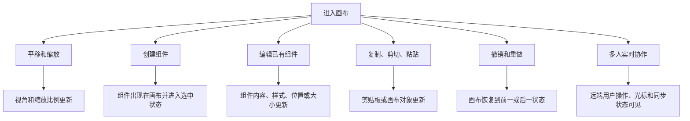

# Canvas 通用交互图

```mermaid
flowchart TD
  Canvas["进入画布"] --> Navigate["平移和缩放"]
  Canvas --> Create["创建组件"]
  Canvas --> Edit["编辑已有组件"]
  Canvas --> Clipboard["复制、剪切、粘贴"]
  Canvas --> History["撤销和重做"]
  Canvas --> Realtime["多人实时协作"]

  Navigate --> ViewState["视角和缩放比例更新"]
  Create --> Created["组件出现在画布并进入选中状态"]
  Edit --> Edited["组件内容、样式、位置或大小更新"]
  Clipboard --> ClipboardState["剪贴板或画布对象更新"]
  History --> HistoryState["画布恢复到前一或后一状态"]
  Realtime --> RemoteState["远端用户操作、光标和同步状态可见"]
```

