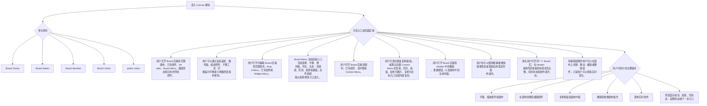

# Canvas 粗粒度交互图

本图用于快速说明 Canvas 模块有哪些参与角色、入口、主要能力和结果状态。它不展开每个控件的全部状态，详细交互见 [canvas-detailed-interaction-diagram.md](./canvas-detailed-interaction-diagram.md)。

```mermaid
flowchart TD
  Start["进入 Canvas 模块"]
  Start --> Actors{"参与角色"}
  Actors --> A1["Board Owner"]
  Actors --> A2["Board Admin"]
  Actors --> A3["Board Member"]
  Actors --> A4["Board Visitor"]
  Actors --> A5["public visitor"]
  Start --> Entry{"可见入口或页面区域"}
  Entry --> E1["用户打开 Board 后看到无限画布、已有组件、He<br/>ader、Board Menu、缩放状态和可用的导航<br/>控件。"]
  Entry --> E2["用户可以通过鼠标滚轮、触控板、缩放控件、平移工具、空<br/>格临时平移或小地图改变画布视角。"]
  Entry --> E3["用户打开可编辑 Board 后看到无限画布、Boar<br/>d Menu、已有组件和 Widget Menu。"]
  Entry --> E4["Board Menu 当前直接入口包括选择、平移、便<br/>利贴、手绘、文本、连接线、形状、资源和模板；文件和链<br/>接从资源/更多入口进入。"]
  Entry --> E5["用户打开 Board 后看到画布、已有组件、选中框和<br/> Context Menu。"]
  Entry --> E6["用户可通过键盘复制/粘贴，或通过右键 Context<br/> Menu 的复制、剪切、粘贴、复制为图片、复制为文<br/>本入口完成内容复用。"]
  Entry --> E7["用户打开 Board 后看到 Header 中的撤销<br/>、重做按钮，以及画布中的当前内容。"]
  Entry --> E8["用户也可以使用撤销/重做快捷键恢复或重新应用最近的画<br/>布操作。"]
  Entry --> E9["多名用户打开同一个 Board 后，在 Header<br/> 或协作区域看到在线成员头像、同步状态和协作者光标。"]
  Entry --> E10["有编辑权限的用户可以在画布上创建、移动、编辑或删除组<br/>件；只读用户可以查看实时变化。"]
  Entry --> Capabilities{"用户可执行的主要操作"}
  Capabilities --> UC1["平移、缩放和导航画布"]
  Capabilities --> UC2["在画布创建和编辑组件"]
  Capabilities --> UC3["复制和粘贴画布内容"]
  Capabilities --> UC4["撤销和重做画布操作"]
  Capabilities --> UC5["画布实时协作"]
  Capabilities --> Result["界面显示成功、失败、空状态、权限状态或下一步入口"]
```
