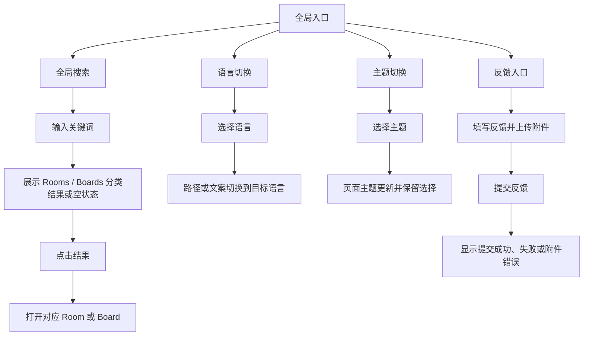

# Common 交互图

```mermaid
flowchart TD
  Global["全局入口"] --> Search["全局搜索"]
  Global --> Language["语言切换"]
  Global --> Theme["主题切换"]
  Global --> Feedback["反馈入口"]

  Search --> Query["输入关键词"]
  Query --> Results["展示 Rooms / Boards 分类结果或空状态"]
  Results --> OpenResult["点击结果"]
  OpenResult --> Target["打开对应 Room 或 Board"]

  Language --> PickLang["选择语言"]
  PickLang --> LangResult["路径或文案切换到目标语言"]

  Theme --> PickTheme["选择主题"]
  PickTheme --> ThemeResult["页面主题更新并保留选择"]

  Feedback --> Form["填写反馈并上传附件"]
  Form --> Submit["提交反馈"]
  Submit --> SubmitResult["显示提交成功、失败或附件错误"]
```

