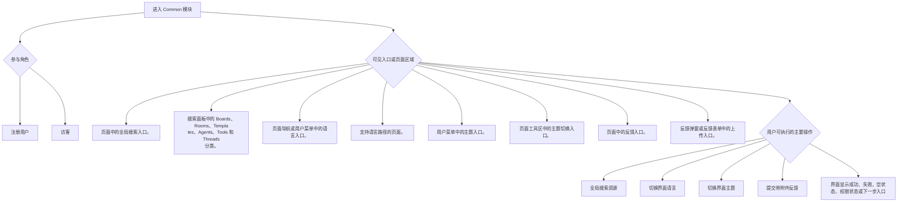

# Common 粗粒度交互图

本图用于快速说明 Common 模块有哪些参与角色、入口、主要能力和结果状态。它不展开每个控件的全部状态，详细交互见 [common-detailed-interaction-diagram.md](./common-detailed-interaction-diagram.md)。

```mermaid
flowchart TD
  Start["进入 Common 模块"]
  Start --> Actors{"参与角色"}
  Actors --> A1["注册用户"]
  Actors --> A2["访客"]
  Start --> Entry{"可见入口或页面区域"}
  Entry --> E1["页面中的全局搜索入口。"]
  Entry --> E2["搜索面板中的 Boards、Rooms、Templa<br/>tes、Agents、Tools 和 Threads<br/> 分类。"]
  Entry --> E3["页面导航或用户菜单中的语言入口。"]
  Entry --> E4["支持语言路径的页面。"]
  Entry --> E5["用户菜单中的主题入口。"]
  Entry --> E6["页面工具区中的主题切换入口。"]
  Entry --> E7["页面中的反馈入口。"]
  Entry --> E8["反馈弹窗或反馈表单中的上传入口。"]
  Entry --> Capabilities{"用户可执行的主要操作"}
  Capabilities --> UC1["全局搜索资源"]
  Capabilities --> UC2["切换界面语言"]
  Capabilities --> UC3["切换界面主题"]
  Capabilities --> UC4["提交带附件反馈"]
  Capabilities --> Result["界面显示成功、失败、空状态、权限状态或下一步入口"]
```
