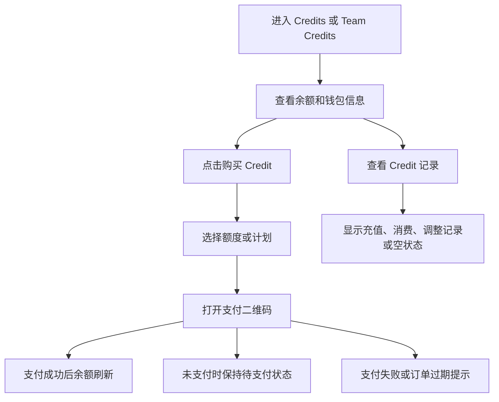

# Credits 交互图

```mermaid
flowchart TD
  Entry["进入 Credits 或 Team Credits"] --> Wallet["查看余额和钱包信息"]
  Wallet --> Buy["点击购买 Credit"]
  Buy --> Plan["选择额度或计划"]
  Plan --> Payment["打开支付二维码"]
  Payment --> Paid["支付成功后余额刷新"]
  Payment --> Pending["未支付时保持待支付状态"]
  Payment --> Failed["支付失败或订单过期提示"]
  Wallet --> Records["查看 Credit 记录"]
  Records --> RecordList["显示充值、消费、调整记录或空状态"]
```

