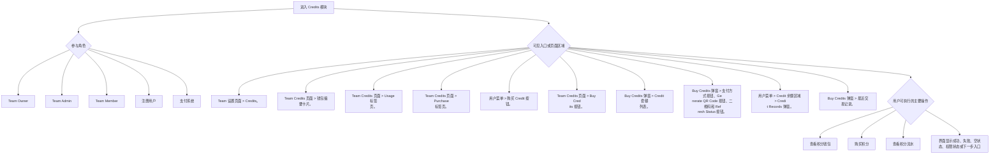

# Credits 粗粒度交互图

本图用于快速说明 Credits 模块有哪些参与角色、入口、主要能力和结果状态。它不展开每个控件的全部状态，详细交互见 [credits-detailed-interaction-diagram.md](./credits-detailed-interaction-diagram.md)。

```mermaid
flowchart TD
  Start["进入 Credits 模块"]
  Start --> Actors{"参与角色"}
  Actors --> A1["Team Owner"]
  Actors --> A2["Team Admin"]
  Actors --> A3["Team Member"]
  Actors --> A4["注册用户"]
  Actors --> A5["支付系统"]
  Start --> Entry{"可见入口或页面区域"}
  Entry --> E1["Team 设置页面 > Credits。"]
  Entry --> E2["Team Credits 页面 > 钱包摘要卡片。"]
  Entry --> E3["Team Credits 页面 > Usage 标签<br/>页。"]
  Entry --> E4["Team Credits 页面 > Purchase<br/> 标签页。"]
  Entry --> E5["用户菜单 > 购买 Credit 按钮。"]
  Entry --> E6["Team Credits 页面 > Buy Cred<br/>its 按钮。"]
  Entry --> E7["Buy Credits 弹窗 > Credit 套餐<br/>列表。"]
  Entry --> E8["Buy Credits 弹窗 > 支付方式按钮、Ge<br/>nerate QR Code 按钮、二维码和 Ref<br/>resh Status 按钮。"]
  Entry --> E9["用户菜单 > Credit 余额区域 > Credi<br/>t Records 弹窗。"]
  Entry --> E10["Buy Credits 弹窗 > 最近交易记录。"]
  Entry --> Capabilities{"用户可执行的主要操作"}
  Capabilities --> UC1["查看积分钱包"]
  Capabilities --> UC2["购买积分"]
  Capabilities --> UC3["查看积分流水"]
  Capabilities --> Result["界面显示成功、失败、空状态、权限状态或下一步入口"]
```
