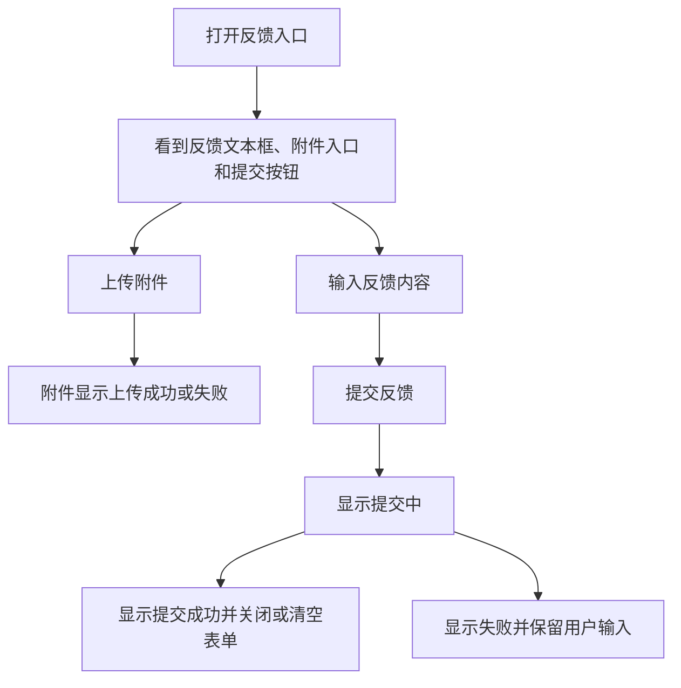

# Feedback 交互图

```mermaid
flowchart TD
  Entry["打开反馈入口"] --> Form["看到反馈文本框、附件入口和提交按钮"]
  Form --> Input["输入反馈内容"]
  Form --> Attach["上传附件"]
  Attach --> AttachState["附件显示上传成功或失败"]
  Input --> Submit["提交反馈"]
  Submit --> Loading["显示提交中"]
  Loading --> Success["显示提交成功并关闭或清空表单"]
  Loading --> Failed["显示失败并保留用户输入"]
```

