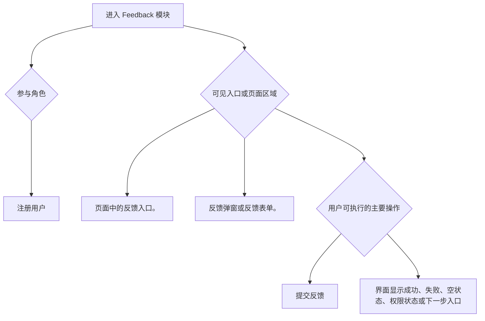

# Feedback 粗粒度交互图

本图用于快速说明 Feedback 模块有哪些参与角色、入口、主要能力和结果状态。它不展开每个控件的全部状态，详细交互见 [feedback-detailed-interaction-diagram.md](./feedback-detailed-interaction-diagram.md)。

```mermaid
flowchart TD
  Start["进入 Feedback 模块"]
  Start --> Actors{"参与角色"}
  Actors --> A1["注册用户"]
  Start --> Entry{"可见入口或页面区域"}
  Entry --> E1["页面中的反馈入口。"]
  Entry --> E2["反馈弹窗或反馈表单。"]
  Entry --> Capabilities{"用户可执行的主要操作"}
  Capabilities --> UC1["提交反馈"]
  Capabilities --> Result["界面显示成功、失败、空状态、权限状态或下一步入口"]
```
