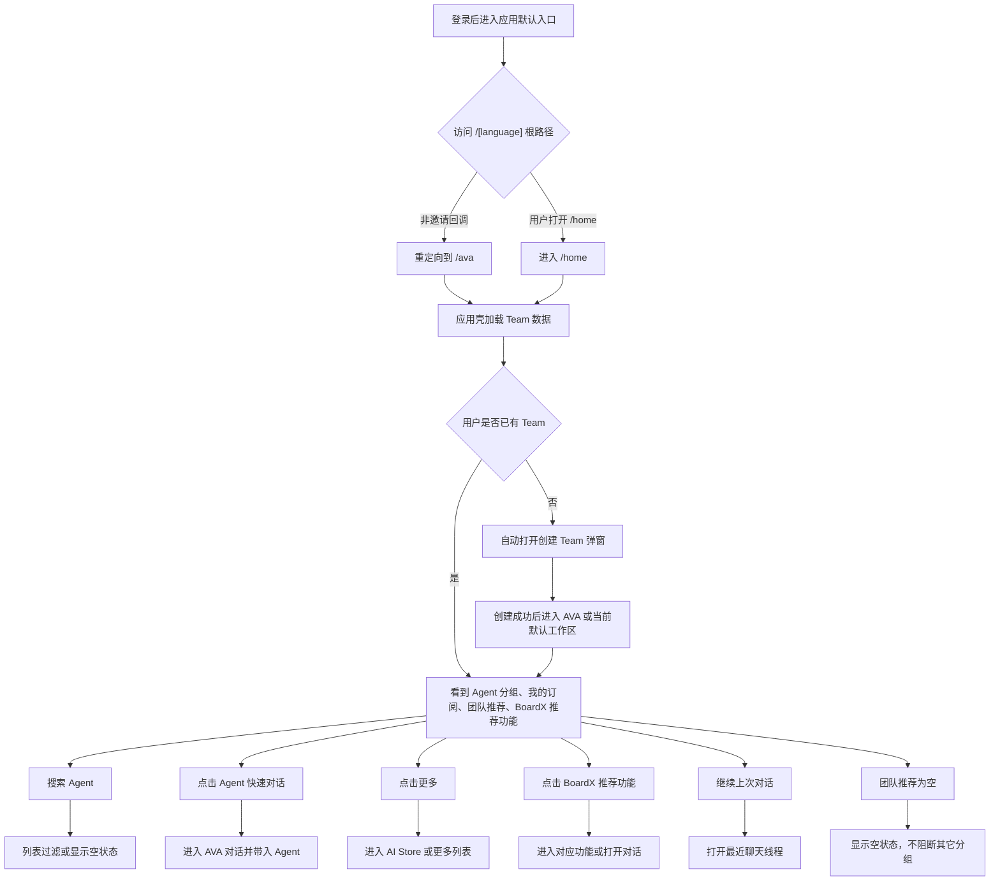

# Home Page 交互图

```mermaid
flowchart TD
  DefaultEntry["登录后进入应用默认入口"] --> Root{"访问 /[language] 根路径"}
  Root -->|非邀请回调| AvaDefault["重定向到 /ava"]
  Root -->|用户打开 /home| Home["进入 /home"]
  AvaDefault --> AppShell["应用壳加载 Team 数据"]
  Home --> AppShell
  AppShell --> HasTeam{"用户是否已有 Team"}
  HasTeam -->|否| CreateTeam["自动打开创建 Team 弹窗"]
  CreateTeam --> TeamCreated["创建成功后进入 AVA 或当前默认工作区"]
  HasTeam -->|是| Sections["看到 Agent 分组、我的订阅、团队推荐、BoardX 推荐功能"]
  TeamCreated --> Sections
  Sections --> Search["搜索 Agent"]
  Search --> SearchResult["列表过滤或显示空状态"]
  Sections --> QuickChat["点击 Agent 快速对话"]
  QuickChat --> AvaChat["进入 AVA 对话并带入 Agent"]
  Sections --> More["点击更多"]
  More --> Store["进入 AI Store 或更多列表"]
  Sections --> Recommended["点击 BoardX 推荐功能"]
  Recommended --> FeatureTarget["进入对应功能或打开对话"]
  Sections --> Continue["继续上次对话"]
  Continue --> LastThread["打开最近聊天线程"]
  Sections --> EmptyTeam["团队推荐为空"]
  EmptyTeam --> EmptyState["显示空状态，不阻断其它分组"]
```
