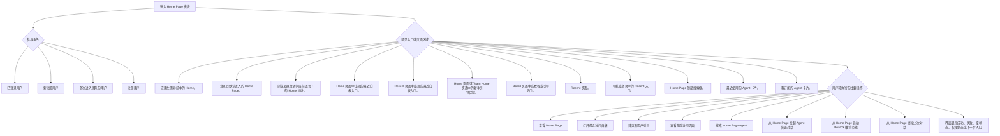

# Home Page 粗粒度交互图

本图用于快速说明 Home Page 模块有哪些参与角色、入口、主要能力和结果状态。它不展开每个控件的全部状态，详细交互见 [home-page-detailed-interaction-diagram.md](./home-page-detailed-interaction-diagram.md)。

```mermaid
flowchart TD
  Start["进入 Home Page 模块"]
  Start --> Actors{"参与角色"}
  Actors --> A1["已登录用户"]
  Actors --> A2["新注册用户"]
  Actors --> A3["首次进入团队的用户"]
  Actors --> A4["注册用户"]
  Start --> Entry{"可见入口或页面区域"}
  Entry --> E1["应用左侧导航中的 Home。"]
  Entry --> E2["登录后默认进入的 Home Page。"]
  Entry --> E3["浏览器直接访问当前语言下的 Home 地址。"]
  Entry --> E4["Home 页面中出现的最近白板入口。"]
  Entry --> E5["Recent 页面中出现的最近白板入口。"]
  Entry --> E6["Home 页面或 Team Home 页面中的新手引<br/>导区域。"]
  Entry --> E7["Board 页面中的教程或引导入口。"]
  Entry --> E8["Recent 页面。"]
  Entry --> E9["导航或首页中的 Recent 入口。"]
  Entry --> E10["Home Page 顶部搜索框。"]
  Entry --> E11["最近使用的 Agent 卡片。"]
  Entry --> E12["我订阅的 Agent 卡片。"]
  Entry --> Capabilities{"用户可执行的主要操作"}
  Capabilities --> UC1["查看 Home Page"]
  Capabilities --> UC2["打开最近访问白板"]
  Capabilities --> UC3["首页新用户引导"]
  Capabilities --> UC4["查看最近访问页面"]
  Capabilities --> UC5["搜索 Home Page Agent"]
  Capabilities --> UC6["从 Home Page 发起 Agent 快速对话"]
  Capabilities --> UC7["从 Home Page 启动 BoardX 推荐功能"]
  Capabilities --> UC8["从 Home Page 继续上次对话"]
  Capabilities --> Result["界面显示成功、失败、空状态、权限状态或下一步入口"]
```
